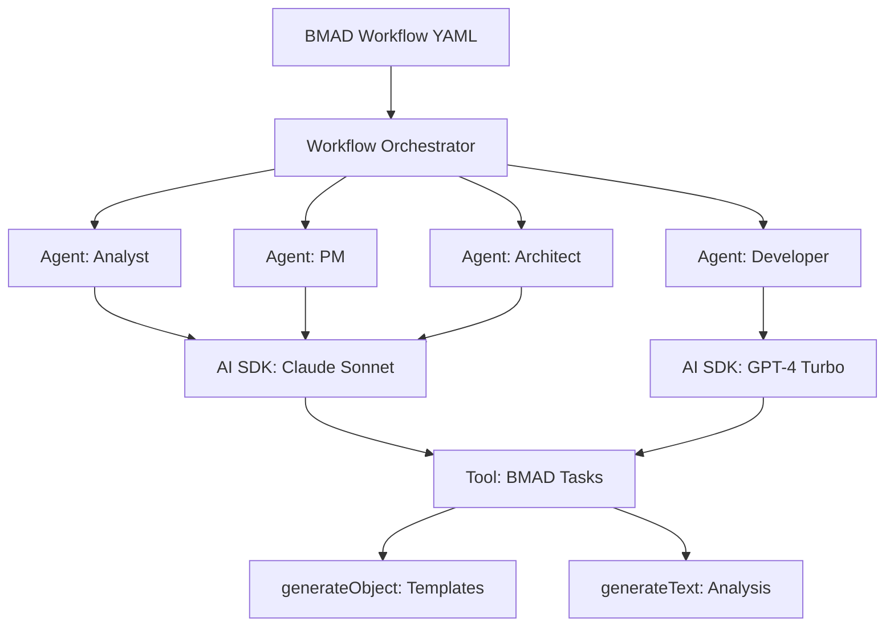

# BMAD-METHOD + Vercel AI SDK Integration Research Task

**Command:** `/research-bmad-ai-sdk-integration`
**Priority:** 🔴 CRITICAL - Foundation for AI Agent Implementation
**Duration:** 6-8 hours

---

## Objective

Research and design the integration architecture between BMAD-METHOD's natural language agent orchestration framework and Vercel AI SDK's multi-model capabilities to enable AI-powered development workflows for the American Nerd Marketplace.

## Context

The American Nerd Marketplace needs AI agents (Analyst, PM, Architect, Developer, QA) to autonomously execute project workflows. We need to combine:

**BMAD-METHOD** strengths:
- Natural language agent orchestration
- Structured workflows (planning → architecture → development)
- YAML-based agent definitions with personas
- Template-driven document generation
- Lean dev agent design

**Vercel AI SDK** strengths:
- Unified API for 15+ AI providers
- Multi-model support (OpenAI, Anthropic, Google, xAI, etc.)
- Tool/function calling with Zod schemas
- Streaming capabilities
- Structured object generation

**Integration Goal**: Enable BMAD agents to leverage AI SDK's model flexibility and tool calling while maintaining BMAD's workflow structure.

## Research Questions

### Must Answer

1. **Architecture Pattern**: Should BMAD agents be implemented as:
   - AI SDK tool orchestrators (agents call AI SDK with tools)?
   - AI SDK tools themselves (AI SDK calls BMAD tasks as tools)?
   - Hybrid approach?

2. **Task-to-Tool Mapping**: How do BMAD tasks map to Vercel AI SDK tool definitions?
   - Can BMAD task markdown be converted to Zod schemas?
   - How does BMAD's `create-doc` task integrate with AI SDK's `generateObject`?

3. **Model Selection Strategy**: Which AI models should power which BMAD agents?
   - Analyst (brainstorming, research) → ?
   - PM (PRD creation, requirements) → ?
   - Architect (system design, tech decisions) → ?
   - Developer (code generation) → ?
   - QA (test design, review) → ?

4. **Workflow Orchestration**: How do BMAD YAML workflows drive AI SDK execution?
   - Multi-step workflows with `generateText` chains?
   - State management across agent handoffs?
   - Error handling and retry logic?

5. **Template Processing**: How do BMAD templates integrate with AI SDK structured output?
   - YAML template → Zod schema conversion?
   - Using `generateObject` for template-driven docs?
   - Streaming template generation?

### Should Answer

- Can AI SDK's streaming enhance BMAD's interactive guided templates?
- How to handle model provider fallbacks (primary model unavailable)?
- Performance optimization: token usage, latency, caching strategies?
- Cost analysis: which providers for which agent tasks?
- How does BMAD's expansion pack system leverage AI SDK providers?

## Research Process

### Phase 1: Deep Documentation Review (2-3 hours)

**BMAD-METHOD Analysis**:
```bash
# Use MCP server to fetch comprehensive BMAD docs
mcp__BMAD-METHOD_Docs__fetch_BMAD_METHOD_documentation
mcp__BMAD-METHOD_Docs__search_BMAD_METHOD_documentation "agent workflow task template"
mcp__BMAD-METHOD_Docs__search_BMAD_METHOD_code "agent definition yaml"
```

Key areas to understand:
- Agent definition structure (`bmad-core/agents/*.md`)
- Task execution model (`bmad-core/tasks/*.md`)
- Template processing (`bmad-core/templates/*.yaml`)
- Workflow sequences (`bmad-core/workflows/*.yaml`)
- How agents load dependencies and execute tasks

**Vercel AI SDK Analysis**:
- Core concepts: `generateText`, `streamText`, `generateObject`, `streamObject`
- Tool calling patterns and Zod schema design
- Multi-step agent execution with `maxSteps`
- Provider configuration and model selection
- Error handling and retry mechanisms

Resources:
- https://ai-sdk.dev/docs/introduction
- https://ai-sdk.dev/docs/ai-sdk-core/overview
- https://ai-sdk.dev/docs/ai-sdk-core/tools-and-tool-calling
- https://ai-sdk.dev/docs/ai-sdk-core/generating-structured-data
- https://github.com/vercel/ai/tree/main/examples

### Phase 2: Integration Architecture Design (2-3 hours)

**Create Integration Patterns**:

**Pattern A: BMAD Agents as AI SDK Orchestrators**
```typescript
// Each BMAD agent uses AI SDK to power its capabilities
interface BMADAgent {
  persona: string;
  dependencies: {
    tasks: string[];
    templates: string[];
  };
  execute: (taskName: string, context: any) => Promise<Result>;
}

class AnalystAgent implements BMADAgent {
  persona = "Market research and analysis expert";

  async execute(taskName: string, context: any) {
    const tools = this.loadTasksAsTools(); // Convert BMAD tasks to AI SDK tools

    return await generateText({
      model: anthropic('claude-3-5-sonnet-20241022'), // Model selection per agent
      system: this.persona,
      prompt: buildPromptFromTask(taskName, context),
      tools: tools,
      maxSteps: 10 // Multi-step execution
    });
  }

  private loadTasksAsTools() {
    // Convert BMAD task markdown to Zod-based AI SDK tools
  }
}
```

**Pattern B: BMAD Tasks as AI SDK Tools**
```typescript
// AI SDK calls BMAD tasks as tools
const bmadTaskTools = {
  createProjectBrief: tool({
    description: 'Create a comprehensive project brief using BMAD template',
    parameters: z.object({
      projectName: z.string(),
      industry: z.string(),
      targetUsers: z.string()
    }),
    execute: async ({ projectName, industry, targetUsers }) => {
      return await executeBMADTask('create-project-brief', {
        template: 'project-brief.yaml',
        context: { projectName, industry, targetUsers }
      });
    }
  }),

  createPRD: tool({
    description: 'Generate Product Requirements Document from brief',
    parameters: z.object({
      briefPath: z.string()
    }),
    execute: async ({ briefPath }) => {
      return await executeBMADTask('create-prd', {
        template: 'prd.yaml',
        input: briefPath
      });
    }
  })
};

// Main workflow orchestrator
const result = await generateText({
  model: anthropic('claude-3-5-sonnet-20241022'),
  prompt: 'Create a new marketplace project for freelance experts',
  tools: bmadTaskTools,
  maxSteps: 20
});
```

**Pattern C: Hybrid Approach**
- BMAD workflows orchestrate high-level agent sequence
- Each agent uses AI SDK internally for model flexibility
- BMAD templates become Zod schemas for structured output
- Tasks can be both internal logic and AI SDK tools

**Decision Criteria Matrix**:
| Pattern | Maintains BMAD Structure | Model Flexibility | Tool Calling | Complexity | Recommended? |
|---------|-------------------------|-------------------|--------------|------------|--------------|
| A: Agents as Orchestrators | ✅ High | ✅ High | ✅ Native | Medium | ? |
| B: Tasks as Tools | ⚠️ Medium | ✅ High | ✅ Native | Low | ? |
| C: Hybrid | ✅ High | ✅ High | ✅ Native | High | ? |

### Phase 3: Model Selection Strategy (1-2 hours)

**Research Model Capabilities**:

Test different models for different agent tasks:

```typescript
const modelSelectionMatrix = {
  analyst: {
    primary: anthropic('claude-3-5-sonnet-20241022'), // Deep reasoning for research
    rationale: 'Long context, strong analysis',
    fallback: openai('gpt-4-turbo'),
    costPerTask: '~$0.02-0.05'
  },

  pm: {
    primary: anthropic('claude-3-5-sonnet-20241022'), // Structured document creation
    rationale: 'Excellent at requirements gathering',
    fallback: openai('gpt-4-turbo'),
    costPerTask: '~$0.03-0.07'
  },

  architect: {
    primary: anthropic('claude-3-5-sonnet-20241022'), // System design expertise
    rationale: 'Strong technical reasoning',
    fallback: openai('o1-mini'), // Alternative: reasoning model
    costPerTask: '~$0.05-0.10'
  },

  developer: {
    primary: openai('gpt-4-turbo'), // Code generation
    rationale: 'Fast, cost-effective, good at code',
    fallback: anthropic('claude-3-5-sonnet-20241022'),
    costPerTask: '~$0.01-0.03'
  },

  qa: {
    primary: openai('gpt-4-turbo'), // Test design
    rationale: 'Good at edge case identification',
    fallback: anthropic('claude-3-5-sonnet-20241022'),
    costPerTask: '~$0.01-0.02'
  }
};
```

**Evaluation Criteria**:
- Quality of output (compare same task across models)
- Speed/latency (streaming matters for UX)
- Cost (token usage × price per token)
- Context window needs (long docs vs. short tasks)
- Tool calling reliability

### Phase 4: Prototype Integration (2-3 hours)

**Build Proof of Concept**:

```typescript
// File: docs/examples/bmad-ai-sdk-integration.ts

import { generateText, generateObject, tool } from 'ai';
import { anthropic } from '@ai-sdk/anthropic';
import { openai } from '@ai-sdk/openai';
import { z } from 'zod';

// 1. BMAD Agent Implementation with AI SDK
class BMADPMAgent {
  private model = anthropic('claude-3-5-sonnet-20241022');

  async createPRD(projectBrief: string) {
    // Use BMAD PRD template as Zod schema
    const prdSchema = z.object({
      productName: z.string(),
      overview: z.string(),
      targetUsers: z.array(z.object({
        persona: z.string(),
        needs: z.string(),
        painPoints: z.string()
      })),
      functionalRequirements: z.array(z.object({
        id: z.string(),
        requirement: z.string(),
        priority: z.enum(['P0', 'P1', 'P2', 'P3'])
      })),
      nonFunctionalRequirements: z.array(z.object({
        category: z.string(),
        requirement: z.string()
      })),
      epics: z.array(z.object({
        id: z.string(),
        title: z.string(),
        description: z.string(),
        stories: z.array(z.string())
      }))
    });

    // Generate structured PRD using AI SDK
    const { object: prd } = await generateObject({
      model: this.model,
      schema: prdSchema,
      system: 'You are an expert Product Manager creating a comprehensive PRD.',
      prompt: `Create a detailed Product Requirements Document based on this project brief:\n\n${projectBrief}`
    });

    return prd;
  }
}

// 2. BMAD Workflow Orchestration
class BMADWorkflowOrchestrator {
  async executeGreenfield(projectIdea: string) {
    // Step 1: Analyst creates project brief
    const analyst = new BMADAnalystAgent();
    const brief = await analyst.createBrief(projectIdea);

    // Step 2: PM creates PRD
    const pm = new BMADPMAgent();
    const prd = await pm.createPRD(brief);

    // Step 3: Architect creates architecture
    const architect = new BMADArchitectAgent();
    const architecture = await architect.designSystem(prd);

    // Step 4: Developer implements stories
    const developer = new BMADDeveloperAgent();
    const implementation = await developer.executeStory(architecture.stories[0]);

    return { brief, prd, architecture, implementation };
  }
}

// 3. Test Integration
async function testIntegration() {
  const orchestrator = new BMADWorkflowOrchestrator();

  const result = await orchestrator.executeGreenfield(
    'Marketplace connecting software project owners with expert developers, ' +
    'using AI agents to manage workflow and Solana blockchain for escrow payments'
  );

  console.log('Integration test results:', result);
}

testIntegration();
```

**Testing Checklist**:
- [ ] BMAD agent can execute with AI SDK
- [ ] BMAD template converts to Zod schema
- [ ] Multi-step workflow orchestration works
- [ ] Model switching per agent type functions
- [ ] Tool calling for BMAD tasks succeeds
- [ ] Error handling gracefully manages failures
- [ ] Cost tracking per agent execution

## Deliverables

### 1. Research Summary (`docs/bmad-ai-sdk-integration.md`)

**Executive Summary**:
- Recommended integration architecture (with diagram)
- Critical decisions: patterns, models, workflows
- Implementation complexity: [X developer-days]
- Cost estimates per agent execution
- Risks and mitigation strategies

**Integration Architecture**:


**Model Selection Guide**:
- Agent-to-model mapping with rationale
- Cost per agent type
- Performance benchmarks
- Fallback strategies

**Implementation Roadmap**:
- Phase 1: Core integration (analyst + PM agents)
- Phase 2: Full workflow (add architect + developer)
- Phase 3: Optimization (caching, streaming, cost reduction)

### 2. Code Examples (`docs/examples/bmad-ai-sdk-integration.ts`)

Complete working integration showing:
- Agent class implementations
- BMAD template → Zod schema conversion
- Workflow orchestration
- Multi-model execution
- Error handling
- Cost tracking

### 3. Update Architecture Document (`docs/architecture.md`)

**Add AI Agent Runtime Section**:
```markdown
#### AI Agent Runtime

| Component | Technology | Version | Purpose | Rationale |
|-----------|-----------|---------|---------|-----------|
| Agent Orchestration | BMAD-METHOD | 5.x | Workflow structure | Natural language agent framework |
| AI Model SDK | Vercel AI SDK | 4.x | Multi-model interface | Provider abstraction, tool calling |
| Primary Model (Reasoning) | Claude 3.5 Sonnet | latest | Analyst, PM, Architect agents | Deep analysis, structured output |
| Secondary Model (Code) | GPT-4 Turbo | latest | Developer, QA agents | Fast, cost-effective code generation |
| Schema Validation | Zod | 3.x | Tool parameters, structured output | Type-safe AI interactions |
```

**MCP Integration Pattern**:
```markdown
### AI Agent Integration Pattern

The marketplace uses a hybrid BMAD-METHOD + Vercel AI SDK architecture:

1. **BMAD Workflows** define high-level agent sequences (Analyst → PM → Architect → Dev)
2. **AI SDK** powers each agent with appropriate models and tool calling
3. **BMAD Templates** convert to Zod schemas for structured `generateObject` calls
4. **BMAD Tasks** become AI SDK tools for multi-step execution

See `docs/bmad-ai-sdk-integration.md` for detailed architecture.
```

### 4. Decision Brief (`docs/bmad-ai-sdk-decision-brief.md`)

**Recommendation**: [Selected Pattern]
**Rationale**: [Why this approach fits our marketplace needs]
**Implementation Effort**: [X developer-days]
**Cost Projection**: [$ per agent execution, monthly estimates]
**Risks**: [Technical, cost, or complexity concerns]
**Next Steps**: [Immediate actions to begin implementation]

## Success Criteria

- ✅ Clear integration architecture with diagrams
- ✅ Working proof-of-concept code
- ✅ Model selection strategy with cost analysis
- ✅ BMAD template → Zod schema conversion pattern
- ✅ Workflow orchestration implementation plan
- ✅ No blockers for MVP agent implementation
- ✅ Architecture document updated

## Timeline

- **Hour 0-2**: Deep dive BMAD-METHOD docs (MCP server)
- **Hour 2-4**: Deep dive Vercel AI SDK docs and examples
- **Hour 4-6**: Design integration patterns and model selection
- **Hour 6-8**: Build proof-of-concept and documentation

**Total: 6-8 hours**

## Output Location

- **Research summary**: `docs/bmad-ai-sdk-integration.md`
- **Decision brief**: `docs/bmad-ai-sdk-decision-brief.md`
- **Code examples**: `docs/examples/bmad-ai-sdk-integration.ts`
- **Architecture updates**: `docs/architecture.md` (inline updates)

## Next Steps After Research

**Immediate (Week 1-2)**:
1. Implement core agent classes (Analyst, PM) with AI SDK
2. Convert 2-3 critical BMAD templates to Zod schemas
3. Test greenfield workflow: idea → brief → PRD

**Short-term (Month 1)**:
1. Complete all agent implementations (Architect, Developer, QA)
2. Integrate with marketplace backend (Node.js runtime)
3. Add cost tracking and model fallback logic
4. Deploy first AI-assisted project workflow

**Long-term (Month 2-3)**:
1. Optimize model selection based on real usage
2. Implement caching and streaming for better UX
3. Expand BMAD expansion packs for marketplace-specific workflows
4. Build agent monitoring dashboard
