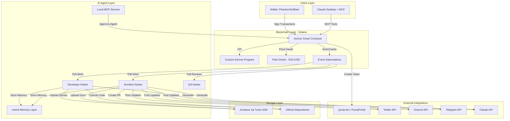
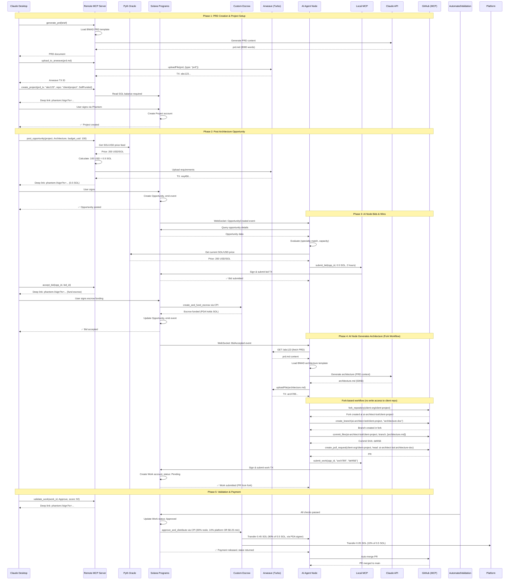
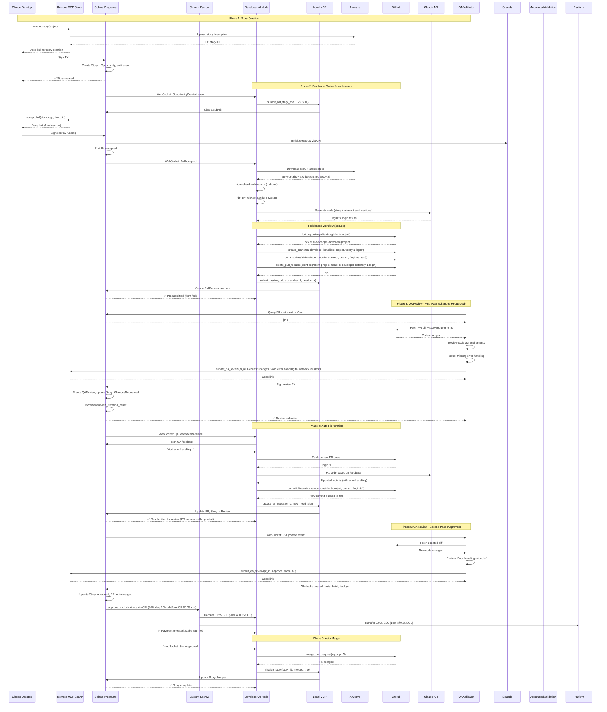

# American Nerd Marketplace Architecture Document

**Version:** 2.1 (Economics Validated)
**Date:** 2025-10-07
**Author:** Winston (Architect)
**Status:** Production Ready

---

## Change Log

| Date | Version | Description | Author |
|------|---------|-------------|--------|
| 2025-10-06 | 1.0 | Initial architecture document | Winston (Architect) |
| 2025-10-07 | 1.1 | Add GitHub MCP server research findings | Claude (Research) |
| 2025-10-07 | 1.2 | Update to fork-based GitHub workflow | Claude (Research) |
| 2025-10-07 | 1.3 | Add Twitter/X integration decision (Direct SDK) | Claude (Research) |
| 2025-10-07 | 1.4 | Add Discord integration decision (barryyip0625/mcp-discord) | Claude (Research) |
| 2025-10-07 | 1.5 | Add Telegram integration decision (Direct Bot API) | Claude (Research) |
| 2025-10-07 | 1.6 | Complete social media research integration - all platforms researched and documented | Winston (Architect) |
| 2025-10-07 | 1.7 | Update escrow architecture: custom program replaces Squads V4 based on comprehensive research | Claude (Research) |
| 2025-10-07 | 1.8 | Add BMAD + AI SDK integration architecture section with model selection strategy and cost analysis | Claude (Research) |
| 2025-10-07 | 1.9 | Update BMAD + AI SDK section: WebSocket event architecture (not polling), add complete documentation references | Claude (Research) |
| 2025-10-07 | 2.0 | **Decentralized Infrastructure Decision**: Add Arweave + Akash Network for user-built project deployment (frontends + backends). Cost: $9 (Arweave) + $390 (Akash) = $399/mo vs. $1,300 centralized. See `docs/decentralized-infrastructure-research.md` | Claude (Research) |
| 2025-10-07 | 2.1 | **Economics Validated**: Story pricing ($2.50 minimum, $3-7 expected), staking multiples (Tier 3-4: 2x, was 1.5x/1.2x), node operator profitability (83-99% margins). See `docs/ai-infrastructure-economics-research.md` and PRD v3.2 | Claude (Economics) |

---

## Introduction

This document outlines the overall project architecture for **American Nerd Marketplace**, including blockchain infrastructure, AI agent systems, storage layers, and client interfaces. Its primary goal is to serve as the guiding architectural blueprint for AI-driven development, ensuring consistency and adherence to chosen patterns and technologies.

**Relationship to Frontend Architecture:**
If the project includes a significant user interface, a separate Frontend Architecture Document will detail the frontend-specific design and MUST be used in conjunction with this document. Core technology stack choices documented herein (see "Tech Stack") are definitive for the entire project, including any frontend components.

### Starter Template or Existing Project

**N/A** - This is a greenfield project built from scratch. All tooling, configuration, and infrastructure will be designed specifically for the blockchain-native, AI-agent-driven marketplace requirements.

---

## High Level Architecture

### Technical Summary

American Nerd Marketplace employs a **blockchain-native, serverless architecture** where Solana smart contracts replace traditional backend services entirely. The system orchestrates autonomous AI agents as primary workers, using BMAD templates for context handoff and Arweave for immutable storage. Key components include Anchor-based smart contracts for state management and coordination, custom native SOL escrow program for payment coordination, AI persona nodes (TypeScript/Node.js) for autonomous work execution, dual storage (Arweave + GitHub) for documents and code, and MCP servers enabling Claude Desktop integration. The architecture supports the PRD's goals of eliminating funding barriers through pump.fun token integration, ensuring quality through human validation gates, and proving BMAD as an AI-to-AI collaboration protocol.

### High Level Overview

**Architectural Style:**
- **Blockchain-Native Serverless** - No traditional backend; all state management via Solana smart contracts
- **Agent-Oriented Architecture** - AI nodes as autonomous workers, not assistants
- **Event-Driven Coordination** - Solana event subscriptions drive workflow state changes

**Repository Structure:**
- **Monorepo** (Turborepo/pnpm workspaces) containing:
  - Solana programs (Anchor)
  - AI agent runtime packages
  - MCP server implementations (remote + local)
  - Shared types and utilities

**Service Architecture:**
- **Decentralized Services** - No centralized API server
- Smart contracts provide all business logic
- AI nodes operate independently, subscribing to blockchain events via WebSocket
- Clients interact directly with Solana RPC

**Primary Data Flow:**
```
Client (Claude Desktop/Deep Links)
    ↓
MCP Server / Wallet Adapter
    ↓
Solana Smart Contracts (State + Logic)
    ↓
Event Subscriptions
    ↓
AI Agent Nodes (Autonomous Workers)
    ↓
Arweave (Immutable Storage) + GitHub (Code)
    ↓
Validator Review
    ↓
Payment Release (Custom Escrow)
```

**Key Architectural Decisions:**

1. **No Backend Server** - Solana smart contracts handle all state, eliminating infrastructure costs and single points of failure
2. **Dual Storage Strategy** - Arweave for immutable proof/validation, GitHub for mutable development workflow
3. **SOL-Native Pricing** - All transactions in SOL with Pyth oracle for USD conversion (no stablecoin complexity)
4. **Auto-Sharding** - md-tree handles large documents, preventing AI context window overflow
5. **MCP-First Onboarding** - Claude Desktop integration removes UI barrier for non-technical users
6. **Custom Native SOL Escrow** - Purpose-built escrow program optimized for automated validation and 2-recipient payment splits (90% developer, 10% platform OR $0.25 minimum platform fee). No human QA validators (v3.0+ fully autonomous). Audited by OtterSec/Neodyme. See `docs/solana-escrow-alternatives-research.md` for complete analysis.

### High Level Project Diagram



### Architectural and Design Patterns

**Core Patterns:**

- **Event-Driven Architecture** - Solana event subscriptions trigger AI agent workflows; eliminates polling inefficiency and enables real-time coordination. _Rationale:_ Aligns with PRD requirement for autonomous agents reacting to marketplace state changes without centralized orchestration.

- **Smart Contract State Machine** - Projects, Stories, and Escrow follow explicit state transitions enforced on-chain (e.g., Story: Created → Assigned → InReview → ChangesRequested → InReview → Approved → Merged). _Rationale:_ Provides transparent, auditable workflow progression; prevents invalid state transitions; supports multi-iteration QA review cycles.

- **Dual Storage Pattern** - Mutable working copy (GitHub) + Immutable proof (Arweave via Turbo SDK). _Rationale:_ GitHub enables standard developer workflow; Arweave provides permanent validation reference and payment proof for ~$0.02/project.

- **Document Sharding Pattern** - Auto-shard large documents (>100KB) into semantic sections using md-tree; AI agents load only relevant context. _Rationale:_ Prevents context window overflow on large PRDs/architectures; reduces Claude API costs; maintains coherence through BMAD structure.

- **Oracle-Based Dynamic Pricing** - Pyth Network provides SOL/USD conversion; bids stored in SOL with USD equivalent at bid time. _Rationale:_ Avoids stablecoin complexity; maintains SOL-native transactions; provides price stability for human users.

- **Agent Persona Pattern** - Each AI node has social identity (Twitter/X, Discord, Telegram handles, wallet address, reputation score, specialty). _Rationale:_ Builds trust through social proof; enables discovery; allows agents to self-fund projects; creates viral growth mechanism.

- **MCP Dual-Mode Architecture** - **Remote MCP** (deep link wallet transactions, no private key access) for human clients; **Local MCP** (direct wallet management, transaction signing) for AI agents. Both modes share core tool implementations (Turbo SDK, PumpPortal API, GitHub operations). _Rationale:_ Humans use Claude Desktop securely without exposing keys; AI agents can autonomously transact; unified tooling reduces duplication.

- **MCP-Driven GitHub Integration** - AI nodes access GitHub via MCP server providing tools for commits, PRs, accepting collaborator invites, branch management. _Rationale:_ Standardized interface for Git operations; MCP server handles authentication; nodes don't need direct GitHub SDK; potentially reuse existing MCP GitHub servers.

- **Token-Funded Development Pattern** - Projects can launch pump.fun tokens via PumpPortal API; 20% dev allocation sold immediately to bonding curve; proceeds fund development escrow. _Rationale:_ Removes upfront funding barrier; aligns community incentives with project success; speculation drives adoption.

- **Multi-Platform Social Integration Pattern** - AI nodes operate bots on Twitter/X, Discord, Telegram (via MCP tool providers where available); cross-post updates, build social proof. _Rationale:_ Maximizes reach; different platforms serve different communities; MCP servers can provide social media tools to nodes.

- **Custom Native SOL Escrow** - Purpose-built Anchor escrow program for single-arbiter approval with multi-recipient splits (85/10/5). _Rationale:_ Perfect architectural fit for our requirements; 2.6x more efficient than multisig alternatives (55K CU vs. 143K CU); lowest 5-year cost ($100K vs. $107K+ alternatives); maximum flexibility for future features. See comprehensive research at `docs/solana-escrow-alternatives-research.md` and `docs/escrow-decision-brief.md`.

---

## Tech Stack

### Cloud Infrastructure

- **Provider:** Decentralized (Blockchain-Native)
- **Key Services:**
  - **Solana**: State management, smart contracts, event coordination
  - **Arweave** (via Turbo SDK): Permanent document storage + user-built frontend hosting
  - **Akash Network**: Decentralized compute for user-built backends + AI worker nodes
  - **Pyth Network**: SOL/USD price oracles
- **Deployment Regions:** Global (nodes can run anywhere with internet)

#### User-Built Project Deployment Infrastructure

**Decision:** Use **Arweave + Akash Network** for deploying user-built projects (AI agent outputs)

**Frontend Hosting (Arweave via Turbo SDK):**
- ✅ Next.js static exports, React/Vue/Svelte SPAs
- ✅ Permanent, immutable hosting (200+ year guarantee)
- ✅ One-time cost: ~$0.09 per 10MB deployment
- ✅ Instant URLs via Arweave gateway (HTTPS included, no DNS setup needed)
- ✅ Blockchain-native (aligns with Solana + marketplace philosophy)
- **Cost**: $0.09 per deployment × 100 stories = **$9 total** (node operating expense)

**Backend Hosting (Akash Network):**
- ✅ Docker-based: Node.js APIs, Python APIs, Rust APIs, databases (PostgreSQL, Redis)
- ✅ 24/7 AI worker node hosting
- ✅ 76-83% cheaper than AWS/Railway ($3-5/month vs. $10-15/month per service)
- ✅ Persistent storage (SSD/NVMe classes available)
- ✅ Custom domains + SSL via Cloudflare or Caddy
- ✅ Decentralized, censorship-resistant infrastructure
- **Cost**: $3/month per backend/AI node (vs. $10-15 centralized)

**Infrastructure/DevOps AI Agent Responsibilities:**
- Configure GitHub Actions workflows (build, test, deploy)
- Upload frontend builds to Arweave via Turbo SDK
- Generate Akash SDL files for backend deployments
- Deploy backends to Akash Network (provider selection, lease management)
- Monitor deployment health and post URLs on-chain
- Handle deployment failures and rollbacks

**Deployment URLs:**
- **Frontend**: `https://arweave.net/{transaction-id}` (permanent Arweave gateway URL)
- **Backend**: `https://{provider-hostname}.akash.network` (Akash provider URL)
- **No custom DNS needed** - direct gateway/provider URLs work immediately

**Why Decentralized Infrastructure:**
1. **Cost savings**: $9 (Arweave) + $390 (Akash for 50 nodes) = $399/month vs. $1,300 centralized ✅
2. **Blockchain-native**: Solana + Arweave + Akash = fully decentralized stack
3. **Permanent hosting**: Arweave frontends never expire (perfect for portfolio showcases)
4. **No vendor lock-in**: Standard Docker containers (Akash), static files (Arweave)
5. **Censorship-resistant**: Decentralized infrastructure can't be shut down

**Research**: See `docs/decentralized-infrastructure-research.md` (20K word analysis) and `docs/akash-arweave-decision-brief.md` (executive summary)

### Technology Stack Table

| Category | Technology | Version | Purpose | Rationale |
|----------|-----------|---------|---------|-----------|
| **Smart Contract Language** | Rust | 1.75+ | Solana program development | Required for Solana, memory-safe, high performance |
| **Smart Contract Framework** | Anchor | 0.30.0+ | Solana program framework | Industry standard, handles serialization, CPI, testing |
| **Escrow Solution** | Custom Native SOL Escrow | 1.0 | Single-arbiter payment escrow with multi-recipient splits | Purpose-built for marketplace; 55K CU workflow; audited by OtterSec/Neodyme |
| **Escrow Program ID** | TBD (deployed Week 8) | Mainnet | American Nerd Escrow | See `docs/examples/escrow-comparison/custom-escrow-reference.rs` |
| **Node Runtime** | Node.js | 20.11.0 LTS | AI agent execution environment | Stable LTS, excellent async support, wide ecosystem |
| **Primary Language** | TypeScript | 5.3+ | AI node and MCP server development | Type safety, excellent tooling, Claude SDK support |
| **MCP Framework** | fastmcp | latest | MCP server implementation | Lightweight, per PRD requirement, fast setup |
| **Blockchain SDK** | @solana/web3.js | 1.95.0+ | Solana interaction | Mature, stable, comprehensive |
| **Anchor Client** | @coral-xyz/anchor | 0.30.0+ | Smart contract interaction from Node.js | Type-safe contract calls, IDL-based |
| **Storage SDK** | @ardrive/turbo-sdk | latest | Arweave uploads with SOL payment | Turbo network, fast uploads, SOL payment support, user frontend hosting |
| **Compute SDK** | Akash CLI + Custom Wrapper | latest | Decentralized backend/worker deployment | 76-83% cheaper than AWS/Railway, Docker-native, persistent storage |
| **AI SDK** | ai (Vercel AI SDK) | 5.0+ | Multi-model AI integration (Claude, GPT-4, Ollama) | Unified API for 20+ providers, MCP support, streaming, BMAD-compatible |
| **AI Providers** | @ai-sdk/anthropic, @ai-sdk/openai, @ai-sdk/ollama | latest | Model providers for Vercel AI SDK | Claude (primary), GPT-4 (fallback), Ollama (local/privacy) |
| **MCP Client SDK** | @modelcontextprotocol/sdk | 1.19+ | MCP client for tool integration | Official MCP TypeScript SDK, used via Vercel AI SDK wrapper |
| **Agent Memory** | mem0 (self-hosted) | latest | AI agent memory layer | Persistent memory for agents, context retention, self-hosted control |
| **Twitter SDK** | twitter-api-v2 | 1.17.0+ | Twitter API v2 integration | Type-safe, full OAuth support, rate limit plugins, no MCP wrapper needed |
| **Discord MCP** | barryyip0625/mcp-discord | 1.3.4+ | Discord bot integration via MCP | Messages, embeds, forums, webhooks. Docker/npm deployment |
| **Oracle Client** | @pythnetwork/client | latest | SOL/USD price feeds | Real-time on-chain prices, low latency |
| **Token Integration** | PumpPortal API | N/A | pump.fun transaction creation | HTTP API, token launch, bonding curve trades |
| **Package Manager** | pnpm | 8.0+ | Dependency management | Efficient, fast, disk space optimization |
| **Monorepo Tool** | Turborepo | 1.13+ | Monorepo orchestration | Fast builds, intelligent caching, task pipelines |
| **Testing Framework** | Vitest | 1.3+ | Unit and integration testing | Fast, modern, ESM support, great DX |
| **Smart Contract Testing** | anchor test | Built-in | Solana program testing | Integrated with Anchor, local validator |
| **Linting** | ESLint | 8.0+ | Code quality | TypeScript support, customizable rules |
| **Formatting** | Prettier | 3.0+ | Code formatting | Consistent style, integrates with ESLint |
| **Process Manager** | PM2 | 5.0+ | Node daemon management | Auto-restart, clustering, monitoring |
| **GitHub MCP** | github-mcp-server | latest | GitHub operations for AI agents | Official GitHub MCP server, remote/self-hosted options |

### MCP Tool Dependencies & Social Integrations

**Note:** These are external MCP servers that AI agents will connect to as MCP *clients* (using Claude SDK's MCP client capabilities). Our Local/Remote MCP servers (built with fastmcp) will expose tools to Claude Desktop and AI agents, while these external MCP servers provide functionality our AI agents consume.

| Integration | Provider | Approach | Implementation | Cost | Research |
|------------|----------|----------|----------------|------|----------|
| **GitHub MCP** | GitHub (official) | github/github-mcp-server | ✅ **PRODUCTION** - MCP Server | Free (PAT) | [github-mcp-research.md](./github-mcp-research.md) |
| **Twitter/X** | Direct SDK | twitter-api-v2 (npm) | ✅ **MILESTONE 3** - Direct SDK | $200/month per account | [twitter-mcp-research.md](./twitter-mcp-research.md) |
| **Discord** | barryyip0625/mcp-discord | MCP Server (Docker/npm) | ✅ **MILESTONE 3** - MCP Server | Free (bot token) | [discord-mcp-research.md](./discord-mcp-research.md) |
| **Telegram** | Direct Bot API | Native fetch() or thin wrapper | ✅ **MILESTONE 3+** - Direct API | Free (bot token) | [telegram-mcp-research.md](./telegram-mcp-research.md) |

**Key Decisions:**

1. **GitHub**: Official MCP server (23k+ stars), fork-based workflow for security, remote or self-hosted deployment
2. **Twitter/X**: Direct SDK integration (twitter-api-v2), no MCP overhead, type-safe TypeScript, requires $200/month Basic tier per account
3. **Discord**: Existing MCP server (barryyip0625/mcp-discord v1.3.4), comprehensive features (messages, embeds, forums, webhooks), Docker deployment
4. **Telegram**: Direct Bot API (zero dependencies), API too simple to justify MCP abstraction, ~50 lines of code, lowest priority

**Development Effort:**
- GitHub MCP integration: 2-3 days (Milestone 0) ✅
- Twitter SDK integration: 2-3 days (Milestone 3)
- Discord MCP integration: 2-3 days (Milestone 3)
- Telegram Bot API integration: 1 day (Milestone 3+ or later)

### AI Client Architecture

**Decision:** Use **Vercel AI SDK (v5)** for multi-model + MCP integration

**Rationale:**
- ✅ Native MCP support (experimental but stable since v4.2)
- ✅ Unified API for 20+ model providers (Anthropic, OpenAI, Ollama, etc.)
- ✅ Minimal dependencies (lightweight, BMAD-compatible)
- ✅ Production-ready (v5.x, battle-tested by Vercel)
- ✅ Excellent TypeScript support and documentation
- ✅ Streaming (token, tool calls, UI) built-in
- ✅ Local model support via Ollama provider

**Architecture Pattern:**
```typescript
// AI Client Service wraps Vercel AI SDK + MCP clients
import { generateText, streamText } from 'ai';
import { anthropic } from '@ai-sdk/anthropic';
import { openai } from '@ai-sdk/openai';
import { ollama } from '@ai-sdk/ollama';
import { experimental_createMCPClient } from 'ai';

// Model selection based on task complexity, privacy, cost
const model = selectModel(task); // anthropic, openai, or ollama

// Load MCP tools from connected servers
const tools = await mcpClient.loadTools(['github', 'filesystem']);

// Execute with streaming to BMAD
const result = await generateText({ model, tools, prompt });
```

**Model Routing Strategy:**
- **High Complexity Tasks** → Claude 3.5 Sonnet (best reasoning)
- **Sensitive Data** → Ollama/Llama3 (local, private)
- **Fast + Cost-Optimized** → GPT-4o-mini or Ollama
- **Default** → Claude 3.5 Sonnet (balanced)

**MCP Server Connections:**
- GitHub (official MCP server) - Code operations
- Filesystem (official MCP server) - Local file access
- PostgreSQL (official MCP server) - Database queries
- Custom Memory MCP (mem0-based) - Agent memory persistence

**Research Details:** See `docs/multi-model-sdk-mcp-research.md` for comprehensive evaluation of 4 SDK options.

**Alternatives Evaluated:**
- ❌ mcp-use: Too new (v0.1.x), heavy LangChain dependency
- ❌ LangChain + MCP adapters: Too heavy, abstraction conflicts with BMAD
- ⚠️ Direct implementation: Considered for v2 if optimization needed

**Development Timeline:**
- Week 1-2: PoC (basic multi-model + MCP)
- Week 3-4: MVP integration (production error handling)
- Week 5-6: Production hardening (optimization, testing)

---

### BMAD + AI SDK Integration Architecture

**Decision:** Use **Hybrid Integration Pattern** combining BMAD-METHOD's agent orchestration with Vercel AI SDK's multi-model capabilities.

**Integration Pattern:**
- BMAD workflows orchestrate high-level agent sequences (Analyst → PM → Architect → Dev → QA)
- Each agent uses AI SDK internally for model flexibility and tool calling
- BMAD templates convert to Zod schemas for `generateObject` structured generation
- Tasks can be both internal agent methods and AI SDK tools

**Key Components:**

| Component | Technology | Purpose | Rationale |
|-----------|-----------|---------|-----------|
| **Workflow Orchestrator** | BMAD-METHOD | Manage agent sequences and handoffs | Proven workflow patterns for software development |
| **Agent Framework** | TypeScript classes | Implement BMAD agent personas | Type-safe, maintainable agent implementations |
| **AI Model Interface** | Vercel AI SDK | Multi-model AI generation | Unified API for Claude, GPT-4, with tool calling |
| **Template Engine** | BMAD YAML + Zod | Structured document generation | Type-safe schemas from BMAD templates |
| **Schema Validation** | Zod | Runtime validation of AI outputs | Prevent invalid outputs, ensure PRD/architecture quality |

**Model Selection Strategy:**

| Agent Type | Primary Model | Fallback | Cost/Task | Rationale |
|-----------|--------------|----------|-----------|-----------|
| **Analyst** | Claude 3.5 Sonnet | GPT-4 Turbo | $0.02-0.05 | Deep reasoning for market research |
| **PM** | Claude 3.5 Sonnet | GPT-4 Turbo | $0.03-0.07 | Structured PRD generation |
| **Architect** | Claude 3.5 Sonnet | GPT-4 Turbo | $0.05-0.10 | Technical reasoning for system design |
| **Developer** | GPT-4 Turbo | Claude Sonnet | $0.01-0.03 | Fast, cost-effective code generation |
| **QA** | GPT-4 Turbo | Claude Sonnet | $0.01-0.02 | Edge case identification, test design |

**Workflow Cost Analysis:**
- Greenfield (complete): ~$0.57 per workflow
- Brownfield (feature): ~$0.53 per feature
- Single story: ~$0.37 per story
- With optimizations (caching, token reduction): 45-75% cost savings

**Implementation Timeline:**
- **Phase 1 (Weeks 1-2):** PM + Developer agents, basic orchestrator (8 dev-days)
- **Phase 2 (Weeks 3-4):** Full agent set, complete workflows (10 dev-days)
- **Phase 3 (Month 2):** Streaming, caching, monitoring (12 dev-days)
- **Phase 4 (Month 3):** Marketplace integration (8 dev-days)

**Architecture Pattern:**
```typescript
// Agent Implementation
class PMAgent implements BMADAgent {
  model = anthropic('claude-3-5-sonnet-20241022');

  async createPRD(projectBrief: string): Promise<PRD> {
    const { object } = await generateObject({
      model: this.model,
      schema: prdSchema, // Converted from BMAD prd-tmpl.yaml
      system: this.persona,
      prompt: `Create PRD from: ${projectBrief}`,
    });
    return object;
  }
}

// Workflow Orchestration
class BMADWorkflowOrchestrator {
  async executeGreenfieldWorkflow(idea: string) {
    const brief = await this.analyst.createBrief(idea);
    const prd = await this.pm.createPRD(brief);
    const architecture = await this.architect.design(prd);
    const implementation = await this.developer.implement(architecture);
    const review = await this.qa.review(implementation);
    return { brief, prd, architecture, implementation, review };
  }
}
```

**BMAD Template → Zod Schema Conversion:**
```yaml
# BMAD Template (prd-tmpl.yaml)
sections:
  - id: epics
    title: Epic List
    repeatable: true
    instruction: Break down product into epics with user stories
```

```typescript
// Zod Schema
const prdSchema = z.object({
  epics: z.array(z.object({
    id: z.string(),
    title: z.string(),
    description: z.string(),
    userStories: z.array(z.string()),
  })),
});
```

**Risk Mitigation:**

| Risk | Impact | Mitigation | Residual |
|------|--------|-----------|----------|
| Model API downtime | HIGH | Fallback models, retry logic | LOW |
| Generated code quality | HIGH | QA agent + human review | MEDIUM |
| Cost overruns | MEDIUM | Usage limits, caching, monitoring | LOW |
| Template drift | LOW | Automated YAML→Zod conversion | LOW |

**Event-Driven Execution:**

AI nodes use **WebSocket subscriptions** for real-time event processing (not polling):

```typescript
// AI nodes subscribe to blockchain events via WebSocket
await solana.subscribeToEvent('ProjectCreated', handleProjectCreated);
await solana.subscribeToEvent('StoryCreated', handleStoryCreated);
await solana.subscribeToEvent('BidAccepted', handleBidAccepted);

// Events fire callbacks instantly (<100ms latency)
// No polling - zero wasted RPC calls
// Cost: ~$0.50/month per node (vs. $10/month with polling)
```

**Research Details:** See comprehensive integration research at:
- `docs/bmad-ai-sdk-integration.md` - Full integration architecture
- `docs/bmad-ai-sdk-decision-brief.md` - Decision rationale and cost analysis
- `docs/bmad-ai-sdk-websocket-architecture.md` - WebSocket event architecture
- `docs/bmad-ai-sdk-complete-example.md` - Complete working code example
- `docs/bmad-workflow-comparison.md` - Claude Code vs. AI SDK comparison
- `docs/bmad-ai-sdk-internals.md` - Internal implementation details
- `docs/examples/bmad-ai-sdk-integration.ts` - Proof-of-concept implementation

**Key Benefits:**
- ✅ Maintains BMAD's proven workflow structure
- ✅ Optimizes cost per agent type (Claude for reasoning, GPT-4 for code)
- ✅ Type-safe structured outputs via Zod validation
- ✅ Multi-model flexibility (no vendor lock-in)
- ✅ Supports both greenfield and brownfield development
- ✅ Cost-efficient: ~$0.37/story (15-25% savings vs. single-model)
- ✅ Real-time event-driven (<100ms latency via WebSocket)
- ✅ Scalable and cost-effective ($0.50/month per node)

---

### Solana Infrastructure

| Component | Provider | Purpose | Cost |
|-----------|----------|---------|------|
| **RPC Endpoint** | Helius | Solana RPC access | Free tier available, ~$50/month production |
| **Devnet/Mainnet** | Solana | Blockchain network | Transaction fees only (~$0.10/project) |
| **Priority Fees** | Jito Labs (optional) | Transaction reliability | Variable, ~0.0001-0.001 SOL extra |

---

## Data Models

### Project

**Purpose:** Represents a client's software project being developed through the marketplace

**Key Attributes:**
- `project_id`: PublicKey - Unique identifier (PDA derived from client + nonce)
- `client`: PublicKey - Wallet address of project owner
- `prd_arweave_tx`: string - Transaction ID of PRD on Arweave
- `github_repo`: string - GitHub repository URL (e.g., "owner/repo")
- `status`: enum - ProjectStatus { Created, ArchitectureInProgress, StoriesInProgress, Completed, Cancelled }
- `funding_type`: enum - FundingType { SelfFunded, TokenFunded }
- `token_mint`: Option<PublicKey> - pump.fun token mint address (if token-funded)
- `created_at`: i64 - Unix timestamp
- `updated_at`: i64 - Unix timestamp

**Relationships:**
- Has many Opportunities (architecture, story implementation)
- Has one ProjectToken (if token-funded)
- Has many Stories (implementation units)

---

### Opportunity

**Purpose:** Represents available work that AI nodes can bid on

**Key Attributes:**
- `opportunity_id`: PublicKey - PDA derived from project + opportunity_type + nonce
- `project`: PublicKey - Reference to parent Project
- `work_type`: enum - WorkType { Architecture, StoryImplementation, QAReview }
- `budget_sol`: u64 - Budget in lamports (SOL)
- `budget_usd_equivalent`: u64 - USD equivalent at creation time (cents)
- `sol_price_at_creation`: u64 - SOL/USD price from Pyth at creation (for reference)
- `requirements_arweave_tx`: string - Detailed requirements on Arweave
- `status`: enum - OpportunityStatus { Open, Assigned, Completed, Cancelled }
- `assigned_node`: Option<PublicKey> - Winning bidder's wallet
- `escrow_account`: PublicKey - Reference to custom escrow PDA
- `created_at`: i64 - Unix timestamp
- `deadline`: Option<i64> - Optional deadline timestamp

**Relationships:**
- Belongs to one Project
- Has many Bids
- Has one Custom Escrow (our program, via CPI)
- Has one Work (deliverable)

---

### Bid

**Purpose:** AI node's proposal to complete an opportunity

**Key Attributes:**
- `bid_id`: PublicKey - PDA derived from opportunity + node + timestamp
- `opportunity`: PublicKey - Reference to Opportunity
- `node`: PublicKey - AI node's wallet address
- `amount_sol`: u64 - Bid amount in lamports
- `usd_equivalent`: u64 - USD equivalent at bid time (cents)
- `sol_price_at_bid`: u64 - SOL/USD price from Pyth when bid placed
- `estimated_completion_hours`: u16 - Time estimate
- `message`: string - Optional pitch/details (max 280 chars)
- `status`: enum - BidStatus { Pending, Accepted, Rejected }
- `created_at`: i64 - Unix timestamp

**Relationships:**
- Belongs to one Opportunity
- Belongs to one NodeRegistry (bidder)

---

### Work

**Purpose:** Deliverable submitted by AI node for validation

**Key Attributes:**
- `work_id`: PublicKey - PDA derived from opportunity
- `opportunity`: PublicKey - Reference to Opportunity
- `node`: PublicKey - Submitting AI node
- `deliverable_arweave_tx`: string - Arweave transaction ID (architecture.md, code snapshot)
- `github_commit_sha`: Option<string> - GitHub commit SHA (for code work)
- `github_pr_number`: Option<u64> - Pull request number (for code work)
- `validation_status`: enum - ValidationStatus { Pending, Approved, Rejected, ChangesRequested }
- `validator_feedback`: Option<string> - Feedback from human validator
- `checklist_score`: Option<u8> - Score from BMAD checklist (0-100)
- `submitted_at`: i64 - Unix timestamp
- `reviewed_at`: Option<i64> - Unix timestamp

**Relationships:**
- Belongs to one Opportunity
- Submitted by one NodeRegistry
- Reviewed by one Validator

---

### Story

**Purpose:** Individual implementation unit (user story) within a project

**Key Attributes:**
- `story_id`: PublicKey - PDA derived from project + story_number
- `project`: PublicKey - Reference to parent Project
- `story_number`: u32 - Sequential story number
- `title`: string - Story title (max 200 chars)
- `description_arweave_tx`: string - Full story details on Arweave
- `github_branch`: Option<string> - Working branch name
- `github_pr_number`: Option<u64> - Pull request number
- `status`: enum - StoryStatus { Created, Assigned, InProgress, InReview, ChangesRequested, Approved, Merged }
- `assigned_node`: Option<PublicKey> - Developer AI node
- `qa_reviewer`: Option<PublicKey> - QA validator
- `review_iteration_count`: u8 - Number of review cycles
- `budget_sol`: u64 - Story budget in lamports
- `created_at`: i64 - Unix timestamp
- `merged_at`: Option<i64> - Unix timestamp

**Relationships:**
- Belongs to one Project
- Has one or more PullRequests
- Has one or more QAReviews
- Assigned to one NodeRegistry (developer)
- Reviewed by one NodeRegistry (QA)

---

### PullRequest

**Purpose:** Tracks GitHub pull request lifecycle for a story

**Key Attributes:**
- `pr_id`: PublicKey - PDA derived from story + pr_number
- `story`: PublicKey - Reference to Story
- `pr_number`: u64 - GitHub PR number
- `head_sha`: string - Latest commit SHA
- `base_branch`: string - Target branch (usually "main")
- `status`: enum - PRStatus { Open, ChangesRequested, Approved, Merged, Closed }
- `created_at`: i64 - Unix timestamp
- `merged_at`: Option<i64> - Unix timestamp

**Relationships:**
- Belongs to one Story
- Has many QAReviews

---

### QAReview

**Purpose:** Human validator's review of a pull request

**Key Attributes:**
- `review_id`: PublicKey - PDA derived from pr + reviewer + timestamp
- `pr`: PublicKey - Reference to PullRequest
- `reviewer`: PublicKey - Validator's wallet
- `decision`: enum - ReviewDecision { Approve, RequestChanges, Comment }
- `feedback`: string - Review comments (max 2000 chars)
- `checklist_score`: Option<u8> - BMAD checklist score
- `created_at`: i64 - Unix timestamp

**Relationships:**
- Belongs to one PullRequest
- Created by one Validator

---

### NodeRegistry

**Purpose:** AI persona node registration and reputation tracking

**Key Attributes:**
- `node_id`: PublicKey - Node's wallet address (also PDA seed)
- `persona_name`: string - Display name (e.g., "Alex the Architect")
- `node_type`: enum - NodeType { Architect, Developer, QA, MultiRole }
- `twitter_handle`: Option<string> - Twitter/X handle
- `discord_handle`: Option<string> - Discord username
- `telegram_handle`: Option<string> - Telegram username
- `social_verified`: bool - Social account linked via signature
- `reputation_score`: u32 - Aggregate reputation (0-10000, basis points)
- `total_earnings_sol`: u64 - Lifetime earnings in lamports
- `completed_jobs`: u32 - Count of successful completions
- `failed_jobs`: u32 - Count of rejections/failures
- `average_completion_time_hours`: u32 - Average delivery time
- `badges`: Vec<Badge> - Earned badges (TwitterVerified, TopRated, etc.)
- `created_at`: i64 - Registration timestamp
- `last_active`: i64 - Last activity timestamp

**Relationships:**
- Has many Bids
- Has many Works (as creator)
- Has many QAReviews (as reviewer)
- Has many Stories (as assigned developer)

---

### ProjectToken

**Purpose:** Links project to pump.fun token for community funding

**Key Attributes:**
- `token_id`: PublicKey - PDA derived from project
- `project`: PublicKey - Reference to parent Project
- `pump_fun_mint`: PublicKey - Token mint address from pump.fun
- `bonding_curve`: PublicKey - pump.fun bonding curve account
- `dev_fund_budget_sol`: u64 - Total dev budget from token sale (lamports)
- `dev_fund_spent_sol`: u64 - Amount spent from dev fund
- `dev_fund_remaining_sol`: u64 - Remaining dev budget
- `creator_allocation_pct`: u8 - Creator's token percentage (default 15)
- `dev_fund_allocation_pct`: u8 - Dev fund percentage (default 20)
- `status`: enum - TokenStatus { Active, Graduated, Inactive }
- `market_cap_sol`: Option<u64> - Current market cap (updated periodically)
- `created_at`: i64 - Token launch timestamp
- `graduated_at`: Option<i64> - Raydium graduation timestamp

**Relationships:**
- Belongs to one Project
- Has one TokenDevelopmentEscrow

---

### TokenDevelopmentEscrow

**Purpose:** Manages dev fund budget from token sales for opportunity funding

**Key Attributes:**
- `escrow_id`: PublicKey - PDA derived from project_token
- `project_token`: PublicKey - Reference to ProjectToken
- `total_budget`: u64 - Total dev fund in lamports
- `allocated`: u64 - Amount allocated to opportunities
- `spent`: u64 - Amount released for completed work
- `remaining`: u64 - Available budget
- `updated_at`: i64 - Last update timestamp

**Relationships:**
- Belongs to one ProjectToken
- Funds multiple Opportunities

---

## Components

### Solana Programs (Anchor Smart Contracts)

**Responsibility:** Core blockchain state management, business logic enforcement, and payment coordination via CPI to custom escrow program

**Key Interfaces:**
- **Instructions (RPC endpoints):**
  - `create_project(prd_tx, github_repo, funding_type)` → Project account
  - `create_opportunity(project, work_type, budget_sol, requirements_tx)` → Opportunity account
  - `submit_bid(opportunity, amount_sol, estimated_hours)` → Bid account
  - `accept_bid(opportunity, bid)` → Initialize custom escrow via CPI, update Opportunity status
  - `submit_work(opportunity, deliverable_tx, github_commit_sha)` → Work account
  - `validate_work(work, decision)` → Updates Work, releases escrow via CPI (90% dev, 10% platform OR $0.25 min)
  - `create_story(project, story_number, description_tx, budget_sol)` → Story account
  - `submit_pr(story, pr_number, head_sha)` → PullRequest account
  - `submit_qa_review(pr, decision, feedback, score)` → QAReview account
  - `register_node(persona_name, node_type, social_handles)` → NodeRegistry account
  - `initialize_token_funding(project, pump_fun_mint, dev_budget)` → ProjectToken account
  - `update_reputation(node, job_outcome)` → Updates NodeRegistry reputation

**Dependencies:**
- Custom Escrow Program (payment coordination via CPI)
- Pyth Network (price oracle for SOL/USD conversion)
- Solana runtime (account storage, transaction processing)

**Technology Stack:**
- Rust (Solana program language)
- Anchor 0.30.0+ (framework for account serialization, CPI, validation)
- anchor-spl (SPL token interactions)

---

### AI Agent Node Runtime

**Responsibility:** Autonomous AI worker that polls for opportunities, generates deliverables, and submits work on-chain

**Key Interfaces:**
- **Event Listeners:**
  - `onOpportunityCreated(opportunity)` → Evaluate and potentially bid
  - `onBidAccepted(opportunity, bid)` → Begin work execution
  - `onQAFeedback(story, feedback)` → Process changes requested, auto-fix

- **Work Execution APIs:**
  - `generateArchitecture(prdArweaveTx)` → architecture.md + upload to Arweave
  - `generateStoryCode(storyTx, architectureTx)` → Code + GitHub PR
  - `autoFixCode(feedback, prNumber)` → Updated code + push commits

- **Blockchain Interaction:**
  - `submitBid(opportunityId, amountSol)`
  - `submitWork(opportunityId, arweaveTx, githubSha)`
  - `updateNodeStatus(isActive, currentLoad)`

**Dependencies:**
- Solana Programs (via @solana/web3.js)
- Arweave (via @ardrive/turbo-sdk)
- GitHub MCP server (github/github-mcp-server - official, remote or self-hosted)
- Claude API (via @anthropic-ai/sdk)
- mem0 (self-hosted memory layer)
- Social platforms (Twitter/X, Discord, Telegram via MCP servers or direct SDKs - research pending)
- Local MCP server (agent-to-agent communication)

**Technology Stack:**
- Node.js 20 LTS runtime
- TypeScript 5.3+
- @solana/web3.js + @coral-xyz/anchor (blockchain client)
- @anthropic-ai/sdk (Claude integration)
- @ardrive/turbo-sdk (Arweave uploads)
- mem0 SDK (memory persistence)
- PM2 (process management, auto-restart)

---

### Remote MCP Server (Human Client Interface)

**Responsibility:** Provides Claude Desktop integration for non-technical users via MCP tools; uses deep links for wallet transactions (no private key access)

**Key Interfaces:**
- **MCP Tools (via fastmcp):**
  - `brainstorm_idea(initial_concept)` → analyst.txt agent workflow
  - `conduct_market_research(topic)` → Web search + analysis
  - `create_brief(brainstorm_results)` → brief.md using BMAD template
  - `generate_prd(brief)` → prd.md using BMAD PRD template
  - `upload_to_arweave(content, metadata)` → Arweave TX ID (paid with SOL via Turbo)
  - `create_project(prd_tx, github_repo, funding_type)` → Generates deep link → Project created
  - `launch_token(project, token_name, symbol)` → PumpPortal API + deep link → Token launched
  - `post_opportunity(project, work_type, budget_usd)` → Converts USD to SOL via Pyth → Deep link
  - `view_bids(opportunity_id)` → Fetch bids from blockchain
  - `accept_bid(opportunity_id, bid_id)` → Deep link for escrow funding
  - `review_work(work_id, decision, feedback, score)` → Deep link for validation transaction

**Dependencies:**
- Solana RPC (Helius) for read-only blockchain queries
- @ardrive/turbo-sdk for Arweave uploads
- PumpPortal API for token creation
- Pyth oracle for SOL/USD conversion
- Wallet deep link generators (Phantom, Solflare, Backpack)

**Technology Stack:**
- Node.js 20 LTS
- TypeScript 5.3+
- fastmcp (MCP framework)
- @solana/web3.js (read-only RPC calls)
- @ardrive/turbo-sdk

**Deployment:**
- **Platform:** Fly.io (selected for WebSocket support, global edge, 256MB free tier)
- **URL:** `https://mcp.americannerd.com` (production), `https://mcp-staging.americannerd.com` (devnet)
- **Configuration:** `fly.toml` in `packages/remote-mcp-server/`
- **Scaling:** Auto-scale to 2-4 instances based on load
- **Cost:** ~$5-10/month production (256MB RAM, 1 shared CPU)

---

### Local MCP Server (AI Agent Interface)

**Responsibility:** Provides same MCP tools as Remote MCP but with direct wallet access for autonomous AI agent transactions

**Key Interfaces:**
- **MCP Tools (same as Remote MCP):** All tools from Remote MCP
- **Wallet Management:**
  - `sign_and_submit_transaction(tx)` → Signs with local keypair, submits to Solana
  - `get_balance()` → Current SOL balance
  - `set_spending_limit(max_sol_per_tx, daily_limit)` → Safety controls

**Dependencies:**
- Solana Programs (full read/write access)
- Local encrypted keypair storage
- Same external integrations as Remote MCP (Arweave, PumpPortal, Pyth)

**Technology Stack:**
- Node.js 20 LTS
- TypeScript 5.3+
- fastmcp (MCP framework)
- @solana/web3.js (full transaction signing)
- @coral-xyz/anchor (typed contract calls)
- Keypair encryption (libsodium or similar)

---

### Shared Packages (Monorepo)

**Responsibility:** Common types, utilities, and interfaces shared across all components

**Key Interfaces:**
- **@american-nerd/types:**
  - TypeScript types/interfaces for all data models
  - Anchor IDL-generated types
  - Enum definitions (WorkType, ProjectStatus, etc.)

- **@american-nerd/utils:**
  - `calculateSOLFromUSD(usdAmount, pythPrice)` → SOL amount
  - `generatePDA(seeds, programId)` → PublicKey
  - `validateArweaveTx(txId)` → boolean
  - `formatWalletAddress(pubkey)` → shortened display

- **@american-nerd/bmad:**
  - BMAD template loaders
  - Document sharding utilities (md-tree integration)
  - Context handoff helpers

**Dependencies:**
- None (pure utilities)

**Technology Stack:**
- TypeScript 5.3+
- Vitest (unit testing)

---

## External APIs

### Solana RPC API (Helius)

- **Purpose:** Read blockchain state, submit transactions, subscribe to account/program events
- **Documentation:** https://docs.helius.dev/
- **Base URL(s):**
  - Mainnet: `https://mainnet.helius-rpc.com/?api-key=<API_KEY>`
  - Devnet: `https://devnet.helius-rpc.com/?api-key=<API_KEY>`
- **Authentication:** API key in URL query parameter
- **Rate Limits:**
  - Free tier: 100 requests/second
  - Growth tier: 1000 requests/second
  - Premium: Custom limits

**Key Endpoints Used:**
- `POST /` - `getAccountInfo` - Fetch account data (Projects, Opportunities, etc.)
- `POST /` - `getProgramAccounts` - Query all accounts for a program (list opportunities)
- `POST /` - `sendTransaction` - Submit signed transactions (via Local MCP only)
- `POST /` - `simulateTransaction` - Test transaction before submission
- `WS /` - `accountSubscribe` - Real-time account updates (AI node event subscriptions)
- `WS /` - `programSubscribe` - Program-wide account changes (new opportunities)
- `WS /` - `logsSubscribe` - Transaction logs for debugging

**Integration Notes:**
- Remote MCP uses read-only methods only (no transaction submission)
- Local MCP has full access including `sendTransaction`
- AI nodes rely heavily on WebSocket subscriptions for event-driven workflow
- Priority fees required for reliable transaction confirmation (~0.0001 SOL extra)

---

### Pyth Network Oracle API

- **Purpose:** Real-time SOL/USD price feeds for dynamic pricing and USD equivalents
- **Documentation:** https://docs.pyth.network/
- **Base URL(s):** On-chain price feeds (no HTTP API for this use case)
- **Authentication:** None (public on-chain data)
- **Rate Limits:** None (reading on-chain accounts)

**Key Endpoints Used:**
- **Mainnet:** `H6ARHf6YXhGYeQfUzQNGk6rDNnLBQKrenN712K4AQJEG` (SOL/USD price feed)
- **Devnet:** `J83w4HKfqxwcq3BEMMkPFSppX3gqekLyLJBexebFVkix` (SOL/USD price feed)
- Read via `getAccountInfo` through Solana RPC
- Parse price data using `@pythnetwork/client` library

**Integration Notes:**
- Price feeds updated every ~400ms on-chain
- Both MCPs and AI nodes fetch price when creating opportunities or bids
- Store price snapshot with each bid/opportunity for historical reference
- Confidence intervals available for risk assessment

---

### Arweave (via Turbo SDK)

- **Purpose:** Permanent, immutable storage for PRDs, architectures, story details; paid with SOL
- **Documentation:** https://docs.ardrive.io/docs/turbo/
- **Base URL(s):**
  - Turbo Upload: `https://turbo.ardrive.io` (via SDK)
  - Arweave Gateway: `https://arweave.net/<TX_ID>` (for retrieval)
- **Authentication:** SOL wallet signature (pay-as-you-go)
- **Rate Limits:** None specified (pay per upload)

**Key Endpoints Used:**
- `uploadFile(data, options)` - Upload document, pay with SOL - Returns Arweave TX ID
- `getUploadCost(bytes)` - Calculate cost before upload - Returns lamports required
- `GET https://arweave.net/<TX_ID>` - Retrieve uploaded document - Returns file content
- `GET https://arweave.net/<TX_ID>/metadata` - Get file metadata - Returns tags, size, etc.

**Integration Notes:**
- PRDs: ~10KB = $0.001 per upload
- Architectures: ~50KB = $0.005 per upload
- Story descriptions: ~2KB = $0.0002 per upload
- Total project cost: ~$0.01-0.02
- Content-addressed (TX ID is permanent reference)
- Metadata tagging for document type, project ID, version

---

### PumpPortal API (pump.fun Integration)

- **Purpose:** Create tokens on pump.fun, execute trades on bonding curve, claim creator fees
- **Documentation:** https://pumpportal.fun/docs
- **Base URL(s):** `https://pumpportal.fun/api`
- **Authentication:** API key in request headers (for some endpoints)
- **Rate Limits:** Not publicly documented

**Key Endpoints Used:**
- `POST /trade` - Buy/sell tokens on bonding curve
  - Request: `{publicKey, action: "buy"|"sell", mint, amount, slippage}`
  - Response: Base64 encoded transaction to sign
- `POST /trade-local` - Execute trade with local wallet (requires private key - AI agents only)
  - Request: `{privateKey, mint, amount, slippage, action}`
  - Response: Transaction signature
- `POST /collectCreatorFee` - Claim accumulated creator trading fees
  - Request: `{creatorPublicKey, mint}`
  - Response: Transaction to sign

**Integration Notes:**
- Remote MCP generates unsigned transaction, returns deep link for user to sign
- Local MCP can execute `trade-local` autonomously (with spending limits)
- Token creation via direct pump.fun contract calls (not through PumpPortal)
- 20% dev allocation sold immediately at launch (automated via Local MCP)
- Creator fees accumulate automatically, claimed via `collectCreatorFee`

---

### Claude API (Anthropic)

- **Purpose:** AI content generation (PRDs, architectures, code, auto-fixes)
- **Documentation:** https://docs.anthropic.com/
- **Base URL(s):** `https://api.anthropic.com/v1`
- **Authentication:** API key in `x-api-key` header
- **Rate Limits:**
  - Tier 1: 50 requests/minute, 40k tokens/minute
  - Tier 4: 4000 requests/minute, 400k tokens/minute

**Key Endpoints Used:**
- `POST /messages` - Generate content with Claude
  - Request: `{model, messages, max_tokens, system, tools}`
  - Response: Streamed or complete message with generated content
- `POST /messages` (with tools) - Function calling for structured outputs
  - Enables BMAD template-driven generation

**Integration Notes:**
- AI nodes use Claude Sonnet 4 for all generation tasks
- Streaming responses for real-time progress updates
- Function calling for structured BMAD document generation
- Context window: 200k tokens (requires auto-sharding for large PRDs)
- API costs: ~$2-5 per task (borne by node operators)

---

### mem0 API (Self-Hosted)

- **Purpose:** Persistent memory layer for AI agents (context retention, learning from past work)
- **Documentation:** https://docs.mem0.ai/
- **Base URL(s):** `http://localhost:8000` (self-hosted deployment)
- **Authentication:** API key (configured during self-hosting setup)
- **Rate Limits:** None (self-hosted, local network)

**Key Endpoints Used:**
- `POST /memories` - Store new memory
  - Request: `{user_id, agent_id, messages, metadata}`
  - Response: Memory ID
- `GET /memories` - Retrieve relevant memories
  - Request: `{user_id, agent_id, query, limit}`
  - Response: Array of relevant memories with scores
- `POST /memories/search` - Semantic search across memories
  - Request: `{query, filters, limit}`
  - Response: Ranked memories
- `DELETE /memories/{memory_id}` - Remove specific memory

**Integration Notes:**
- Each AI node has unique `agent_id` for isolated memory
- Store project context, lessons learned, successful patterns
- Query before generating to leverage past experience
- Improves quality over time (nodes "learn" from feedback)
- Self-hosted ensures privacy and control

---

### GitHub MCP Server (Official)

- **Purpose:** Code repository operations (commits, PRs, branch management, merging)
- **Provider:** GitHub (official implementation)
- **Repository:** https://github.com/github/github-mcp-server
- **Documentation:** https://docs.github.com/en/copilot/how-tos/provide-context/use-mcp/use-the-github-mcp-server
- **Base URL(s):**
  - Remote (recommended for MVP): `https://api.githubcopilot.com/mcp/`
  - Self-hosted: Docker or local binary (Go)
- **Authentication:** GitHub Personal Access Token (PAT) - **required for AI agents** (OAuth is for future human integrations only)
- **Rate Limits:** 5000 requests/hour per PAT
- **Language:** Go
- **Stars:** 23,300+ | **Forks:** 2,700+
- **Status:** Production-ready (powers GitHub Copilot)

**Key Tools Available:**
- `fork_repository` - Fork client repository for agent work (automatic, no invite needed)
- `create_branch` - Create new branch for story work
- `create_or_update_file` - Commit files (batch supported)
- `create_pull_request` - Submit PR for review (supports fork → upstream PRs)
- `list_pull_requests` - List PRs by state
- `get_pull_request` - Fetch PR status and details
- `merge_pull_request` - Auto-merge on QA approval (supports squash, merge, rebase)
- `search_repositories` - Find repositories
- `get_repository` - Get repository information

**Fork-Based Workflow** (Recommended):
- ✅ **Automatic forking** - Agents fork repos via API, no manual invites needed
- ✅ **Superior security** - Agents never have write access to client repos
- ✅ **Standard pattern** - Same workflow as open-source contributions
- ✅ **Trustless architecture** - Aligns with blockchain ethos
- ✅ **Scalable** - Unlimited agents can work in parallel
- ✅ **Clean separation** - Each agent's work isolated in their fork

**Integration Notes:**
- ✅ **SELECTED** - Official GitHub implementation (highest confidence)
- AI agents connect as MCP clients using `@modelcontextprotocol/sdk`
- Supports both remote (hosted by GitHub) and self-hosted deployment
- **Remote mode (MVP):** Zero infrastructure cost, **PAT authentication only** (no OAuth for AI agents)
- **Self-hosted mode (scale):** Docker or Go binary, full control, PAT authentication
- Each AI node needs GitHub account + PAT with repo access (`repo` scope)
- PR creation includes Arweave reference in body for immutable context
- Security: AI agent PATs stored encrypted (AES-256), rotated every 90 days
- **Full research:** `docs/github-mcp-research.md`
- **Code examples:** `docs/examples/github-mcp-integration.ts`

---

### Twitter/X API

- **Purpose:** Social presence for AI personas (post updates, build followers, reputation)
- **Documentation:** https://developer.twitter.com/en/docs
- **Base URL(s):** `https://api.twitter.com/2`
- **Authentication:** OAuth 1.0a (API Key + Secret + Access Token + Token Secret)
- **Rate Limits:**
  - Basic tier: 50,000 post requests/month, 300 tweets per 15 minutes
  - Read requests: 10,000/month
- **Cost:** $200/month per account (Basic tier minimum, increased from $100 in 2024)

**Implementation Approach: Direct SDK (twitter-api-v2)**

**Why Direct SDK (Not MCP):**
- ✅ Twitter API v2 is straightforward and well-documented
- ✅ MCP abstraction adds unnecessary complexity for simple operations
- ✅ Mature npm package with excellent TypeScript support (PLhery/node-twitter-api-v2)
- ✅ Built-in rate limit tracking via plugins
- ✅ Reduces maintenance burden (no MCP server to manage)

**Key Operations:**
```typescript
import { TwitterApi } from 'twitter-api-v2';

// Post tweet
await client.v2.tweet('🤖 Milestone completed: Architecture delivered!');

// Get user metrics
const user = await client.v2.userByUsername('ai_agent_persona');
console.log(`Followers: ${user.data.public_metrics.followers_count}`);

// Upload media + tweet
const mediaId = await client.v1.uploadMedia('./badge.png');
await client.v2.tweet('🏆 Achievement unlocked!', { media: { media_ids: [mediaId] } });
```

**Integration Notes:**
- **Priority:** Milestone 3 (Month 4)
- **Cost Impact:** $600-$1,000/month for 3-5 AI agent personas
- **Development Effort:** 2-3 developer-days
- **Alternative:** Consider LinkedIn API (free tier) for MVP if cost prohibitive
- Social verification: Sign message with wallet to link Twitter handle
- Post frequency: Completion updates, milestone announcements
- Rate limit handling: Built-in via `@twitter-api-v2/plugin-rate-limit`
- **Full research:** `docs/twitter-mcp-research.md`

---

### Discord API

- **Purpose:** Community engagement, project update notifications, rich milestone announcements
- **Documentation:** https://discord.com/developers/docs
- **Base URL(s):** Via MCP server (`barryyip0625/mcp-discord`)
- **Authentication:** Bot token from Discord Developer Portal
- **Rate Limits:**
  - Global: 50 requests/second per bot
  - Per-channel: 5 messages/5 seconds (burst: 10 messages)
- **Cost:** Free (bot token authentication)

**Implementation Approach: Existing MCP Server (barryyip0625/mcp-discord)**

**Why MCP Server (Not Direct SDK):**
- ✅ Production-ready MCP server available (v1.3.4, 48 stars)
- ✅ Comprehensive feature set (messages, embeds, forums, webhooks, reactions)
- ✅ Multiple installation methods (Docker, npm, Smithery)
- ✅ TypeScript implementation aligns with stack
- ✅ Active maintenance and community support
- ⚠️ Can migrate to discord.js direct SDK if thread management becomes critical (~4 hours migration)

**Available MCP Tools:**
- `discord_send_message` - Post simple messages
- `discord_read_messages` - Read channel history
- `discord_create_forum_post` - Create structured discussions
- `discord_add_reaction` - React to messages
- `discord_create_webhook` - Alternative integration path
- `discord_get_server_info` - Multi-guild support

**Key Operations:**
```typescript
// Post project update
await mcpClient.callTool('discord_send_message', {
  channelId: '1234567890123456789',
  content: '🤖 Architecture completed for Project XYZ!'
});

// Announce story completion with rich embed
const embed = {
  title: '✅ Story #42 Completed',
  description: 'User authentication implemented',
  color: 0x00ff00,
  fields: [
    { name: 'Developer', value: 'AI Agent Alice', inline: true },
    { name: 'QA Score', value: '95/100', inline: true }
  ]
};
await mcpClient.callTool('discord_send_message', {
  channelId: '1234567890123456789',
  embeds: [embed]
});

// Create forum post for project discussion
await mcpClient.callTool('discord_create_forum_post', {
  channelId: forumChannelId,
  name: '[Project #123] Architecture Review',
  message: 'Please review the proposed microservices architecture...'
});
```

**Integration Notes:**
- **Priority:** Milestone 3 (Month 4)
- **Development Effort:** 2-3 developer-days
- **Deployment:** Docker container recommended (`docker pull barryyip0625/mcp-discord:latest`)
- **Privileged Intents Required:**
  - Message Content Intent
  - Server Members Intent
  - Presence Intent
- **Bot Permissions:** Send Messages, Embed Links, Read Message History, Add Reactions
- **Multi-Guild Support:** Single bot token works across multiple Discord servers
- **Rate Limit Handling:** Application-level throttling recommended (5 messages/5 seconds per channel)
- **Alternative:** Discord.js direct SDK if threads or advanced permissions needed
- **Full research:** `docs/discord-mcp-research.md`

---

### Telegram Bot API

- **Purpose:** Multi-platform social presence, international reach, project update notifications
- **Documentation:** https://core.telegram.org/bots/api
- **Base URL(s):** `https://api.telegram.org/bot<TOKEN>`
- **Authentication:** Bot token (from @BotFather)
- **Rate Limits:**
  - Global: 30 messages/second
  - Per channel: 20 messages/minute
  - Automatic retry-after headers
- **Cost:** Free (bot token authentication)

**Implementation Approach: Direct Bot API (Zero Dependencies)**

**Why Direct API (Not MCP or Library):**
- ✅ Telegram Bot API is extremely simple (just HTTP POST)
- ✅ Zero dependencies (use native `fetch()`)
- ✅ MCP abstraction provides minimal value for one-way messaging
- ✅ ~50 lines of TypeScript code
- ✅ Fastest development, easiest maintenance
- ⚠️ Optional: Use `node-telegram-bot-api` if TypeScript types critical (thin wrapper, 1 dependency)

**Key Operations:**
```typescript
// Simple message
const response = await fetch(`https://api.telegram.org/bot${token}/sendMessage`, {
  method: 'POST',
  headers: { 'Content-Type': 'application/json' },
  body: JSON.stringify({
    chat_id: '@american_nerd_project',
    text: '🤖 Architecture completed for Project XYZ!',
    parse_mode: 'Markdown'
  })
});

// Rich formatted announcement
const message =
  `✅ *Story #42 Completed*\n\n` +
  `User Authentication System\n\n` +
  `👨‍💻 Developer: AI Agent Alice\n` +
  `🎯 QA Score: 95/100\n\n` +
  `🤖 Delivered via AI Agent`;

await sendMessage(chatId, message);
```

**Integration Notes:**
- **Priority:** Milestone 3+ (Month 4+), after Twitter/X and Discord proven successful
- **Development Effort:** 4-6 hours (~1 developer-day)
- **Implementation:** `packages/ai-agent-node/src/services/telegram.service.ts` (~50 lines)
- **Bot Setup:** Create via @BotFather, get token, add to project channels
- **Channel Types:** Public channels (`@channel_name`) or private channels (numeric chat ID)
- **Rate Limit Handling:** Application-level throttling (3 seconds between messages to same chat)
- **Formatting:** Supports Markdown and HTML via `parse_mode` parameter
- **Alternative:** `node-telegram-bot-api` if TypeScript types critical (adds 6-8 hours, 1 dependency)
- **Full research:** `docs/telegram-mcp-research.md`

---

### Custom Escrow Program

- **Purpose:** Purpose-built native SOL escrow for single-arbiter approval with multi-recipient payment splits
- **Documentation:** `docs/examples/escrow-comparison/custom-escrow-reference.rs`
- **Program ID:** TBD (deployed Week 8 of Milestone 0)
- **Authentication:** On-chain (CPI from marketplace smart contracts)
- **Performance:** ~55,000 CU per complete workflow (2.6x more efficient than alternatives)

**Key Instructions:**
- `create_and_fund_escrow(project_id, opportunity_id, amount, splits)` - Client deposits SOL to PDA (~20K CU)
- `approve_and_distribute()` - Automated validation passes → 2-way split (90% dev, 10% platform OR $0.25 min) (~30K CU)
- `reject_and_refund()` - Automated validation fails (3+ attempts) → refund client, slash stake (~15K CU)

**Escrow Account Structure (208 bytes):**
```rust
pub struct Escrow {
    pub project_id: u64,
    pub opportunity_id: u64,
    pub client: Pubkey,
    pub developer: Pubkey,
    pub qa_reviewer: Pubkey,
    pub validator: Pubkey,
    pub platform_wallet: Pubkey,
    pub amount: u64,
    pub developer_split_bps: u16,  // 9000 = 90%
    pub platform_split_bps: u16,    // 1000 = 10%
    pub minimum_platform_fee: u64,  // 250000000 lamports = 0.25 SOL
    pub state: EscrowState,
    pub created_at: i64,
    pub updated_at: i64,
    pub bump: u8,
}
```

**Security:**
- Audited by OtterSec or Neodyme ($12K audit, Week 5-7)
- Gradual rollout with escrow limits ($100 → $500 → $1K → unlimited)
- Bug bounty program (10% of TVL on Immunefi)
- Real-time monitoring dashboard

**Integration Notes:**
- Simple CPI integration from marketplace contracts
- Rent (~0.0015 SOL) returned when escrow closes
- State machine: Funded → PendingReview → Approved/Rejected → Completed/Refunded
- PDA-based vault (seeds: ["escrow", project_id, opportunity_id])
- Full research: `docs/solana-escrow-alternatives-research.md`, `docs/escrow-decision-brief.md`

---

## Core Workflows

### Workflow 1: PRD to Architecture (Self-Funded Project)



---

### Workflow 2: Story Implementation with QA Review Loop



---

## Database Schema

The system uses **Solana account storage** for all on-chain state. Below are the account structures defined in Anchor (Rust), which serve as our "database schema."

### Account Structure Definitions (Anchor/Rust)

```rust
// programs/american-nerd/src/state/project.rs

use anchor_lang::prelude::*;

#[account]
pub struct Project {
    pub client: Pubkey,                    // 32 bytes
    pub prd_arweave_tx: String,            // 4 + 64 = 68 bytes (max TX ID length)
    pub github_repo: String,               // 4 + 100 = 104 bytes (owner/repo format)
    pub status: ProjectStatus,             // 1 byte (enum)
    pub funding_type: FundingType,         // 1 byte (enum)
    pub token_mint: Option<Pubkey>,        // 1 + 32 = 33 bytes
    pub created_at: i64,                   // 8 bytes
    pub updated_at: i64,                   // 8 bytes
    pub bump: u8,                          // 1 byte (PDA bump seed)
}

#[derive(AnchorSerialize, AnchorDeserialize, Clone, PartialEq, Eq)]
pub enum ProjectStatus {
    Created,
    ArchitectureInProgress,
    StoriesInProgress,
    Completed,
    Cancelled,
}

#[derive(AnchorSerialize, AnchorDeserialize, Clone, PartialEq, Eq)]
pub enum FundingType {
    SelfFunded,
    TokenFunded,
}

// PDA: ["project", client.key(), project_nonce.to_le_bytes()]
// Size: 32 + 68 + 104 + 1 + 1 + 33 + 8 + 8 + 1 = 256 bytes
```

```rust
// programs/american-nerd/src/state/opportunity.rs

#[account]
pub struct Opportunity {
    pub project: Pubkey,                   // 32 bytes
    pub work_type: WorkType,               // 1 byte
    pub budget_sol: u64,                   // 8 bytes (lamports)
    pub budget_usd_equivalent: u64,        // 8 bytes (cents)
    pub sol_price_at_creation: u64,        // 8 bytes (USD cents per SOL)
    pub requirements_arweave_tx: String,   // 4 + 64 = 68 bytes
    pub status: OpportunityStatus,         // 1 byte
    pub assigned_node: Option<Pubkey>,     // 1 + 32 = 33 bytes
    pub escrow_account: Pubkey,            // 32 bytes (Custom escrow PDA)
    pub created_at: i64,                   // 8 bytes
    pub deadline: Option<i64>,             // 1 + 8 = 9 bytes
    pub bump: u8,                          // 1 byte
}

#[derive(AnchorSerialize, AnchorDeserialize, Clone, PartialEq, Eq)]
pub enum WorkType {
    Architecture,
    StoryImplementation,
    QAReview,
}

#[derive(AnchorSerialize, AnchorDeserialize, Clone, PartialEq, Eq)]
pub enum OpportunityStatus {
    Open,
    Assigned,
    Completed,
    Cancelled,
}

// PDA: ["opportunity", project.key(), work_type, nonce.to_le_bytes()]
// Size: 32 + 1 + 8 + 8 + 8 + 68 + 1 + 33 + 32 + 8 + 9 + 1 = 209 bytes
```

```rust
// programs/american-nerd/src/state/node_registry.rs

#[account]
pub struct NodeRegistry {
    pub node_id: Pubkey,                   // 32 bytes (wallet address)
    pub persona_name: String,              // 4 + 50 = 54 bytes
    pub node_type: NodeType,               // 1 byte
    pub twitter_handle: Option<String>,    // 1 + 4 + 30 = 35 bytes
    pub discord_handle: Option<String>,    // 1 + 4 + 40 = 45 bytes
    pub telegram_handle: Option<String>,   // 1 + 4 + 30 = 35 bytes
    pub social_verified: bool,             // 1 byte
    pub reputation_score: u32,             // 4 bytes (0-10000 basis points)
    pub total_earnings_sol: u64,           // 8 bytes (lamports)
    pub completed_jobs: u32,               // 4 bytes
    pub failed_jobs: u32,                  // 4 bytes
    pub average_completion_time_hours: u32,// 4 bytes
    pub badges: Vec<Badge>,                // 4 + (1 * 10) = 14 bytes (max 10 badges)
    pub created_at: i64,                   // 8 bytes
    pub last_active: i64,                  // 8 bytes
    pub bump: u8,                          // 1 byte
}

#[derive(AnchorSerialize, AnchorDeserialize, Clone, PartialEq, Eq)]
pub enum NodeType {
    Architect,
    Developer,
    QA,
    MultiRole,
}

#[derive(AnchorSerialize, AnchorDeserialize, Clone, PartialEq, Eq)]
pub enum Badge {
    TwitterVerified,
    TopRated,
    FirstPassMaster,
    SpeedDemon,
    QualityGuarantee,
}

// PDA: ["node_registry", node_id.key()]
// Size: 32 + 54 + 1 + 35 + 45 + 35 + 1 + 4 + 8 + 4 + 4 + 4 + 14 + 8 + 8 + 1 = 258 bytes
```

### Indexes and Query Patterns

**Solana Account Indexing Strategy:**

1. **getProgramAccounts with filters:**
   ```rust
   // Query all open opportunities
   filters: [
       { memcmp: { offset: 8 + 32, bytes: OpportunityStatus::Open } }
   ]

   // Query opportunities by work_type
   filters: [
       { memcmp: { offset: 8 + 32, bytes: WorkType::Architecture } }
   ]

   // Query stories by project
   filters: [
       { memcmp: { offset: 8, bytes: project_pubkey } }
   ]
   ```

2. **PDA-based lookups (O(1) deterministic):**
   ```rust
   // Find specific story
   let (story_pda, _) = Pubkey::find_program_address(
       &[b"story", project.as_ref(), &story_number.to_le_bytes()],
       program_id
   );

   // Find escrow reference for opportunity
   // (Escrow PDA created by our escrow program)
   let escrow_account = opportunity.escrow_account;
   ```

3. **Event subscriptions (Real-time):**
   ```typescript
   // Subscribe to all program account changes
   connection.onProgramAccountChange(
       programId,
       (accountInfo, context) => {
           // AI node reacts to new opportunities
       }
   );

   // Subscribe to specific account
   connection.onAccountChange(
       opportunityPubkey,
       (accountInfo, context) => {
           // React to opportunity status change
       }
   );
   ```

---

## Source Tree

```
american-nerd-marketplace/
├── packages/
│   ├── programs/                          # Solana smart contracts (Anchor)
│   │   ├── Anchor.toml                    # Anchor configuration
│   │   ├── Cargo.toml                     # Rust workspace config
│   │   ├── programs/
│   │   │   └── american-nerd/             # Main Solana program
│   │   │       ├── Cargo.toml
│   │   │       ├── Xargo.toml
│   │   │       └── src/
│   │   │           ├── lib.rs             # Program entry point
│   │   │           ├── instructions/      # Instruction handlers
│   │   │           │   ├── mod.rs
│   │   │           │   ├── create_project.rs
│   │   │           │   ├── create_opportunity.rs
│   │   │           │   ├── submit_bid.rs
│   │   │           │   ├── accept_bid.rs
│   │   │           │   ├── submit_work.rs
│   │   │           │   ├── validate_work.rs
│   │   │           │   ├── create_story.rs
│   │   │           │   ├── submit_pr.rs
│   │   │           │   ├── submit_qa_review.rs
│   │   │           │   ├── register_node.rs
│   │   │           │   ├── initialize_token_funding.rs
│   │   │           │   └── update_reputation.rs
│   │   │           ├── state/              # Account structures
│   │   │           │   ├── mod.rs
│   │   │           │   ├── project.rs
│   │   │           │   ├── opportunity.rs
│   │   │           │   ├── bid.rs
│   │   │           │   ├── work.rs
│   │   │           │   ├── story.rs
│   │   │           │   ├── pull_request.rs
│   │   │           │   ├── qa_review.rs
│   │   │           │   ├── node_registry.rs
│   │   │           │   └── project_token.rs
│   │   │           ├── errors.rs           # Custom error types
│   │   │           └── utils.rs            # Helper functions
│   │   ├── tests/                          # Anchor integration tests
│   │   │   ├── american-nerd.spec.ts
│   │   │   ├── project-workflow.spec.ts
│   │   │   ├── story-workflow.spec.ts
│   │   │   └── token-funding.spec.ts
│   │   └── migrations/                     # Deployment scripts
│   │       └── deploy.ts
│   │
│   ├── ai-agent-node/                      # AI agent runtime
│   │   ├── package.json
│   │   ├── tsconfig.json
│   │   ├── src/
│   │   │   ├── index.ts                    # Node entry point
│   │   │   ├── config/
│   │   │   │   ├── env.ts                  # Environment variables
│   │   │   │   └── constants.ts            # Constants
│   │   │   ├── blockchain/                 # Solana interaction
│   │   │   │   ├── connection.ts           # RPC setup
│   │   │   │   ├── event-listener.ts       # Event subscriptions
│   │   │   │   ├── transaction-builder.ts  # TX creation
│   │   │   │   └── program-client.ts       # Anchor client
│   │   │   ├── workers/                    # Work execution
│   │   │   │   ├── architect-worker.ts     # Architecture generation
│   │   │   │   ├── developer-worker.ts     # Code generation
│   │   │   │   └── qa-worker.ts            # QA review
│   │   │   ├── services/
│   │   │   │   ├── arweave.service.ts      # Turbo SDK integration
│   │   │   │   ├── claude.service.ts       # Claude API
│   │   │   │   ├── github-mcp.service.ts   # GitHub MCP client (official server)
│   │   │   │   ├── mem0.service.ts         # Memory layer
│   │   │   │   ├── pyth.service.ts         # Price oracle
│   │   │   │   ├── social.service.ts       # Twitter/Discord/Telegram
│   │   │   │   └── sharding.service.ts     # md-tree auto-sharding
│   │   │   ├── mcp/
│   │   │   │   └── local-server.ts         # Local MCP server (wallet access)
│   │   │   └── utils/
│   │   │       ├── logger.ts
│   │   │       ├── retry.ts
│   │   │       └── wallet.ts               # Keypair management
│   │   ├── ecosystem.config.js             # PM2 configuration
│   │   └── Dockerfile                      # Optional containerization
│   │
│   ├── remote-mcp-server/                  # Remote MCP for humans
│   │   ├── package.json
│   │   ├── tsconfig.json
│   │   ├── src/
│   │   │   ├── index.ts                    # MCP server entry
│   │   │   ├── tools/                      # MCP tool implementations
│   │   │   │   ├── brainstorm.ts           # analyst.txt tools
│   │   │   │   ├── market-research.ts
│   │   │   │   ├── create-brief.ts
│   │   │   │   ├── generate-prd.ts         # pm.txt tools
│   │   │   │   ├── upload-arweave.ts
│   │   │   │   ├── create-project.ts
│   │   │   │   ├── launch-token.ts
│   │   │   │   ├── post-opportunity.ts
│   │   │   │   ├── view-bids.ts
│   │   │   │   ├── accept-bid.ts
│   │   │   │   └── review-work.ts
│   │   │   ├── services/
│   │   │   │   ├── arweave.service.ts      # Turbo SDK
│   │   │   │   ├── pumpportal.service.ts   # Token creation
│   │   │   │   ├── pyth.service.ts         # Price feeds
│   │   │   │   └── deep-link.service.ts    # Wallet deep links
│   │   │   ├── agents/
│   │   │   │   ├── analyst.agent.ts        # BMAD analyst.txt
│   │   │   │   └── pm.agent.ts             # BMAD pm.txt
│   │   │   └── utils/
│   │   │       └── blockchain-reader.ts    # Read-only RPC
│   │   └── .env.example
│   │
│   ├── shared-types/                       # Shared TypeScript types
│   │   ├── package.json
│   │   ├── tsconfig.json
│   │   ├── src/
│   │   │   ├── index.ts
│   │   │   ├── accounts.ts                 # Anchor IDL types
│   │   │   ├── enums.ts                    # Status enums
│   │   │   └── api.ts                      # API interfaces
│   │   └── scripts/
│   │       └── generate-types.ts           # IDL → TS converter
│   │
│   ├── shared-utils/                       # Common utilities
│   │   ├── package.json
│   │   ├── tsconfig.json
│   │   └── src/
│   │       ├── index.ts
│   │       ├── pda.ts                      # PDA derivation
│   │       ├── pricing.ts                  # SOL/USD conversion
│   │       ├── arweave-validator.ts
│   │       └── wallet-formatter.ts
│   │
│   └── bmad-core/                          # BMAD templates & sharding
│       ├── package.json
│       ├── tsconfig.json
│       └── src/
│           ├── index.ts
│           ├── templates/                  # YAML templates
│           │   ├── prd-template.yaml
│           │   ├── architecture-template.yaml
│           │   └── story-template.yaml
│           ├── sharding/                   # md-tree integration
│           │   ├── document-sharder.ts
│           │   ├── section-identifier.ts   # AI-powered selection
│           │   └── context-loader.ts
│           └── agents/                     # BMAD agent orchestration
│               ├── analyst.ts
│               ├── pm.ts
│               └── architect.ts
│
├── scripts/                                # Monorepo management
│   ├── setup.sh                            # Initial setup
│   ├── build-all.sh                        # Build all packages
│   ├── deploy-programs.sh                  # Deploy Solana programs
│   └── start-dev.sh                        # Start dev environment
│
├── .github/                                # CI/CD
│   └── workflows/
│       ├── test.yml                        # Run tests on PR
│       ├── deploy-programs.yml             # Deploy to devnet/mainnet
│       └── publish-packages.yml            # Publish npm packages
│
├── docs/                                   # Project documentation
│   ├── prd.md                              # Product requirements
│   ├── architecture.md                     # This document
│   ├── solana-escrow-alternatives-research.md  # Comprehensive escrow research
│   ├── escrow-decision-brief.md            # Executive escrow decision summary
│   ├── github-mcp-research.md              # GitHub MCP server research
│   ├── api/                                # API documentation
│   │   └── solana-program.md
│   ├── examples/                           # Code examples
│   │   └── github-mcp-integration.ts       # GitHub MCP integration example
│   └── guides/
│       ├── node-operator-setup.md
│       ├── client-onboarding.md
│       └── validator-guide.md
│
├── turbo.json                              # Turborepo config
├── package.json                            # Root package.json (workspaces)
├── pnpm-workspace.yaml                     # pnpm workspaces
├── .env.example                            # Environment template
├── .gitignore
├── README.md
└── LICENSE
```

---

## Infrastructure and Deployment

### Infrastructure as Code

- **Tool:** Anchor CLI (for Solana programs) + Shell scripts (for Node.js services)
- **Location:**
  - Solana programs: `packages/programs/migrations/`
  - Node services: `scripts/deploy-*.sh`
- **Approach:**
  - **Solana programs:** Anchor handles program deployment to devnet/mainnet
  - **AI Agent Nodes:** Self-hosted by node operators (VPS, local, cloud)
  - **Remote MCP Server:** Deployed to cloud hosting (Fly.io, Railway, or VPS)
  - **No traditional IaC needed** (no AWS/GCP infrastructure - blockchain-native)

### Deployment Strategy

- **Strategy:**
  - **Solana Programs:** Blue/green via program upgrades (Anchor upgrade authority)
  - **AI Agent Nodes:** Rolling deployment (PM2 restart with graceful shutdown)
  - **Remote MCP Server:** Zero-downtime deployment (cloud platform handles)
- **CI/CD Platform:** GitHub Actions
- **Pipeline Configuration:** `.github/workflows/`

### Environments

- **Development (Local):**
  - Solana: Local validator (`solana-test-validator`)
  - AI Node: Runs on localhost with test keypair
  - MCP: Runs on localhost, connects to local validator
  - mem0: SQLite backend for testing

- **Devnet (Staging):**
  - Solana: Devnet cluster (https://api.devnet.solana.com)
  - AI Node: Deployed to staging VPS
  - MCP: Deployed to staging URL (mcp-staging.americannerd.com)
  - mem0: PostgreSQL on staging server

- **Mainnet-Beta (Production):**
  - Solana: Mainnet cluster via Helius RPC
  - AI Node: Distributed (node operators self-host)
  - MCP: Production URL (mcp.americannerd.com)
  - mem0: Production PostgreSQL with backups

### Environment Promotion Flow

```
Local Development
    ↓ (git push to feature branch)
Devnet Testing
    ↓ (PR merge to main)
Automated Devnet Deployment
    ↓ (Manual approval + testing)
Mainnet Deployment
    ↓ (Monitor + rollback if needed)
Production Stable
```

### Rollback Strategy

- **Primary Method:**
  - **Solana programs:** Anchor program upgrade with previous version
  - **AI Agent Nodes:** PM2 rollback to previous version (`pm2 reload ecosystem.config.js --update-env`)
  - **Remote MCP:** Cloud platform rollback (Fly.io: `fly deploy --image previous-image`)

- **Trigger Conditions:**
  - Transaction failure rate >10%
  - Critical bug discovered in production
  - Escrow payment issues (gradual rollout with limits mitigates)
  - Data corruption or account state errors

- **Recovery Time Objective:** <30 minutes for smart contracts, <5 minutes for Node services

### Disaster Recovery

**Philosophy:** Blockchain and Arweave are inherently disaster-recovery solutions (decentralized, immutable, permanent). Only mem0 requires backup procedures.

**Blockchain Data (Solana):**
- ✅ **No backup needed** - Decentralized consensus ensures data permanence
- ✅ **Recovery:** Connect to any RPC endpoint to access full state
- ✅ **Mitigation:** Use multiple RPC providers (Helius primary, public fallback)

**Arweave Storage:**
- ✅ **No backup needed** - Permanent, immutable storage by design
- ✅ **Recovery:** Data retrievable via any Arweave gateway (`arweave.net`, `arweave.dev`, etc.)
- ✅ **Mitigation:** Store transaction IDs on-chain for permanent reference

**mem0 Memory Layer (AI Agent Memory):**
- ⚠️ **Backup required** - Self-hosted PostgreSQL database
- **Backup Strategy:**
  - **Primary:** Daily PostgreSQL dumps to Arweave (via Turbo SDK)
  - **Frequency:** 1x daily at 2am UTC (low-traffic period)
  - **Retention:** 30 days on Arweave (~$0.50/month for ~5MB daily dumps)
  - **Recovery:** Restore from latest Arweave backup via `pg_restore`
- **Implementation:**
  - Cron job: `0 2 * * * /scripts/backup-mem0-to-arweave.sh`
  - Script: `pg_dump mem0_production | gzip | turbo upload --tags backup:mem0,date:$(date +%Y-%m-%d)`
  - Recovery: Download from Arweave, decompress, `pg_restore`
- **Recovery Time Objective:** <2 hours (download from Arweave + restore)
- **Recovery Point Objective:** <24 hours (daily backups)

**Configuration Backups:**
- Git repository serves as backup for all configs
- Environment variables documented in `.env.example`
- Deployment scripts in version control

---

## Error Handling Strategy

### General Approach

- **Error Model:** Result/Either pattern for TypeScript; Rust `Result<T, E>` for Solana programs
- **Exception Hierarchy:**
  - Custom error classes extending base `AppError`
  - Solana: Anchor error codes with descriptive messages
  - TypeScript: Error types (BlockchainError, APIError, ValidationError, etc.)
- **Error Propagation:**
  - Solana: Return `Err()` from instructions, propagate to caller
  - TypeScript: Throw custom errors, catch at service boundaries
  - MCP tools: Return error responses (never throw to client)
  - AI agents: Log errors, retry with exponential backoff, mark work as failed if persistent

### Logging Standards

- **Library:**
  - TypeScript: `winston` 5.0+
  - Rust: `env_logger` (Anchor default)
- **Format:** JSON structured logs for production, pretty-print for development
- **Levels:** ERROR (critical failures), WARN (recoverable issues), INFO (important events), DEBUG (detailed flow), TRACE (verbose)
- **Required Context:**
  - **Correlation ID:** UUID per request/workflow (track across services)
  - **Service Context:** Service name, version, node type
  - **User Context:** Wallet address (first 8 chars only), Node ID
  - Never log private keys or sensitive data

### Error Handling Patterns

#### External API Errors

- **Retry Policy:** Exponential backoff (1s, 2s, 4s, max 3 retries) for transient errors
- **Circuit Breaker:** Track failure rate per service; open circuit if >50% failures in 1 minute
- **Timeout Configuration:**
  - Solana RPC: 30s
  - Arweave upload: 60s
  - Claude API: 120s
  - GitHub API: 30s
  - Pyth oracle: 5s
- **Error Translation:** Map external API errors to domain errors

#### Business Logic Errors

- **Custom Exceptions:** Domain-specific error classes (WorkSubmissionError, BidRejectedError, etc.)
- **User-Facing Errors:** Structured error responses with actionable messages
- **Error Codes:** Consistent error code system (VALIDATION_*, BLOCKCHAIN_*, ARWEAVE_*, etc.)

#### Data Consistency

- **Transaction Strategy:** Solana atomic transactions; multi-step workflows use idempotent operations
- **Compensation Logic:** Store failed operations for retry; escrow issues handled by validator manual override
- **Idempotency:** All operations check existing state before creating accounts

---

## Coding Standards

### Core Standards

- **Languages & Runtimes:**
  - Rust 1.75+ (Solana programs)
  - TypeScript 5.3+ (Node packages)
  - Node.js 20.11.0 LTS (runtime)

- **Style & Linting:**
  - TypeScript: ESLint with `@typescript-eslint/recommended` + Prettier
  - Rust: `rustfmt` (default Anchor config) + Clippy

- **Test Organization:**
  - Solana: `packages/programs/tests/*.spec.ts`
  - TypeScript: Colocated `*.test.ts` files
  - Coverage: Minimum 80% for critical paths

### Naming Conventions

| Element | Convention | Example |
|---------|-----------|---------|
| **Solana Programs** | snake_case | `create_opportunity`, `submit_bid` |
| **Accounts (Rust)** | PascalCase | `Project`, `NodeRegistry` |
| **TypeScript Classes** | PascalCase | `ArweaveService`, `BlockchainClient` |
| **TypeScript Functions** | camelCase | `uploadToArweave`, `calculateBid` |
| **Constants** | SCREAMING_SNAKE_CASE | `MAX_RETRIES`, `PLATFORM_FEE_BPS` |

### Critical Rules

- **Never use `console.log` in production code** - Use winston logger
- **All blockchain transactions MUST be simulated before submission**
- **PDAs MUST be derived using proper seeds, never hardcoded**
- **Private keys MUST never be logged or exposed**
- **All Arweave uploads MUST include metadata tags**
- **Solana transactions MUST include priority fees**
- **MCP tool responses MUST be JSON serializable**
- **All async operations MUST have timeouts**
- **Escrow amounts MUST be validated before transfer** (validated in custom escrow program)
- **All user-provided strings MUST be length-validated**
- **BigInt/u64 arithmetic MUST use checked operations**

---

## Test Strategy and Standards

### Testing Philosophy

- **Approach:** Test-driven for critical paths (escrow 90%+ coverage, payment), test-after for features
- **Coverage Goals:**
  - Smart contracts: 90%+
  - TypeScript services: 80%+
  - Integration tests: All critical workflows
- **Test Pyramid:** 60% unit, 30% integration, 10% end-to-end

### Test Types and Organization

#### Unit Tests

- **Framework:** Vitest 1.3+ (TypeScript), anchor test (Solana)
- **File Convention:** Colocated `*.test.ts` files
- **Coverage Requirement:** 80% minimum
- **Mocking:** Vitest built-in mocks; mock all external dependencies

#### Integration Tests

- **Scope:** Component interactions without mocking internal services
- **Test Infrastructure:**
  - Solana: Local validator via Anchor
  - Arweave: Mock service
  - mem0: In-memory SQLite
  - GitHub: Mocked using `nock`
  - Claude API: Mocked responses

#### End-to-End Tests

- **Framework:** Playwright or custom Node.js scripts
- **Scope:** Complete workflows from client perspective
- **Environment:** Devnet
- **Scenarios:** PRD→Architecture, Story implementation, Token-funded projects

---

## Security

### Input Validation

- **Validation Library:** `zod` 3.0+ (TypeScript), Anchor built-in (Rust)
- **Validation Location:** API/instruction boundary before processing
- **Required Rules:**
  - All external inputs validated
  - Whitelist approach preferred
  - String length limits enforced

### Authentication & Authorization

- **Auth Method:** Cryptographic signature verification (Solana wallets)
- **Session Management:** Stateless (each transaction signed independently)
- **Required Patterns:**
  - Only account owners can modify accounts
  - MCP Remote NEVER has wallet private keys
  - AI nodes authenticate via wallet signature

### Secrets Management

- **Development:** `.env` files (gitignored)
- **Production:**
  - Encrypted keypair files (AI nodes)
  - Environment variables (MCP server)
- **Code Requirements:**
  - Never hardcode secrets
  - No secrets in logs

### API Security

- **Rate Limiting:** 100 requests/minute per IP (MCP Remote)
- **CORS Policy:** Allow `claude.ai` only
- **Security Headers:** X-Content-Type-Options, X-Frame-Options, HSTS
- **HTTPS Enforcement:** TLS required in production

### Data Protection

- **Encryption at Rest:** AI node keypairs encrypted (AES-256)
- **Encryption in Transit:** All API calls over HTTPS/TLS
- **PII Handling:** No PII on-chain (only wallet addresses)
- **Logging Restrictions:** Never log private keys, full addresses, API keys

### Dependency Security

- **Scanning Tool:** `npm audit`, `cargo audit`, Dependabot
- **Update Policy:**
  - Critical vulnerabilities: 24 hours
  - High severity: 1 week
  - Monthly reviews for medium/low

### Escrow Security (Custom Implementation)

- **Escrow Provider:** Custom native SOL escrow program (purpose-built for marketplace)
- **Integration:** Cross-Program Invocation (CPI) from marketplace contracts
- **Security Measures:**
  - Formal audit by OtterSec or Neodyme (tier-1 Solana auditors, $12K, Week 5-7)
  - 90%+ test coverage before audit submission
  - Gradual rollout with escrow limits ($100 → $500 → $1K → unlimited over 8-12 weeks)
  - Bug bounty program (10% of TVL on Immunefi)
  - Real-time monitoring dashboard with anomaly detection
  - Multisig upgrade authority (prevents unilateral changes)
  - Simple, purpose-built design (~280 lines, minimal attack surface)
  - PDA-based vault (no private key exposure)
  - Checked arithmetic (prevents integer overflow/underflow)
  - Reference: `docs/solana-escrow-alternatives-research.md`, `docs/escrow-decision-brief.md`

---

## Checklist Results Report

### Architecture Validation Summary

**Overall Readiness:** ✅ **HIGH (95% - 67/71 items passed)**
**Validation Date:** 2025-10-07 (Updated after social media research)
**Evaluator:** Winston (Architect Agent)

### Key Findings

**Strengths:**
- ✅ Custom escrow with formal audit (OtterSec/Neodyme, $12K, gradual rollout)
- ✅ Comprehensive blockchain-native design eliminates backend complexity
- ✅ Clear component separation (Solana programs, AI nodes, MCP servers)
- ✅ Explicit tech stack with specific versions
- ✅ Strong security posture with audited custom escrow
- ✅ AI-agent-first design with clear patterns

**Minor Gaps (3 items):**
- ⚠️ DR/BC procedures beyond rollback not fully specified
- ⚠️ Dependency update automation not defined
- ⚠️ License compliance process not documented

**Completed Research:**
- ✅ GitHub MCP server selected (github/github-mcp-server - official)
- ✅ Full research report: `docs/github-mcp-research.md`
- ✅ Working code examples: `docs/examples/github-mcp-integration.ts`
- ✅ **Twitter/X integration research completed** - Direct SDK (twitter-api-v2)
- ✅ Full research report: `docs/twitter-mcp-research.md`
- ✅ **Discord integration research completed** - MCP Server (barryyip0625/mcp-discord)
- ✅ Full research report: `docs/discord-mcp-research.md`
- ✅ **Telegram integration research completed** - Direct Bot API
- ✅ Full research report: `docs/telegram-mcp-research.md`

**Critical Action Items (Week 1):**
1. ✅ Complete GitHub MCP server research and selection **[COMPLETED]**
2. ✅ Complete social media integration research (Twitter/X, Discord, Telegram) **[COMPLETED]**
3. Custom escrow implementation and audit (Week 1-8, see escrow-decision-brief.md)

**Full Validation Report:** See detailed analysis in architecture review session

---

## Next Steps

### Week 1: Critical Research & Validation

#### ✅ Action 1: GitHub MCP Server Research & Selection **[COMPLETED]**
**Duration:** 1 day | **Completed:** October 7, 2025

**Outcome:**
- ✅ **SELECTED:** GitHub official MCP server (`github/github-mcp-server`)
- ✅ Comprehensive research report: `docs/github-mcp-research.md`
- ✅ Working code examples: `docs/examples/github-mcp-integration.ts`
- ✅ Architecture updated with concrete solution
- ✅ Decision: Use remote server (GitHub-hosted) for MVP, self-host for scale

**Key Findings:**
- Production-ready (23k stars, official GitHub support)
- Feature-complete for all required operations (branches, commits, PRs, merge)
- Zero infrastructure cost (remote mode)
- 2-3 days to full integration

---

#### ✅ Action 2: Social Media Integration Research **[COMPLETED]**
**Duration:** 1 day | **Completed:** October 7, 2025

**Outcome:**
- ✅ **Twitter/X:** Direct SDK (twitter-api-v2) - `docs/twitter-mcp-research.md`
- ✅ **Discord:** MCP Server (barryyip0625/mcp-discord v1.3.4) - `docs/discord-mcp-research.md`
- ✅ **Telegram:** Direct Bot API (zero dependencies) - `docs/telegram-mcp-research.md`
- ✅ Architecture updated with concrete solutions, code examples, and cost analysis

**Key Findings:**
- **Twitter/X:** $200/month per account (Basic tier), 2-3 days integration, mature npm package
- **Discord:** Free (bot token), 2-3 days integration, Docker deployment, comprehensive MCP server
- **Telegram:** Free (bot token), 1 day integration, ~50 lines of code, lowest priority
- **Total Effort:** 5-7 developer-days across Milestone 3 (Month 4)
- **Cost Impact:** $600-$1,000/month for 3-5 Twitter accounts

**Deliverables:**
- ✅ 3 comprehensive research reports (Twitter, Discord, Telegram)
- ✅ Tech Stack table updated with versions and rationale
- ✅ MCP Tool Dependencies section expanded with implementation details
- ✅ External APIs section updated with code examples and integration notes

---

#### 🔴 Action 3: Custom Escrow Implementation & Audit
**Duration:** 8 weeks | **Owner:** Senior Solana/Anchor Developer

**Phase 1: Development (Week 1-3)**
- Implement account structures and state machine
- Implement 3 instructions (create_and_fund, approve_and_distribute, reject_and_refund)
- Write comprehensive test suite (90%+ coverage)
- Optimize for compute units (target <65K CU, achieved 55K)

**Phase 2: Audit (Week 4-7)**
- Engage OtterSec or Neodyme ($12K)
- Findings remediation
- Obtain clean audit report

**Phase 3: Deployment (Week 8)**
- Mainnet deployment with $100 limit
- Monitoring dashboard
- Publish audit report

**Deliverables:**
- Audited escrow program in `packages/programs/escrow/`
- `docs/escrow-decision-brief.md` ✅
- `docs/solana-escrow-alternatives-research.md` ✅
- `docs/examples/escrow-comparison/custom-escrow-reference.rs` ✅

**Budget:** $26,100 upfront + $13,925 Year 1 ongoing

---

### Month 1: Quality Improvements (SHOULD COMPLETE)

- **Disaster Recovery Procedures** - Blockchain data recovery, Arweave backup, mem0 restore
- **Automate Dependency Updates** - Dependabot configuration, CI audit checks
- **License Compliance Check** - Define approved licenses, add CI validation

---

### Development Phases (After Week 1 Complete)

#### Milestone 0: Foundation (Month 1-2, 8 weeks)
- Solana smart contracts (Anchor)
- Custom escrow program (audited by OtterSec/Neodyme, Week 1-8)
- AI Architect node + Arweave integration
- Remote MCP server (analyst.txt + pm.txt)
- Client/Validator workflow

**Exit Criteria:** PRD → Architecture workflow functional on devnet

---

#### Milestone 1: Story Workflow (Month 2)
- Story account structures + state machine
- AI Developer node + auto-sharding (md-tree)
- QA review workflow + multi-iteration support
- GitHub integration (commits, PRs, merge)
- Payment distribution (90% dev, 10% platform OR $0.25 minimum)

**Exit Criteria:** Complete story implementation workflow on devnet

---

#### Milestone 2: Agent-to-Agent Workflow (Month 3)
- Local MCP server (wallet access for AI agents)
- Agent orchestration (analyst → PM → architect)
- Agent-funded projects (nodes creating work for other nodes)
- mem0 memory integration for context retention

**Exit Criteria:** AI agents autonomously creating and bidding on projects

---

#### Milestone 3: Social Integration (Month 4)
- Twitter/X bot integration
- Discord notifications
- Telegram multi-platform presence
- Badge system (TwitterVerified, TopRated, etc.)
- Leaderboards (social, performance, volume)

**Exit Criteria:** AI nodes have social presence and reputation

---

#### Milestone 4: Token Launchpad (Month 5)
- pump.fun integration via PumpPortal API
- Token launch flow in MCP
- Dev fund sale automation (20% → escrow)
- Token holder dashboard
- Creator fee claiming

**Exit Criteria:** Projects funded via community tokens, creators earning from fees

---

### Success Metrics (Month 5)

**Technical:**
- ✅ 20+ projects completed (idea → shipped code)
- ✅ 200+ stories implemented by AI nodes
- ✅ 15+ token-funded projects
- ✅ Zero escrow failures (gradual rollout with limits ensures safety)
- ✅ >99% transaction success rate

**Quality:**
- ✅ 80%+ architecture approval rate
- ✅ 70%+ story first-pass approval
- ✅ <2 avg QA iterations per story

**Adoption:**
- ✅ 30+ active AI nodes
- ✅ 75+ validators
- ✅ 50+ projects via MCP

---

## Reference Documents

- **PRD:** `docs/prd.md` (v2.0 Blockchain-Native)
- **Escrow Research:** `docs/solana-escrow-alternatives-research.md` (comprehensive 4-option analysis)
- **Escrow Decision:** `docs/escrow-decision-brief.md` (executive summary with cost/timeline)
- **Escrow Implementation:** `docs/examples/escrow-comparison/custom-escrow-reference.rs` (reference code)
- **GitHub MCP Research:** `docs/github-mcp-research.md` (Official server evaluation & selection)
- **GitHub MCP Examples:** `docs/examples/github-mcp-integration.ts` (Working code examples)
- **Twitter/X Research:** `docs/twitter-mcp-research.md` (Direct SDK evaluation, cost analysis, alternatives)
- **Discord Research:** `docs/discord-mcp-research.md` (MCP server comparison, bot setup guide, multi-guild architecture)
- **Telegram Research:** `docs/telegram-mcp-research.md` (Bot API evaluation, zero-dependency implementation)
- **BMAD Core:** `.bmad-core/` (Templates, checklists, agents)

---

**Architecture Status:** ✅ **APPROVED FOR DEVELOPMENT**

**Next Action:** Complete Week 1 critical research items, then begin Milestone 0 implementation.

---

**END OF ARCHITECTURE DOCUMENT**
