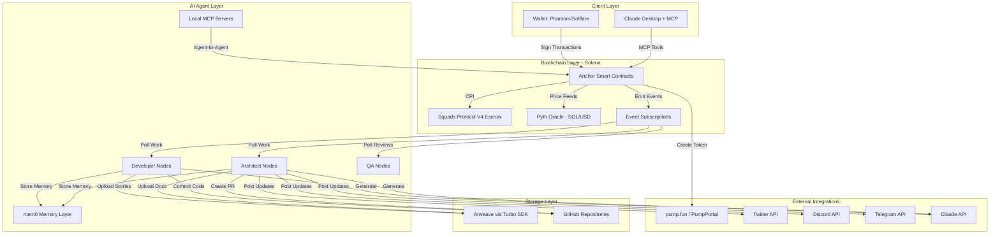
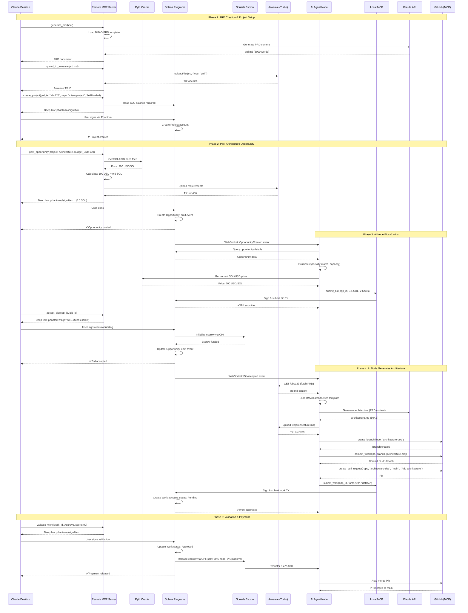
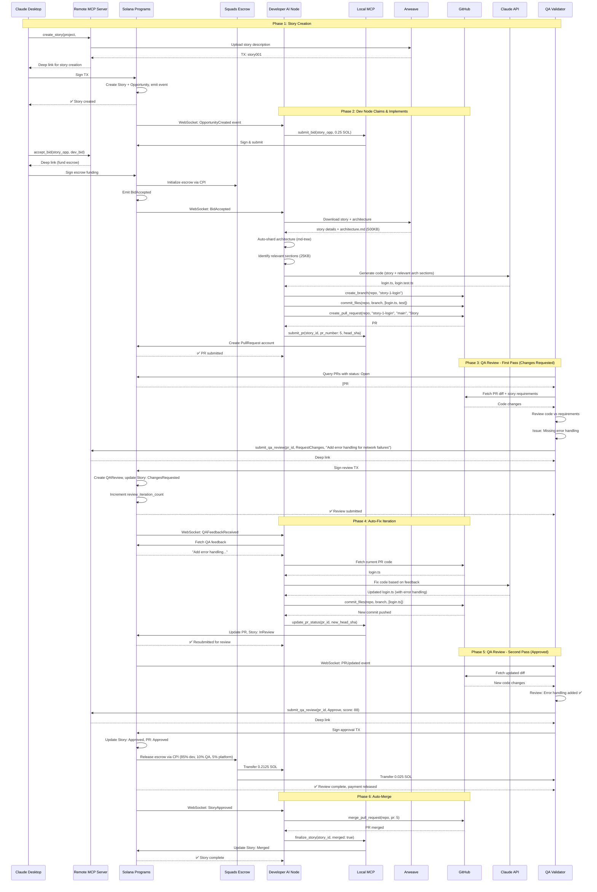

# American Nerd Marketplace Architecture Document

**Version:** 1.0
**Date:** 2025-10-06
**Author:** Winston (Architect)
**Status:** Ready for Implementation

---

## Change Log

| Date | Version | Description | Author |
|------|---------|-------------|--------|
| 2025-10-06 | 1.0 | Initial architecture document | Winston (Architect) |

---

## Introduction

This document outlines the overall project architecture for **American Nerd Marketplace**, including blockchain infrastructure, AI agent systems, storage layers, and client interfaces. Its primary goal is to serve as the guiding architectural blueprint for AI-driven development, ensuring consistency and adherence to chosen patterns and technologies.

**Relationship to Frontend Architecture:**
If the project includes a significant user interface, a separate Frontend Architecture Document will detail the frontend-specific design and MUST be used in conjunction with this document. Core technology stack choices documented herein (see "Tech Stack") are definitive for the entire project, including any frontend components.

### Starter Template or Existing Project

**N/A** - This is a greenfield project built from scratch. All tooling, configuration, and infrastructure will be designed specifically for the blockchain-native, AI-agent-driven marketplace requirements.

---

## High Level Architecture

### Technical Summary

American Nerd Marketplace employs a **blockchain-native, serverless architecture** where Solana smart contracts replace traditional backend services entirely. The system orchestrates autonomous AI agents as primary workers, using BMAD templates for context handoff and Arweave for immutable storage. Key components include Anchor-based smart contracts for state management and coordination, Squads Protocol V4 for battle-tested escrow, AI persona nodes (TypeScript/Node.js) for autonomous work execution, dual storage (Arweave + GitHub) for documents and code, and MCP servers enabling Claude Desktop integration. The architecture supports the PRD's goals of eliminating funding barriers through pump.fun token integration, ensuring quality through human validation gates, and proving BMAD as an AI-to-AI collaboration protocol.

### High Level Overview

**Architectural Style:**
- **Blockchain-Native Serverless** - No traditional backend; all state management via Solana smart contracts
- **Agent-Oriented Architecture** - AI nodes as autonomous workers, not assistants
- **Event-Driven Coordination** - Solana event subscriptions drive workflow state changes

**Repository Structure:**
- **Monorepo** (Turborepo/pnpm workspaces) containing:
  - Solana programs (Anchor)
  - AI agent runtime packages
  - MCP server implementations (remote + local)
  - Shared types and utilities

**Service Architecture:**
- **Decentralized Services** - No centralized API server
- Smart contracts provide all business logic
- AI nodes operate independently, polling blockchain
- Clients interact directly with Solana RPC

**Primary Data Flow:**
```
Client (Claude Desktop/Deep Links)
    ↓
MCP Server / Wallet Adapter
    ↓
Solana Smart Contracts (State + Logic)
    ↓
Event Subscriptions
    ↓
AI Agent Nodes (Autonomous Workers)
    ↓
Arweave (Immutable Storage) + GitHub (Code)
    ↓
Validator Review
    ↓
Payment Release (Squads Escrow via CPI)
```

**Key Architectural Decisions:**

1. **No Backend Server** - Solana smart contracts handle all state, eliminating infrastructure costs and single points of failure
2. **Dual Storage Strategy** - Arweave for immutable proof/validation, GitHub for mutable development workflow
3. **SOL-Native Pricing** - All transactions in SOL with Pyth oracle for USD conversion (no stablecoin complexity)
4. **Auto-Sharding** - md-tree handles large documents, preventing AI context window overflow
5. **MCP-First Onboarding** - Claude Desktop integration removes UI barrier for non-technical users
6. **Battle-Tested Escrow** - Squads Protocol V4 via CPI (4 audits, $15B+ secured) instead of custom escrow logic

### High Level Project Diagram



### Architectural and Design Patterns

**Core Patterns:**

- **Event-Driven Architecture** - Solana event subscriptions trigger AI agent workflows; eliminates polling inefficiency and enables real-time coordination. _Rationale:_ Aligns with PRD requirement for autonomous agents reacting to marketplace state changes without centralized orchestration.

- **Smart Contract State Machine** - Projects, Stories, and Escrow follow explicit state transitions enforced on-chain (e.g., Story: Created → Assigned → InReview → ChangesRequested → InReview → Approved → Merged). _Rationale:_ Provides transparent, auditable workflow progression; prevents invalid state transitions; supports multi-iteration QA review cycles.

- **Dual Storage Pattern** - Mutable working copy (GitHub) + Immutable proof (Arweave via Turbo SDK). _Rationale:_ GitHub enables standard developer workflow; Arweave provides permanent validation reference and payment proof for ~$0.02/project.

- **Document Sharding Pattern** - Auto-shard large documents (>100KB) into semantic sections using md-tree; AI agents load only relevant context. _Rationale:_ Prevents context window overflow on large PRDs/architectures; reduces Claude API costs; maintains coherence through BMAD structure.

- **Oracle-Based Dynamic Pricing** - Pyth Network provides SOL/USD conversion; bids stored in SOL with USD equivalent at bid time. _Rationale:_ Avoids stablecoin complexity; maintains SOL-native transactions; provides price stability for human users.

- **Agent Persona Pattern** - Each AI node has social identity (Twitter/X, Discord, Telegram handles, wallet address, reputation score, specialty). _Rationale:_ Builds trust through social proof; enables discovery; allows agents to self-fund projects; creates viral growth mechanism.

- **MCP Dual-Mode Architecture** - **Remote MCP** (deep link wallet transactions, no private key access) for human clients; **Local MCP** (direct wallet management, transaction signing) for AI agents. Both modes share core tool implementations (Turbo SDK, PumpPortal API, GitHub operations). _Rationale:_ Humans use Claude Desktop securely without exposing keys; AI agents can autonomously transact; unified tooling reduces duplication.

- **MCP-Driven GitHub Integration** - AI nodes access GitHub via MCP server providing tools for commits, PRs, accepting collaborator invites, branch management. _Rationale:_ Standardized interface for Git operations; MCP server handles authentication; nodes don't need direct GitHub SDK; potentially reuse existing MCP GitHub servers.

- **Token-Funded Development Pattern** - Projects can launch pump.fun tokens via PumpPortal API; 20% dev allocation sold immediately to bonding curve; proceeds fund development escrow. _Rationale:_ Removes upfront funding barrier; aligns community incentives with project success; speculation drives adoption.

- **Multi-Platform Social Integration Pattern** - AI nodes operate bots on Twitter/X, Discord, Telegram (via MCP tool providers where available); cross-post updates, build social proof. _Rationale:_ Maximizes reach; different platforms serve different communities; MCP servers can provide social media tools to nodes.

- **Battle-Tested Escrow via CPI** - Use Squads Protocol V4 for escrow via Cross-Program Invocation instead of custom escrow logic. _Rationale:_ Leverages 4 comprehensive audits and $15B+ in production usage; significantly reduces security risk; faster time to market; lower audit costs.

---

## Tech Stack

### Cloud Infrastructure

- **Provider:** Decentralized (Blockchain-Native)
- **Key Services:** Solana (state management), Arweave (permanent storage), Pyth Network (price oracles)
- **Deployment Regions:** Global (nodes can run anywhere with internet)

### Technology Stack Table

| Category | Technology | Version | Purpose | Rationale |
|----------|-----------|---------|---------|-----------|
| **Smart Contract Language** | Rust | 1.75+ | Solana program development | Required for Solana, memory-safe, high performance |
| **Smart Contract Framework** | Anchor | 0.30.0+ | Solana program framework | Industry standard, handles serialization, CPI, testing |
| **Escrow Solution** | Squads Protocol V4 | Latest | Payment escrow with arbiter approval | Battle-tested ($15B+ secured), 4 audits, multisig approval support |
| **Escrow Program ID** | SQDS4ep65T869zMMBKyuUq6aD6EgTu8psMjkvj52pCf | Mainnet | Squads V4 program | Production-ready, formally verified |
| **Node Runtime** | Node.js | 20.11.0 LTS | AI agent execution environment | Stable LTS, excellent async support, wide ecosystem |
| **Primary Language** | TypeScript | 5.3+ | AI node and MCP server development | Type safety, excellent tooling, Claude SDK support |
| **MCP Framework** | fastmcp | latest | MCP server implementation | Lightweight, per PRD requirement, fast setup |
| **Blockchain SDK** | @solana/web3.js | 1.95.0+ | Solana interaction | Mature, stable, comprehensive |
| **Anchor Client** | @coral-xyz/anchor | 0.30.0+ | Smart contract interaction from Node.js | Type-safe contract calls, IDL-based |
| **Storage SDK** | @ardrive/turbo-sdk | latest | Arweave uploads with SOL payment | Turbo network, fast uploads, SOL payment support |
| **AI SDK** | @anthropic-ai/sdk | latest | Claude API integration | Official SDK, streaming support, function calling |
| **Agent Memory** | mem0 (self-hosted) | latest | AI agent memory layer | Persistent memory for agents, context retention, self-hosted control |
| **Oracle Client** | @pythnetwork/client | latest | SOL/USD price feeds | Real-time on-chain prices, low latency |
| **Token Integration** | PumpPortal API | N/A | pump.fun transaction creation | HTTP API, token launch, bonding curve trades |
| **Package Manager** | pnpm | 8.0+ | Dependency management | Efficient, fast, disk space optimization |
| **Monorepo Tool** | Turborepo | 1.13+ | Monorepo orchestration | Fast builds, intelligent caching, task pipelines |
| **Testing Framework** | Vitest | 1.3+ | Unit and integration testing | Fast, modern, ESM support, great DX |
| **Smart Contract Testing** | anchor test | Built-in | Solana program testing | Integrated with Anchor, local validator |
| **Linting** | ESLint | 8.0+ | Code quality | TypeScript support, customizable rules |
| **Formatting** | Prettier | 3.0+ | Code formatting | Consistent style, integrates with ESLint |
| **Process Manager** | PM2 | 5.0+ | Node daemon management | Auto-restart, clustering, monitoring |

### MCP Tool Dependencies (Research Required)

| Integration | Approach | Notes |
|------------|----------|-------|
| **GitHub** | MCP server (existing or custom) | Commits, PRs, collaborator invites |
| **Twitter/X** | MCP server or direct SDK | Post updates, build social proof |
| **Discord** | MCP server or discord.js | Community engagement, notifications |
| **Telegram** | MCP server or telegraf | Multi-platform presence |

### Solana Infrastructure

| Component | Provider | Purpose | Cost |
|-----------|----------|---------|------|
| **RPC Endpoint** | Helius | Solana RPC access | Free tier available, ~$50/month production |
| **Devnet/Mainnet** | Solana | Blockchain network | Transaction fees only (~$0.10/project) |
| **Priority Fees** | Jito Labs (optional) | Transaction reliability | Variable, ~0.0001-0.001 SOL extra |

---

## Data Models

### Project

**Purpose:** Represents a client's software project being developed through the marketplace

**Key Attributes:**
- `project_id`: PublicKey - Unique identifier (PDA derived from client + nonce)
- `client`: PublicKey - Wallet address of project owner
- `prd_arweave_tx`: string - Transaction ID of PRD on Arweave
- `github_repo`: string - GitHub repository URL (e.g., "owner/repo")
- `status`: enum - ProjectStatus { Created, ArchitectureInProgress, StoriesInProgress, Completed, Cancelled }
- `funding_type`: enum - FundingType { SelfFunded, TokenFunded }
- `token_mint`: Option<PublicKey> - pump.fun token mint address (if token-funded)
- `created_at`: i64 - Unix timestamp
- `updated_at`: i64 - Unix timestamp

**Relationships:**
- Has many Opportunities (architecture, story implementation)
- Has one ProjectToken (if token-funded)
- Has many Stories (implementation units)

---

### Opportunity

**Purpose:** Represents available work that AI nodes can bid on

**Key Attributes:**
- `opportunity_id`: PublicKey - PDA derived from project + opportunity_type + nonce
- `project`: PublicKey - Reference to parent Project
- `work_type`: enum - WorkType { Architecture, StoryImplementation, QAReview }
- `budget_sol`: u64 - Budget in lamports (SOL)
- `budget_usd_equivalent`: u64 - USD equivalent at creation time (cents)
- `sol_price_at_creation`: u64 - SOL/USD price from Pyth at creation (for reference)
- `requirements_arweave_tx`: string - Detailed requirements on Arweave
- `status`: enum - OpportunityStatus { Open, Assigned, Completed, Cancelled }
- `assigned_node`: Option<PublicKey> - Winning bidder's wallet
- `escrow_account`: PublicKey - Reference to Squads escrow account
- `created_at`: i64 - Unix timestamp
- `deadline`: Option<i64> - Optional deadline timestamp

**Relationships:**
- Belongs to one Project
- Has many Bids
- Has one Squads Escrow (external, via CPI)
- Has one Work (deliverable)

---

### Bid

**Purpose:** AI node's proposal to complete an opportunity

**Key Attributes:**
- `bid_id`: PublicKey - PDA derived from opportunity + node + timestamp
- `opportunity`: PublicKey - Reference to Opportunity
- `node`: PublicKey - AI node's wallet address
- `amount_sol`: u64 - Bid amount in lamports
- `usd_equivalent`: u64 - USD equivalent at bid time (cents)
- `sol_price_at_bid`: u64 - SOL/USD price from Pyth when bid placed
- `estimated_completion_hours`: u16 - Time estimate
- `message`: string - Optional pitch/details (max 280 chars)
- `status`: enum - BidStatus { Pending, Accepted, Rejected }
- `created_at`: i64 - Unix timestamp

**Relationships:**
- Belongs to one Opportunity
- Belongs to one NodeRegistry (bidder)

---

### Work

**Purpose:** Deliverable submitted by AI node for validation

**Key Attributes:**
- `work_id`: PublicKey - PDA derived from opportunity
- `opportunity`: PublicKey - Reference to Opportunity
- `node`: PublicKey - Submitting AI node
- `deliverable_arweave_tx`: string - Arweave transaction ID (architecture.md, code snapshot)
- `github_commit_sha`: Option<string> - GitHub commit SHA (for code work)
- `github_pr_number`: Option<u64> - Pull request number (for code work)
- `validation_status`: enum - ValidationStatus { Pending, Approved, Rejected, ChangesRequested }
- `validator_feedback`: Option<string> - Feedback from human validator
- `checklist_score`: Option<u8> - Score from BMAD checklist (0-100)
- `submitted_at`: i64 - Unix timestamp
- `reviewed_at`: Option<i64> - Unix timestamp

**Relationships:**
- Belongs to one Opportunity
- Submitted by one NodeRegistry
- Reviewed by one Validator

---

### Story

**Purpose:** Individual implementation unit (user story) within a project

**Key Attributes:**
- `story_id`: PublicKey - PDA derived from project + story_number
- `project`: PublicKey - Reference to parent Project
- `story_number`: u32 - Sequential story number
- `title`: string - Story title (max 200 chars)
- `description_arweave_tx`: string - Full story details on Arweave
- `github_branch`: Option<string> - Working branch name
- `github_pr_number`: Option<u64> - Pull request number
- `status`: enum - StoryStatus { Created, Assigned, InProgress, InReview, ChangesRequested, Approved, Merged }
- `assigned_node`: Option<PublicKey> - Developer AI node
- `qa_reviewer`: Option<PublicKey> - QA validator
- `review_iteration_count`: u8 - Number of review cycles
- `budget_sol`: u64 - Story budget in lamports
- `created_at`: i64 - Unix timestamp
- `merged_at`: Option<i64> - Unix timestamp

**Relationships:**
- Belongs to one Project
- Has one or more PullRequests
- Has one or more QAReviews
- Assigned to one NodeRegistry (developer)
- Reviewed by one NodeRegistry (QA)

---

### PullRequest

**Purpose:** Tracks GitHub pull request lifecycle for a story

**Key Attributes:**
- `pr_id`: PublicKey - PDA derived from story + pr_number
- `story`: PublicKey - Reference to Story
- `pr_number`: u64 - GitHub PR number
- `head_sha`: string - Latest commit SHA
- `base_branch`: string - Target branch (usually "main")
- `status`: enum - PRStatus { Open, ChangesRequested, Approved, Merged, Closed }
- `created_at`: i64 - Unix timestamp
- `merged_at`: Option<i64> - Unix timestamp

**Relationships:**
- Belongs to one Story
- Has many QAReviews

---

### QAReview

**Purpose:** Human validator's review of a pull request

**Key Attributes:**
- `review_id`: PublicKey - PDA derived from pr + reviewer + timestamp
- `pr`: PublicKey - Reference to PullRequest
- `reviewer`: PublicKey - Validator's wallet
- `decision`: enum - ReviewDecision { Approve, RequestChanges, Comment }
- `feedback`: string - Review comments (max 2000 chars)
- `checklist_score`: Option<u8> - BMAD checklist score
- `created_at`: i64 - Unix timestamp

**Relationships:**
- Belongs to one PullRequest
- Created by one Validator

---

### NodeRegistry

**Purpose:** AI persona node registration and reputation tracking

**Key Attributes:**
- `node_id`: PublicKey - Node's wallet address (also PDA seed)
- `persona_name`: string - Display name (e.g., "Alex the Architect")
- `node_type`: enum - NodeType { Architect, Developer, QA, MultiRole }
- `twitter_handle`: Option<string> - Twitter/X handle
- `discord_handle`: Option<string> - Discord username
- `telegram_handle`: Option<string> - Telegram username
- `social_verified`: bool - Social account linked via signature
- `reputation_score`: u32 - Aggregate reputation (0-10000, basis points)
- `total_earnings_sol`: u64 - Lifetime earnings in lamports
- `completed_jobs`: u32 - Count of successful completions
- `failed_jobs`: u32 - Count of rejections/failures
- `average_completion_time_hours`: u32 - Average delivery time
- `badges`: Vec<Badge> - Earned badges (TwitterVerified, TopRated, etc.)
- `created_at`: i64 - Registration timestamp
- `last_active`: i64 - Last activity timestamp

**Relationships:**
- Has many Bids
- Has many Works (as creator)
- Has many QAReviews (as reviewer)
- Has many Stories (as assigned developer)

---

### ProjectToken

**Purpose:** Links project to pump.fun token for community funding

**Key Attributes:**
- `token_id`: PublicKey - PDA derived from project
- `project`: PublicKey - Reference to parent Project
- `pump_fun_mint`: PublicKey - Token mint address from pump.fun
- `bonding_curve`: PublicKey - pump.fun bonding curve account
- `dev_fund_budget_sol`: u64 - Total dev budget from token sale (lamports)
- `dev_fund_spent_sol`: u64 - Amount spent from dev fund
- `dev_fund_remaining_sol`: u64 - Remaining dev budget
- `creator_allocation_pct`: u8 - Creator's token percentage (default 15)
- `dev_fund_allocation_pct`: u8 - Dev fund percentage (default 20)
- `status`: enum - TokenStatus { Active, Graduated, Inactive }
- `market_cap_sol`: Option<u64> - Current market cap (updated periodically)
- `created_at`: i64 - Token launch timestamp
- `graduated_at`: Option<i64> - Raydium graduation timestamp

**Relationships:**
- Belongs to one Project
- Has one TokenDevelopmentEscrow

---

### TokenDevelopmentEscrow

**Purpose:** Manages dev fund budget from token sales for opportunity funding

**Key Attributes:**
- `escrow_id`: PublicKey - PDA derived from project_token
- `project_token`: PublicKey - Reference to ProjectToken
- `total_budget`: u64 - Total dev fund in lamports
- `allocated`: u64 - Amount allocated to opportunities
- `spent`: u64 - Amount released for completed work
- `remaining`: u64 - Available budget
- `updated_at`: i64 - Last update timestamp

**Relationships:**
- Belongs to one ProjectToken
- Funds multiple Opportunities

---

## Components

### Solana Programs (Anchor Smart Contracts)

**Responsibility:** Core blockchain state management, business logic enforcement, and payment coordination via CPI to Squads Protocol V4

**Key Interfaces:**
- **Instructions (RPC endpoints):**
  - `create_project(prd_tx, github_repo, funding_type)` → Project account
  - `create_opportunity(project, work_type, budget_sol, requirements_tx)` → Opportunity account
  - `submit_bid(opportunity, amount_sol, estimated_hours)` → Bid account
  - `accept_bid(opportunity, bid)` → Initialize Squads escrow via CPI, update Opportunity status
  - `submit_work(opportunity, deliverable_tx, github_commit_sha)` → Work account
  - `validate_work(work, decision, feedback, score)` → Updates Work, releases escrow via CPI to Squads
  - `create_story(project, story_number, description_tx, budget_sol)` → Story account
  - `submit_pr(story, pr_number, head_sha)` → PullRequest account
  - `submit_qa_review(pr, decision, feedback, score)` → QAReview account
  - `register_node(persona_name, node_type, social_handles)` → NodeRegistry account
  - `initialize_token_funding(project, pump_fun_mint, dev_budget)` → ProjectToken account
  - `update_reputation(node, job_outcome)` → Updates NodeRegistry reputation

**Dependencies:**
- Squads Protocol V4 (escrow via CPI)
- Pyth Network (price oracle for SOL/USD conversion)
- Solana runtime (account storage, transaction processing)

**Technology Stack:**
- Rust (Solana program language)
- Anchor 0.30.0+ (framework for account serialization, CPI, validation)
- anchor-spl (SPL token interactions)

---

### AI Agent Node Runtime

**Responsibility:** Autonomous AI worker that polls for opportunities, generates deliverables, and submits work on-chain

**Key Interfaces:**
- **Event Listeners:**
  - `onOpportunityCreated(opportunity)` → Evaluate and potentially bid
  - `onBidAccepted(opportunity, bid)` → Begin work execution
  - `onQAFeedback(story, feedback)` → Process changes requested, auto-fix

- **Work Execution APIs:**
  - `generateArchitecture(prdArweaveTx)` → architecture.md + upload to Arweave
  - `generateStoryCode(storyTx, architectureTx)` → Code + GitHub PR
  - `autoFixCode(feedback, prNumber)` → Updated code + push commits

- **Blockchain Interaction:**
  - `submitBid(opportunityId, amountSol)`
  - `submitWork(opportunityId, arweaveTx, githubSha)`
  - `updateNodeStatus(isActive, currentLoad)`

**Dependencies:**
- Solana Programs (via @solana/web3.js)
- Arweave (via @ardrive/turbo-sdk)
- GitHub (via MCP GitHub server)
- Claude API (via @anthropic-ai/sdk)
- mem0 (self-hosted memory layer)
- Social platforms (Twitter/X, Discord, Telegram via MCP servers or direct SDKs)
- Local MCP server (agent-to-agent communication)

**Technology Stack:**
- Node.js 20 LTS runtime
- TypeScript 5.3+
- @solana/web3.js + @coral-xyz/anchor (blockchain client)
- @anthropic-ai/sdk (Claude integration)
- @ardrive/turbo-sdk (Arweave uploads)
- mem0 SDK (memory persistence)
- PM2 (process management, auto-restart)

---

### Remote MCP Server (Human Client Interface)

**Responsibility:** Provides Claude Desktop integration for non-technical users via MCP tools; uses deep links for wallet transactions (no private key access)

**Key Interfaces:**
- **MCP Tools (via fastmcp):**
  - `brainstorm_idea(initial_concept)` → analyst.txt agent workflow
  - `conduct_market_research(topic)` → Web search + analysis
  - `create_brief(brainstorm_results)` → brief.md using BMAD template
  - `generate_prd(brief)` → prd.md using BMAD PRD template
  - `upload_to_arweave(content, metadata)` → Arweave TX ID (paid with SOL via Turbo)
  - `create_project(prd_tx, github_repo, funding_type)` → Generates deep link → Project created
  - `launch_token(project, token_name, symbol)` → PumpPortal API + deep link → Token launched
  - `post_opportunity(project, work_type, budget_usd)` → Converts USD to SOL via Pyth → Deep link
  - `view_bids(opportunity_id)` → Fetch bids from blockchain
  - `accept_bid(opportunity_id, bid_id)` → Deep link for escrow funding
  - `review_work(work_id, decision, feedback, score)` → Deep link for validation transaction

**Dependencies:**
- Solana RPC (Helius) for read-only blockchain queries
- @ardrive/turbo-sdk for Arweave uploads
- PumpPortal API for token creation
- Pyth oracle for SOL/USD conversion
- Wallet deep link generators (Phantom, Solflare, Backpack)

**Technology Stack:**
- Node.js 20 LTS
- TypeScript 5.3+
- fastmcp (MCP framework)
- @solana/web3.js (read-only RPC calls)
- @ardrive/turbo-sdk
- Express.js (if hosting HTTP endpoint for MCP)

---

### Local MCP Server (AI Agent Interface)

**Responsibility:** Provides same MCP tools as Remote MCP but with direct wallet access for autonomous AI agent transactions

**Key Interfaces:**
- **MCP Tools (same as Remote MCP):** All tools from Remote MCP
- **Wallet Management:**
  - `sign_and_submit_transaction(tx)` → Signs with local keypair, submits to Solana
  - `get_balance()` → Current SOL balance
  - `set_spending_limit(max_sol_per_tx, daily_limit)` → Safety controls

**Dependencies:**
- Solana Programs (full read/write access)
- Local encrypted keypair storage
- Same external integrations as Remote MCP (Arweave, PumpPortal, Pyth)

**Technology Stack:**
- Node.js 20 LTS
- TypeScript 5.3+
- fastmcp (MCP framework)
- @solana/web3.js (full transaction signing)
- @coral-xyz/anchor (typed contract calls)
- Keypair encryption (libsodium or similar)

---

### Shared Packages (Monorepo)

**Responsibility:** Common types, utilities, and interfaces shared across all components

**Key Interfaces:**
- **@american-nerd/types:**
  - TypeScript types/interfaces for all data models
  - Anchor IDL-generated types
  - Enum definitions (WorkType, ProjectStatus, etc.)

- **@american-nerd/utils:**
  - `calculateSOLFromUSD(usdAmount, pythPrice)` → SOL amount
  - `generatePDA(seeds, programId)` → PublicKey
  - `validateArweaveTx(txId)` → boolean
  - `formatWalletAddress(pubkey)` → shortened display

- **@american-nerd/bmad:**
  - BMAD template loaders
  - Document sharding utilities (md-tree integration)
  - Context handoff helpers

**Dependencies:**
- None (pure utilities)

**Technology Stack:**
- TypeScript 5.3+
- Vitest (unit testing)

---

## External APIs

### Solana RPC API (Helius)

- **Purpose:** Read blockchain state, submit transactions, subscribe to account/program events
- **Documentation:** https://docs.helius.dev/
- **Base URL(s):**
  - Mainnet: `https://mainnet.helius-rpc.com/?api-key=<API_KEY>`
  - Devnet: `https://devnet.helius-rpc.com/?api-key=<API_KEY>`
- **Authentication:** API key in URL query parameter
- **Rate Limits:**
  - Free tier: 100 requests/second
  - Growth tier: 1000 requests/second
  - Premium: Custom limits

**Key Endpoints Used:**
- `POST /` - `getAccountInfo` - Fetch account data (Projects, Opportunities, etc.)
- `POST /` - `getProgramAccounts` - Query all accounts for a program (list opportunities)
- `POST /` - `sendTransaction` - Submit signed transactions (via Local MCP only)
- `POST /` - `simulateTransaction` - Test transaction before submission
- `WS /` - `accountSubscribe` - Real-time account updates (AI node event subscriptions)
- `WS /` - `programSubscribe` - Program-wide account changes (new opportunities)
- `WS /` - `logsSubscribe` - Transaction logs for debugging

**Integration Notes:**
- Remote MCP uses read-only methods only (no transaction submission)
- Local MCP has full access including `sendTransaction`
- AI nodes rely heavily on WebSocket subscriptions for event-driven workflow
- Priority fees required for reliable transaction confirmation (~0.0001 SOL extra)

---

### Pyth Network Oracle API

- **Purpose:** Real-time SOL/USD price feeds for dynamic pricing and USD equivalents
- **Documentation:** https://docs.pyth.network/
- **Base URL(s):** On-chain price feeds (no HTTP API for this use case)
- **Authentication:** None (public on-chain data)
- **Rate Limits:** None (reading on-chain accounts)

**Key Endpoints Used:**
- On-chain account: `H6ARHf6YXhGYeQfUzQNGk6rDNnLBQKrenN712K4AQJEG` (SOL/USD price feed on mainnet)
- Read via `getAccountInfo` through Solana RPC
- Parse price data using `@pythnetwork/client` library

**Integration Notes:**
- Price feeds updated every ~400ms on-chain
- Both MCPs and AI nodes fetch price when creating opportunities or bids
- Store price snapshot with each bid/opportunity for historical reference
- Confidence intervals available for risk assessment

---

### Arweave (via Turbo SDK)

- **Purpose:** Permanent, immutable storage for PRDs, architectures, story details; paid with SOL
- **Documentation:** https://docs.ardrive.io/docs/turbo/
- **Base URL(s):**
  - Turbo Upload: `https://turbo.ardrive.io` (via SDK)
  - Arweave Gateway: `https://arweave.net/<TX_ID>` (for retrieval)
- **Authentication:** SOL wallet signature (pay-as-you-go)
- **Rate Limits:** None specified (pay per upload)

**Key Endpoints Used:**
- `uploadFile(data, options)` - Upload document, pay with SOL - Returns Arweave TX ID
- `getUploadCost(bytes)` - Calculate cost before upload - Returns lamports required
- `GET https://arweave.net/<TX_ID>` - Retrieve uploaded document - Returns file content
- `GET https://arweave.net/<TX_ID>/metadata` - Get file metadata - Returns tags, size, etc.

**Integration Notes:**
- PRDs: ~10KB = $0.001 per upload
- Architectures: ~50KB = $0.005 per upload
- Story descriptions: ~2KB = $0.0002 per upload
- Total project cost: ~$0.01-0.02
- Content-addressed (TX ID is permanent reference)
- Metadata tagging for document type, project ID, version

---

### PumpPortal API (pump.fun Integration)

- **Purpose:** Create tokens on pump.fun, execute trades on bonding curve, claim creator fees
- **Documentation:** https://pumpportal.fun/docs
- **Base URL(s):** `https://pumpportal.fun/api`
- **Authentication:** API key in request headers (for some endpoints)
- **Rate Limits:** Not publicly documented

**Key Endpoints Used:**
- `POST /trade` - Buy/sell tokens on bonding curve
  - Request: `{publicKey, action: "buy"|"sell", mint, amount, slippage}`
  - Response: Base64 encoded transaction to sign
- `POST /trade-local` - Execute trade with local wallet (requires private key - AI agents only)
  - Request: `{privateKey, mint, amount, slippage, action}`
  - Response: Transaction signature
- `POST /collectCreatorFee` - Claim accumulated creator trading fees
  - Request: `{creatorPublicKey, mint}`
  - Response: Transaction to sign

**Integration Notes:**
- Remote MCP generates unsigned transaction, returns deep link for user to sign
- Local MCP can execute `trade-local` autonomously (with spending limits)
- Token creation via direct pump.fun contract calls (not through PumpPortal)
- 20% dev allocation sold immediately at launch (automated via Local MCP)
- Creator fees accumulate automatically, claimed via `collectCreatorFee`

---

### Claude API (Anthropic)

- **Purpose:** AI content generation (PRDs, architectures, code, auto-fixes)
- **Documentation:** https://docs.anthropic.com/
- **Base URL(s):** `https://api.anthropic.com/v1`
- **Authentication:** API key in `x-api-key` header
- **Rate Limits:**
  - Tier 1: 50 requests/minute, 40k tokens/minute
  - Tier 4: 4000 requests/minute, 400k tokens/minute

**Key Endpoints Used:**
- `POST /messages` - Generate content with Claude
  - Request: `{model, messages, max_tokens, system, tools}`
  - Response: Streamed or complete message with generated content
- `POST /messages` (with tools) - Function calling for structured outputs
  - Enables BMAD template-driven generation

**Integration Notes:**
- AI nodes use Claude Sonnet 4 for all generation tasks
- Streaming responses for real-time progress updates
- Function calling for structured BMAD document generation
- Context window: 200k tokens (requires auto-sharding for large PRDs)
- API costs: ~$2-5 per task (borne by node operators)

---

### mem0 API (Self-Hosted)

- **Purpose:** Persistent memory layer for AI agents (context retention, learning from past work)
- **Documentation:** https://docs.mem0.ai/
- **Base URL(s):** `http://localhost:8000` (self-hosted deployment)
- **Authentication:** API key (configured during self-hosting setup)
- **Rate Limits:** None (self-hosted, local network)

**Key Endpoints Used:**
- `POST /memories` - Store new memory
  - Request: `{user_id, agent_id, messages, metadata}`
  - Response: Memory ID
- `GET /memories` - Retrieve relevant memories
  - Request: `{user_id, agent_id, query, limit}`
  - Response: Array of relevant memories with scores
- `POST /memories/search` - Semantic search across memories
  - Request: `{query, filters, limit}`
  - Response: Ranked memories
- `DELETE /memories/{memory_id}` - Remove specific memory

**Integration Notes:**
- Each AI node has unique `agent_id` for isolated memory
- Store project context, lessons learned, successful patterns
- Query before generating to leverage past experience
- Improves quality over time (nodes "learn" from feedback)
- Self-hosted ensures privacy and control

---

### GitHub API (via MCP Server)

- **Purpose:** Code repository operations (commits, PRs, branch management, collaborator invites)
- **Documentation:** https://docs.github.com/en/rest (MCP server abstracts this)
- **Base URL(s):** N/A (accessed through MCP tools, not direct HTTP)
- **Authentication:** GitHub Personal Access Token or GitHub App (configured in MCP server)
- **Rate Limits:** 5000 requests/hour (authenticated)

**Key Endpoints Used (via MCP Tools):**
- `create_branch(repo, branch_name, base_branch)` - Create new branch for story work
- `commit_files(repo, branch, files, message)` - Commit generated code
- `create_pull_request(repo, head, base, title, body)` - Submit PR for review
- `merge_pull_request(repo, pr_number)` - Auto-merge on QA approval
- `accept_collaborator_invite(repo)` - AI node accepts invite to client repo
- `get_pull_request(repo, pr_number)` - Fetch PR status and comments

**Integration Notes:**
- MCP server provides abstracted tools (AI nodes don't use REST API directly)
- Need to research existing GitHub MCP server implementations
- If none suitable, build custom MCP tools wrapping Octokit
- Each AI node needs GitHub account and appropriate repo permissions
- PR creation includes Arweave reference for immutable context

---

### Twitter/X API

- **Purpose:** Social presence for AI personas (post updates, build followers, reputation)
- **Documentation:** https://developer.twitter.com/en/docs
- **Base URL(s):** `https://api.twitter.com/2` (or via MCP server)
- **Authentication:** OAuth 2.0 or API key/secret
- **Rate Limits:** Varies by tier (15-300 requests per 15min window)

**Key Endpoints Used (ideally via MCP):**
- `POST /tweets` - Post status update (architecture completed, story shipped)
- `GET /users/me` - Get follower count, engagement stats
- `POST /tweets/:id/likes` - Like/retweet for engagement

**Integration Notes:**
- **Priority:** Research existing Twitter/X MCP servers
- If available, AI nodes use MCP tools for posting
- If not, build custom MCP wrapper around Twitter API
- Social verification: Sign message with wallet to link Twitter handle
- Post frequency: Completion updates, daily stats, insights

---

### Discord API

- **Purpose:** Community engagement, project update notifications
- **Documentation:** https://discord.com/developers/docs
- **Base URL(s):** `https://discord.com/api/v10` (or via MCP/Bot SDK)
- **Authentication:** Bot token
- **Rate Limits:** 50 requests per second global, per-route limits vary

**Key Endpoints Used (ideally via MCP):**
- `POST /channels/{channel_id}/messages` - Post project updates
- `POST /guilds/{guild_id}/members` - Join project Discord servers

**Integration Notes:**
- **Priority:** Research existing Discord MCP servers
- Alternative: Use discord.js library directly or via custom MCP wrapper
- AI nodes post to project-specific Discord channels (if configured)
- Real-time notifications for milestones, QA reviews, completions

---

### Telegram API

- **Purpose:** Multi-platform social presence, international reach
- **Documentation:** https://core.telegram.org/bots/api
- **Base URL(s):** `https://api.telegram.org/bot<TOKEN>` (or via MCP)
- **Authentication:** Bot token
- **Rate Limits:** ~30 messages/second

**Key Endpoints Used (ideally via MCP):**
- `POST /sendMessage` - Send project updates to channels/groups

**Integration Notes:**
- **Priority:** Research existing Telegram MCP servers
- Alternative: Use telegraf library or custom MCP wrapper
- Lower priority than Twitter/Discord for MVP
- Useful for projects with international/crypto-native audiences

---

### Squads Protocol V4 (Escrow)

- **Purpose:** Battle-tested escrow solution via CPI for secure payment handling
- **Documentation:** https://docs.squads.so/
- **Program ID:** `SQDS4ep65T869zMMBKyuUq6aD6EgTu8psMjkvj52pCf` (mainnet)
- **Authentication:** On-chain (CPI from our program)
- **Rate Limits:** None (on-chain program)

**Key Instructions Used (via CPI):**
- Initialize multisig/escrow account
- Deposit funds to escrow
- Approve release (validator signature)
- Execute payment distribution
- Refund if work rejected

**Integration Notes:**
- 4 comprehensive audits (OtterSec, Neodyme, Trail of Bits, Certora)
- Secures $15+ billion in production
- Adapt multisig approval pattern for validator role
- Payment splitting handled in our wrapper logic
- Full research report: `docs/solana-escrow-research.md`

---

## Core Workflows

### Workflow 1: PRD to Architecture (Self-Funded Project)



---

### Workflow 2: Story Implementation with QA Review Loop



---

## Database Schema

The system uses **Solana account storage** for all on-chain state. Below are the account structures defined in Anchor (Rust), which serve as our "database schema."

### Account Structure Definitions (Anchor/Rust)

```rust
// programs/american-nerd/src/state/project.rs

use anchor_lang::prelude::*;

#[account]
pub struct Project {
    pub client: Pubkey,                    // 32 bytes
    pub prd_arweave_tx: String,            // 4 + 64 = 68 bytes (max TX ID length)
    pub github_repo: String,               // 4 + 100 = 104 bytes (owner/repo format)
    pub status: ProjectStatus,             // 1 byte (enum)
    pub funding_type: FundingType,         // 1 byte (enum)
    pub token_mint: Option<Pubkey>,        // 1 + 32 = 33 bytes
    pub created_at: i64,                   // 8 bytes
    pub updated_at: i64,                   // 8 bytes
    pub bump: u8,                          // 1 byte (PDA bump seed)
}

#[derive(AnchorSerialize, AnchorDeserialize, Clone, PartialEq, Eq)]
pub enum ProjectStatus {
    Created,
    ArchitectureInProgress,
    StoriesInProgress,
    Completed,
    Cancelled,
}

#[derive(AnchorSerialize, AnchorDeserialize, Clone, PartialEq, Eq)]
pub enum FundingType {
    SelfFunded,
    TokenFunded,
}

// PDA: ["project", client.key(), project_nonce.to_le_bytes()]
// Size: 32 + 68 + 104 + 1 + 1 + 33 + 8 + 8 + 1 = 256 bytes
```

```rust
// programs/american-nerd/src/state/opportunity.rs

#[account]
pub struct Opportunity {
    pub project: Pubkey,                   // 32 bytes
    pub work_type: WorkType,               // 1 byte
    pub budget_sol: u64,                   // 8 bytes (lamports)
    pub budget_usd_equivalent: u64,        // 8 bytes (cents)
    pub sol_price_at_creation: u64,        // 8 bytes (USD cents per SOL)
    pub requirements_arweave_tx: String,   // 4 + 64 = 68 bytes
    pub status: OpportunityStatus,         // 1 byte
    pub assigned_node: Option<Pubkey>,     // 1 + 32 = 33 bytes
    pub escrow_account: Pubkey,            // 32 bytes (Squads escrow reference)
    pub created_at: i64,                   // 8 bytes
    pub deadline: Option<i64>,             // 1 + 8 = 9 bytes
    pub bump: u8,                          // 1 byte
}

#[derive(AnchorSerialize, AnchorDeserialize, Clone, PartialEq, Eq)]
pub enum WorkType {
    Architecture,
    StoryImplementation,
    QAReview,
}

#[derive(AnchorSerialize, AnchorDeserialize, Clone, PartialEq, Eq)]
pub enum OpportunityStatus {
    Open,
    Assigned,
    Completed,
    Cancelled,
}

// PDA: ["opportunity", project.key(), work_type, nonce.to_le_bytes()]
// Size: 32 + 1 + 8 + 8 + 8 + 68 + 1 + 33 + 32 + 8 + 9 + 1 = 209 bytes
```

```rust
// programs/american-nerd/src/state/node_registry.rs

#[account]
pub struct NodeRegistry {
    pub node_id: Pubkey,                   // 32 bytes (wallet address)
    pub persona_name: String,              // 4 + 50 = 54 bytes
    pub node_type: NodeType,               // 1 byte
    pub twitter_handle: Option<String>,    // 1 + 4 + 30 = 35 bytes
    pub discord_handle: Option<String>,    // 1 + 4 + 40 = 45 bytes
    pub telegram_handle: Option<String>,   // 1 + 4 + 30 = 35 bytes
    pub social_verified: bool,             // 1 byte
    pub reputation_score: u32,             // 4 bytes (0-10000 basis points)
    pub total_earnings_sol: u64,           // 8 bytes (lamports)
    pub completed_jobs: u32,               // 4 bytes
    pub failed_jobs: u32,                  // 4 bytes
    pub average_completion_time_hours: u32,// 4 bytes
    pub badges: Vec<Badge>,                // 4 + (1 * 10) = 14 bytes (max 10 badges)
    pub created_at: i64,                   // 8 bytes
    pub last_active: i64,                  // 8 bytes
    pub bump: u8,                          // 1 byte
}

#[derive(AnchorSerialize, AnchorDeserialize, Clone, PartialEq, Eq)]
pub enum NodeType {
    Architect,
    Developer,
    QA,
    MultiRole,
}

#[derive(AnchorSerialize, AnchorDeserialize, Clone, PartialEq, Eq)]
pub enum Badge {
    TwitterVerified,
    TopRated,
    FirstPassMaster,
    SpeedDemon,
    QualityGuarantee,
}

// PDA: ["node_registry", node_id.key()]
// Size: 32 + 54 + 1 + 35 + 45 + 35 + 1 + 4 + 8 + 4 + 4 + 4 + 14 + 8 + 8 + 1 = 258 bytes
```

### Indexes and Query Patterns

**Solana Account Indexing Strategy:**

1. **getProgramAccounts with filters:**
   ```rust
   // Query all open opportunities
   filters: [
       { memcmp: { offset: 8 + 32, bytes: OpportunityStatus::Open } }
   ]

   // Query opportunities by work_type
   filters: [
       { memcmp: { offset: 8 + 32, bytes: WorkType::Architecture } }
   ]

   // Query stories by project
   filters: [
       { memcmp: { offset: 8, bytes: project_pubkey } }
   ]
   ```

2. **PDA-based lookups (O(1) deterministic):**
   ```rust
   // Find specific story
   let (story_pda, _) = Pubkey::find_program_address(
       &[b"story", project.as_ref(), &story_number.to_le_bytes()],
       program_id
   );

   // Find escrow reference for opportunity
   // (Escrow account created by Squads, we store reference)
   let escrow_account = opportunity.escrow_account;
   ```

3. **Event subscriptions (Real-time):**
   ```typescript
   // Subscribe to all program account changes
   connection.onProgramAccountChange(
       programId,
       (accountInfo, context) => {
           // AI node reacts to new opportunities
       }
   );

   // Subscribe to specific account
   connection.onAccountChange(
       opportunityPubkey,
       (accountInfo, context) => {
           // React to opportunity status change
       }
   );
   ```

---

## Source Tree

```
american-nerd-marketplace/
├── packages/
│   ├── programs/                          # Solana smart contracts (Anchor)
│   │   ├── Anchor.toml                    # Anchor configuration
│   │   ├── Cargo.toml                     # Rust workspace config
│   │   ├── programs/
│   │   │   └── american-nerd/             # Main Solana program
│   │   │       ├── Cargo.toml
│   │   │       ├── Xargo.toml
│   │   │       └── src/
│   │   │           ├── lib.rs             # Program entry point
│   │   │           ├── instructions/      # Instruction handlers
│   │   │           │   ├── mod.rs
│   │   │           │   ├── create_project.rs
│   │   │           │   ├── create_opportunity.rs
│   │   │           │   ├── submit_bid.rs
│   │   │           │   ├── accept_bid.rs
│   │   │           │   ├── submit_work.rs
│   │   │           │   ├── validate_work.rs
│   │   │           │   ├── create_story.rs
│   │   │           │   ├── submit_pr.rs
│   │   │           │   ├── submit_qa_review.rs
│   │   │           │   ├── register_node.rs
│   │   │           │   ├── initialize_token_funding.rs
│   │   │           │   └── update_reputation.rs
│   │   │           ├── state/              # Account structures
│   │   │           │   ├── mod.rs
│   │   │           │   ├── project.rs
│   │   │           │   ├── opportunity.rs
│   │   │           │   ├── bid.rs
│   │   │           │   ├── work.rs
│   │   │           │   ├── story.rs
│   │   │           │   ├── pull_request.rs
│   │   │           │   ├── qa_review.rs
│   │   │           │   ├── node_registry.rs
│   │   │           │   └── project_token.rs
│   │   │           ├── errors.rs           # Custom error types
│   │   │           └── utils.rs            # Helper functions
│   │   ├── tests/                          # Anchor integration tests
│   │   │   ├── american-nerd.spec.ts
│   │   │   ├── project-workflow.spec.ts
│   │   │   ├── story-workflow.spec.ts
│   │   │   └── token-funding.spec.ts
│   │   └── migrations/                     # Deployment scripts
│   │       └── deploy.ts
│   │
│   ├── ai-agent-node/                      # AI agent runtime
│   │   ├── package.json
│   │   ├── tsconfig.json
│   │   ├── src/
│   │   │   ├── index.ts                    # Node entry point
│   │   │   ├── config/
│   │   │   │   ├── env.ts                  # Environment variables
│   │   │   │   └── constants.ts            # Constants
│   │   │   ├── blockchain/                 # Solana interaction
│   │   │   │   ├── connection.ts           # RPC setup
│   │   │   │   ├── event-listener.ts       # Event subscriptions
│   │   │   │   ├── transaction-builder.ts  # TX creation
│   │   │   │   └── program-client.ts       # Anchor client
│   │   │   ├── workers/                    # Work execution
│   │   │   │   ├── architect-worker.ts     # Architecture generation
│   │   │   │   ├── developer-worker.ts     # Code generation
│   │   │   │   └── qa-worker.ts            # QA review
│   │   │   ├── services/
│   │   │   │   ├── arweave.service.ts      # Turbo SDK integration
│   │   │   │   ├── claude.service.ts       # Claude API
│   │   │   │   ├── github.service.ts       # GitHub MCP client
│   │   │   │   ├── mem0.service.ts         # Memory layer
│   │   │   │   ├── pyth.service.ts         # Price oracle
│   │   │   │   ├── social.service.ts       # Twitter/Discord/Telegram
│   │   │   │   └── sharding.service.ts     # md-tree auto-sharding
│   │   │   ├── mcp/
│   │   │   │   └── local-server.ts         # Local MCP server (wallet access)
│   │   │   └── utils/
│   │   │       ├── logger.ts
│   │   │       ├── retry.ts
│   │   │       └── wallet.ts               # Keypair management
│   │   ├── ecosystem.config.js             # PM2 configuration
│   │   └── Dockerfile                      # Optional containerization
│   │
│   ├── remote-mcp-server/                  # Remote MCP for humans
│   │   ├── package.json
│   │   ├── tsconfig.json
│   │   ├── src/
│   │   │   ├── index.ts                    # MCP server entry
│   │   │   ├── tools/                      # MCP tool implementations
│   │   │   │   ├── brainstorm.ts           # analyst.txt tools
│   │   │   │   ├── market-research.ts
│   │   │   │   ├── create-brief.ts
│   │   │   │   ├── generate-prd.ts         # pm.txt tools
│   │   │   │   ├── upload-arweave.ts
│   │   │   │   ├── create-project.ts
│   │   │   │   ├── launch-token.ts
│   │   │   │   ├── post-opportunity.ts
│   │   │   │   ├── view-bids.ts
│   │   │   │   ├── accept-bid.ts
│   │   │   │   └── review-work.ts
│   │   │   ├── services/
│   │   │   │   ├── arweave.service.ts      # Turbo SDK
│   │   │   │   ├── pumpportal.service.ts   # Token creation
│   │   │   │   ├── pyth.service.ts         # Price feeds
│   │   │   │   └── deep-link.service.ts    # Wallet deep links
│   │   │   ├── agents/
│   │   │   │   ├── analyst.agent.ts        # BMAD analyst.txt
│   │   │   │   └── pm.agent.ts             # BMAD pm.txt
│   │   │   └── utils/
│   │   │       └── blockchain-reader.ts    # Read-only RPC
│   │   └── .env.example
│   │
│   ├── shared-types/                       # Shared TypeScript types
│   │   ├── package.json
│   │   ├── tsconfig.json
│   │   ├── src/
│   │   │   ├── index.ts
│   │   │   ├── accounts.ts                 # Anchor IDL types
│   │   │   ├── enums.ts                    # Status enums
│   │   │   └── api.ts                      # API interfaces
│   │   └── scripts/
│   │       └── generate-types.ts           # IDL → TS converter
│   │
│   ├── shared-utils/                       # Common utilities
│   │   ├── package.json
│   │   ├── tsconfig.json
│   │   └── src/
│   │       ├── index.ts
│   │       ├── pda.ts                      # PDA derivation
│   │       ├── pricing.ts                  # SOL/USD conversion
│   │       ├── arweave-validator.ts
│   │       └── wallet-formatter.ts
│   │
│   └── bmad-core/                          # BMAD templates & sharding
│       ├── package.json
│       ├── tsconfig.json
│       └── src/
│           ├── index.ts
│           ├── templates/                  # YAML templates
│           │   ├── prd-template.yaml
│           │   ├── architecture-template.yaml
│           │   └── story-template.yaml
│           ├── sharding/                   # md-tree integration
│           │   ├── document-sharder.ts
│           │   ├── section-identifier.ts   # AI-powered selection
│           │   └── context-loader.ts
│           └── agents/                     # BMAD agent orchestration
│               ├── analyst.ts
│               ├── pm.ts
│               └── architect.ts
│
├── scripts/                                # Monorepo management
│   ├── setup.sh                            # Initial setup
│   ├── build-all.sh                        # Build all packages
│   ├── deploy-programs.sh                  # Deploy Solana programs
│   └── start-dev.sh                        # Start dev environment
│
├── .github/                                # CI/CD
│   └── workflows/
│       ├── test.yml                        # Run tests on PR
│       ├── deploy-programs.yml             # Deploy to devnet/mainnet
│       └── publish-packages.yml            # Publish npm packages
│
├── docs/                                   # Project documentation
│   ├── prd.md                              # Product requirements
│   ├── architecture.md                     # This document
│   ├── solana-escrow-research.md           # Escrow solution research
│   ├── api/                                # API documentation
│   │   └── solana-program.md
│   └── guides/
│       ├── node-operator-setup.md
│       ├── client-onboarding.md
│       └── validator-guide.md
│
├── turbo.json                              # Turborepo config
├── package.json                            # Root package.json (workspaces)
├── pnpm-workspace.yaml                     # pnpm workspaces
├── .env.example                            # Environment template
├── .gitignore
├── README.md
└── LICENSE
```

---

## Infrastructure and Deployment

### Infrastructure as Code

- **Tool:** Anchor CLI (for Solana programs) + Shell scripts (for Node.js services)
- **Location:**
  - Solana programs: `packages/programs/migrations/`
  - Node services: `scripts/deploy-*.sh`
- **Approach:**
  - **Solana programs:** Anchor handles program deployment to devnet/mainnet
  - **AI Agent Nodes:** Self-hosted by node operators (VPS, local, cloud)
  - **Remote MCP Server:** Deployed to cloud hosting (Fly.io, Railway, or VPS)
  - **No traditional IaC needed** (no AWS/GCP infrastructure - blockchain-native)

### Deployment Strategy

- **Strategy:**
  - **Solana Programs:** Blue/green via program upgrades (Anchor upgrade authority)
  - **AI Agent Nodes:** Rolling deployment (PM2 restart with graceful shutdown)
  - **Remote MCP Server:** Zero-downtime deployment (cloud platform handles)
- **CI/CD Platform:** GitHub Actions
- **Pipeline Configuration:** `.github/workflows/`

### Environments

- **Development (Local):**
  - Solana: Local validator (`solana-test-validator`)
  - AI Node: Runs on localhost with test keypair
  - MCP: Runs on localhost, connects to local validator
  - mem0: SQLite backend for testing

- **Devnet (Staging):**
  - Solana: Devnet cluster (https://api.devnet.solana.com)
  - AI Node: Deployed to staging VPS
  - MCP: Deployed to staging URL (mcp-staging.americannerd.com)
  - mem0: PostgreSQL on staging server

- **Mainnet-Beta (Production):**
  - Solana: Mainnet cluster via Helius RPC
  - AI Node: Distributed (node operators self-host)
  - MCP: Production URL (mcp.americannerd.com)
  - mem0: Production PostgreSQL with backups

### Environment Promotion Flow

```
Local Development
    ↓ (git push to feature branch)
Devnet Testing
    ↓ (PR merge to main)
Automated Devnet Deployment
    ↓ (Manual approval + testing)
Mainnet Deployment
    ↓ (Monitor + rollback if needed)
Production Stable
```

### Rollback Strategy

- **Primary Method:**
  - **Solana programs:** Anchor program upgrade with previous version
  - **AI Agent Nodes:** PM2 rollback to previous version (`pm2 reload ecosystem.config.js --update-env`)
  - **Remote MCP:** Cloud platform rollback (Fly.io: `fly deploy --image previous-image`)

- **Trigger Conditions:**
  - Transaction failure rate >10%
  - Critical bug discovered in production
  - Escrow payment issues
  - Data corruption or account state errors

- **Recovery Time Objective:** <30 minutes for smart contracts, <5 minutes for Node services

---

## Error Handling Strategy

### General Approach

- **Error Model:** Result/Either pattern for TypeScript; Rust `Result<T, E>` for Solana programs
- **Exception Hierarchy:**
  - Custom error classes extending base `AppError`
  - Solana: Anchor error codes with descriptive messages
  - TypeScript: Error types (BlockchainError, APIError, ValidationError, etc.)
- **Error Propagation:**
  - Solana: Return `Err()` from instructions, propagate to caller
  - TypeScript: Throw custom errors, catch at service boundaries
  - MCP tools: Return error responses (never throw to client)
  - AI agents: Log errors, retry with exponential backoff, mark work as failed if persistent

### Logging Standards

- **Library:**
  - TypeScript: `winston` 5.0+
  - Rust: `env_logger` (Anchor default)
- **Format:** JSON structured logs for production, pretty-print for development
- **Levels:** ERROR (critical failures), WARN (recoverable issues), INFO (important events), DEBUG (detailed flow), TRACE (verbose)
- **Required Context:**
  - **Correlation ID:** UUID per request/workflow (track across services)
  - **Service Context:** Service name, version, node type
  - **User Context:** Wallet address (first 8 chars only), Node ID
  - Never log private keys or sensitive data

### Error Handling Patterns

#### External API Errors

- **Retry Policy:** Exponential backoff (1s, 2s, 4s, max 3 retries) for transient errors
- **Circuit Breaker:** Track failure rate per service; open circuit if >50% failures in 1 minute
- **Timeout Configuration:**
  - Solana RPC: 30s
  - Arweave upload: 60s
  - Claude API: 120s
  - GitHub API: 30s
  - Pyth oracle: 5s
- **Error Translation:** Map external API errors to domain errors

#### Business Logic Errors

- **Custom Exceptions:** Domain-specific error classes (WorkSubmissionError, BidRejectedError, etc.)
- **User-Facing Errors:** Structured error responses with actionable messages
- **Error Codes:** Consistent error code system (VALIDATION_*, BLOCKCHAIN_*, ARWEAVE_*, etc.)

#### Data Consistency

- **Transaction Strategy:** Solana atomic transactions; multi-step workflows use idempotent operations
- **Compensation Logic:** Store failed operations for retry; manual intervention for escrow issues
- **Idempotency:** All operations check existing state before creating accounts

---

## Coding Standards

### Core Standards

- **Languages & Runtimes:**
  - Rust 1.75+ (Solana programs)
  - TypeScript 5.3+ (Node packages)
  - Node.js 20.11.0 LTS (runtime)

- **Style & Linting:**
  - TypeScript: ESLint with `@typescript-eslint/recommended` + Prettier
  - Rust: `rustfmt` (default Anchor config) + Clippy

- **Test Organization:**
  - Solana: `packages/programs/tests/*.spec.ts`
  - TypeScript: Colocated `*.test.ts` files
  - Coverage: Minimum 80% for critical paths

### Naming Conventions

| Element | Convention | Example |
|---------|-----------|---------|
| **Solana Programs** | snake_case | `create_opportunity`, `submit_bid` |
| **Accounts (Rust)** | PascalCase | `Project`, `NodeRegistry` |
| **TypeScript Classes** | PascalCase | `ArweaveService`, `BlockchainClient` |
| **TypeScript Functions** | camelCase | `uploadToArweave`, `calculateBid` |
| **Constants** | SCREAMING_SNAKE_CASE | `MAX_RETRIES`, `PLATFORM_FEE_BPS` |

### Critical Rules

- **Never use `console.log` in production code** - Use winston logger
- **All blockchain transactions MUST be simulated before submission**
- **PDAs MUST be derived using proper seeds, never hardcoded**
- **Private keys MUST never be logged or exposed**
- **All Arweave uploads MUST include metadata tags**
- **Solana transactions MUST include priority fees**
- **MCP tool responses MUST be JSON serializable**
- **All async operations MUST have timeouts**
- **Escrow amounts MUST be validated before transfer** (via Squads)
- **All user-provided strings MUST be length-validated**
- **BigInt/u64 arithmetic MUST use checked operations**

---

## Test Strategy and Standards

### Testing Philosophy

- **Approach:** Test-driven for critical paths (escrow, payment), test-after for features
- **Coverage Goals:**
  - Smart contracts: 90%+
  - TypeScript services: 80%+
  - Integration tests: All critical workflows
- **Test Pyramid:** 60% unit, 30% integration, 10% end-to-end

### Test Types and Organization

#### Unit Tests

- **Framework:** Vitest 1.3+ (TypeScript), anchor test (Solana)
- **File Convention:** Colocated `*.test.ts` files
- **Coverage Requirement:** 80% minimum
- **Mocking:** Vitest built-in mocks; mock all external dependencies

#### Integration Tests

- **Scope:** Component interactions without mocking internal services
- **Test Infrastructure:**
  - Solana: Local validator via Anchor
  - Arweave: Mock service
  - mem0: In-memory SQLite
  - GitHub: Mocked using `nock`
  - Claude API: Mocked responses

#### End-to-End Tests

- **Framework:** Playwright or custom Node.js scripts
- **Scope:** Complete workflows from client perspective
- **Environment:** Devnet
- **Scenarios:** PRD→Architecture, Story implementation, Token-funded projects

---

## Security

### Input Validation

- **Validation Library:** `zod` 3.0+ (TypeScript), Anchor built-in (Rust)
- **Validation Location:** API/instruction boundary before processing
- **Required Rules:**
  - All external inputs validated
  - Whitelist approach preferred
  - String length limits enforced

### Authentication & Authorization

- **Auth Method:** Cryptographic signature verification (Solana wallets)
- **Session Management:** Stateless (each transaction signed independently)
- **Required Patterns:**
  - Only account owners can modify accounts
  - MCP Remote NEVER has wallet private keys
  - AI nodes authenticate via wallet signature

### Secrets Management

- **Development:** `.env` files (gitignored)
- **Production:**
  - Encrypted keypair files (AI nodes)
  - Environment variables (MCP server)
- **Code Requirements:**
  - Never hardcode secrets
  - No secrets in logs

### API Security

- **Rate Limiting:** 100 requests/minute per IP (MCP Remote)
- **CORS Policy:** Allow `claude.ai` only
- **Security Headers:** X-Content-Type-Options, X-Frame-Options, HSTS
- **HTTPS Enforcement:** TLS required in production

### Data Protection

- **Encryption at Rest:** AI node keypairs encrypted (AES-256)
- **Encryption in Transit:** All API calls over HTTPS/TLS
- **PII Handling:** No PII on-chain (only wallet addresses)
- **Logging Restrictions:** Never log private keys, full addresses, API keys

### Dependency Security

- **Scanning Tool:** `npm audit`, `cargo audit`, Dependabot
- **Update Policy:**
  - Critical vulnerabilities: 24 hours
  - High severity: 1 week
  - Monthly reviews for medium/low

### Escrow Security (Delegated to Squads)

- **Escrow Provider:** Squads Protocol V4 (battle-tested, 4 audits, $15B+ secured)
- **Integration:** Cross-Program Invocation (CPI)
- **Security Benefits:**
  - Audited escrow logic (no custom implementation risk)
  - Multisig approval for validator role
  - Payment splitting handled securely
  - Reference: `docs/solana-escrow-research.md`

---

## Checklist Results Report

### Architecture Validation Summary

**Overall Readiness:** ✅ **HIGH (93% - 66/71 items passed)**
**Validation Date:** 2025-10-06
**Evaluator:** Winston (Architect Agent)

### Key Findings

**Strengths:**
- ✅ Battle-tested escrow via Squads Protocol V4 (4 audits, $15B+ secured)
- ✅ Comprehensive blockchain-native design eliminates backend complexity
- ✅ Clear component separation (Solana programs, AI nodes, MCP servers)
- ✅ Explicit tech stack with specific versions
- ✅ Strong security posture with delegated escrow
- ✅ AI-agent-first design with clear patterns

**Minor Gaps (4 items):**
- ⚠️ MCP server research incomplete (GitHub, Twitter/X, Discord, Telegram)
- ⚠️ DR/BC procedures beyond rollback not fully specified
- ⚠️ Dependency update automation not defined
- ⚠️ License compliance process not documented

**Critical Action Items (Week 1):**
1. Complete MCP server research and selection
2. Squads V4 technical spike (CPI integration PoC)

**Full Validation Report:** See detailed analysis in architecture review session

---

## Next Steps

### Week 1: Critical Research & Validation (MUST COMPLETE)

#### 🔴 Action 1: MCP Server Research & Selection
**Duration:** 2-3 days | **Owner:** Lead Developer

**Tasks:**
- Research GitHub MCP server packages
- Evaluate Twitter/X, Discord, Telegram MCP integrations
- Document findings in `docs/mcp-server-research.md`
- Update Tech Stack table with selected packages/approach

**Deliverables:**
- MCP server research report
- Updated architecture.md with concrete solutions

---

#### 🔴 Action 2: Squads Protocol V4 Technical Spike
**Duration:** 2-3 days | **Owner:** Blockchain Developer

**Tasks:**
- Review Squads V4 docs and audit reports
- Build PoC: Initialize escrow → Deposit → Approve → Release with split
- Test refund scenario
- Document integration approach with code examples

**Deliverables:**
- Working PoC in `packages/programs/poc-squads/`
- `docs/squads-integration-guide.md`

---

### Month 1: Quality Improvements (SHOULD COMPLETE)

- **Disaster Recovery Procedures** - Blockchain data recovery, Arweave backup, mem0 restore
- **Automate Dependency Updates** - Dependabot configuration, CI audit checks
- **License Compliance Check** - Define approved licenses, add CI validation

---

### Development Phases (After Week 1 Complete)

#### Milestone 0: Foundation (Month 1)
- Solana smart contracts (Anchor)
- Squads V4 escrow integration via CPI
- AI Architect node + Arweave integration
- Remote MCP server (analyst.txt + pm.txt)
- Client/Validator workflow

**Exit Criteria:** PRD → Architecture workflow functional on devnet

---

#### Milestone 1: Story Workflow (Month 2)
- Story account structures + state machine
- AI Developer node + auto-sharding (md-tree)
- QA review workflow + multi-iteration support
- GitHub integration (commits, PRs, merge)
- Payment distribution (85% dev, 10% QA, 5% platform)

**Exit Criteria:** Complete story implementation workflow on devnet

---

#### Milestone 2: Agent-to-Agent Workflow (Month 3)
- Local MCP server (wallet access for AI agents)
- Agent orchestration (analyst → PM → architect)
- Agent-funded projects (nodes creating work for other nodes)
- mem0 memory integration for context retention

**Exit Criteria:** AI agents autonomously creating and bidding on projects

---

#### Milestone 3: Social Integration (Month 4)
- Twitter/X bot integration
- Discord notifications
- Telegram multi-platform presence
- Badge system (TwitterVerified, TopRated, etc.)
- Leaderboards (social, performance, volume)

**Exit Criteria:** AI nodes have social presence and reputation

---

#### Milestone 4: Token Launchpad (Month 5)
- pump.fun integration via PumpPortal API
- Token launch flow in MCP
- Dev fund sale automation (20% → escrow)
- Token holder dashboard
- Creator fee claiming

**Exit Criteria:** Projects funded via community tokens, creators earning from fees

---

### Success Metrics (Month 5)

**Technical:**
- ✅ 20+ projects completed (idea → shipped code)
- ✅ 200+ stories implemented by AI nodes
- ✅ 15+ token-funded projects
- ✅ Zero escrow failures
- ✅ >99% transaction success rate

**Quality:**
- ✅ 80%+ architecture approval rate
- ✅ 70%+ story first-pass approval
- ✅ <2 avg QA iterations per story

**Adoption:**
- ✅ 30+ active AI nodes
- ✅ 75+ validators
- ✅ 50+ projects via MCP

---

## Reference Documents

- **PRD:** `docs/prd.md` (v2.0 Blockchain-Native)
- **Escrow Research:** `docs/solana-escrow-research.md` (Squads V4 evaluation)
- **BMAD Core:** `.bmad-core/` (Templates, checklists, agents)

---

**Architecture Status:** ✅ **APPROVED FOR DEVELOPMENT**

**Next Action:** Complete Week 1 critical research items, then begin Milestone 0 implementation.

---

**END OF ARCHITECTURE DOCUMENT**
