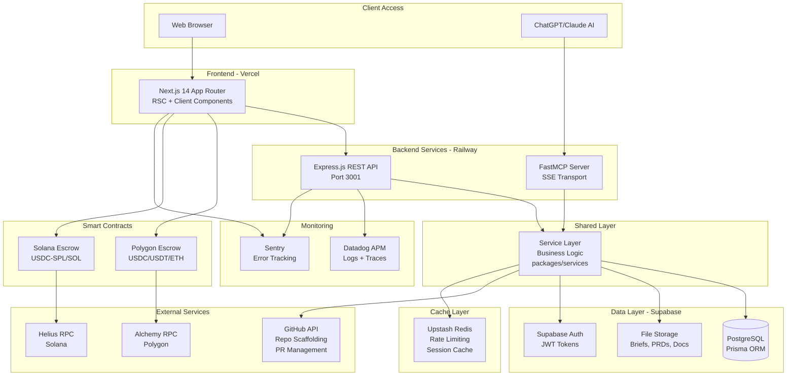

# 2. High Level Architecture

## 2.1 Technical Summary

The American Nerd Marketplace is built as a **fullstack TypeScript monorepo** using Turborepo for build orchestration. The system employs a **dual-interface architecture** with:

1. **MCP Server (REQUIRED for clients)**: Enables conversational brief creation via Claude Desktop/Claude.ai/ChatGPT using analyst.txt agent for guided brainstorming and structured brief generation (not a marketplace - client-driven workflow)
2. **Web UI (REQUIRED for all users)**: Provides marketplace browsing/bidding, project management, deliverable review, and payment workflows
3. **GitHub Integration (Expert work environment)**: All repos initialized with complete BMAD Method v4.44.1+ (.bmad-core/, .claude/, optional IDE configs), experts use any tool (Claude Code, Cursor, Windsurf, Copilot, Vim) to manually shard docs using BMAD method and commit to GitHub

The platform integrates **five specialized marketplaces** (PM, Architect, UX, Developer, QA) into a unified workflow, with each stage producing GitHub-based deliverables tracked via PRs. **Automated GitHub collaborator lifecycle** grants expert write access on bid acceptance and revokes on approval/timeout. **Smart contracts on Polygon and Solana** provide non-custodial escrow for multi-currency crypto payments (USDC/USDT/ETH via Polygon, USDC-SPL/SOL via Solana Program).

A **shared service layer** (`packages/services`) ensures API parity between the REST API and MCP server, while **GitHub App integration** enables automated repo creation with BMAD preinstallation, collaborator management, PR webhook monitoring, and automated quality checks via GitHub Actions. The architecture supports **tool-agnostic expert workflows** - experts can use any development environment as long as deliverables conform to BMAD methodology guidance in the preinstalled .bmad-core/ files.

## 2.2 Platform and Infrastructure Choice

**Selected Platform:** **Vercel + Supabase + Railway**

**Rationale:**
- **Vercel**: Best-in-class Next.js hosting with automatic deployments, edge caching, and Core Web Vitals optimization
- **Supabase**: Managed PostgreSQL + built-in auth + file storage + real-time subscriptions in one platform
- **Railway**: Flexible container hosting for Express API and MCP server with easy database connections
- **GitHub**: Native integration for repository scaffolding, PR workflows, and OAuth

**Key Services:**

| Service | Provider | Purpose |
|---------|----------|---------|
| **Frontend Hosting** | Vercel | Next.js 14 deployment with CDN, serverless functions |
| **Backend API Hosting** | Railway | Express.js API with auto-scaling |
| **MCP Server Hosting** | Railway | FastMCP remote server for AI assistant integration |
| **Database** | Supabase (PostgreSQL) | Primary data store with JSONB support |
| **Authentication** | Supabase Auth + GitHub OAuth | User authentication and API key management |
| **File Storage** | Supabase Storage | Document uploads (briefs, PRDs, architecture docs) |
| **Real-Time Updates** | Supabase Realtime (WebSocket) + GitHub Webhooks | Escrow status updates via WebSocket, commit/PR events via webhooks |
| **Cache** | Upstash Redis | Rate limiting, session storage, hot data caching |
| **Smart Contracts** | Alchemy (Polygon) + Helius (Solana) | RPC nodes for escrow contract deployment and blockchain monitoring |
| **Wallet Integration** | Metamask/WalletConnect (EVM) + Phantom (Solana) | Non-custodial crypto payments exclusively |
| **CI/CD** | GitHub Actions | Automated testing, building, deployment |
| **Monitoring** | Datadog | APM, logs, traces, RUM |
| **Error Tracking** | Sentry | Frontend error tracking with session replay |

**Deployment Regions:**
- **Vercel**: Global edge network with primary region us-east-1
- **Railway**: us-west-2 (API + MCP server)
- **Supabase**: us-east-1 (database)

## 2.3 Repository Structure

**Structure:** Monorepo

**Monorepo Tool:** Turborepo

**Rationale:**
- **Code Sharing**: TypeScript types, utilities, and business logic shared between frontend, backend, and MCP server
- **Atomic Commits**: Changes to data models automatically propagate across API, frontend, and contracts
- **Build Orchestration**: Turborepo's caching reduces CI/CD time by 60%+
- **Service Layer**: `packages/services` ensures API parity between REST API and MCP tools

**Package Organization:**

```
apps/
  web/          - Next.js 14 frontend (Vercel)
  api/          - Express.js REST API (Railway)
  mcp-server/   - FastMCP server (Railway)

packages/
  services/     - Shared business logic (used by API + MCP)
  database/     - Prisma schema and client
  contracts/    - Smart contracts (Solidity + Rust)
    evm/        - Hardhat project for Polygon escrow
    solana/     - Anchor project for Solana escrow
  ui/           - Shared UI components (shadcn-ui)
  config/       - Shared ESLint, TypeScript, Prettier configs
  tsconfig/     - Shared TypeScript configurations
```

## 2.4 Architecture Diagram



## 2.5 Architectural Patterns

**1. Monorepo with Shared Service Layer**
- **Pattern**: All business logic in `packages/services`, consumed by API and MCP server
- **Rationale**: Ensures API parity, reduces duplication, simplifies testing

**2. Jamstack Architecture**
- **Pattern**: Static site generation with serverless API (Next.js + Vercel Functions)
- **Rationale**: Optimal performance, automatic scaling, global CDN distribution

**3. Repository Pattern**
- **Pattern**: Abstract data access through Prisma ORM with service layer wrapper
- **Rationale**: Enables testing with mocked data, future database migration flexibility

**4. Backend for Frontend (BFF)**
- **Pattern**: Next.js API routes for client-specific data transformations
- **Rationale**: Reduces frontend complexity, optimizes payload sizes

**5. Event-Driven Architecture**
- **Pattern**: GitHub webhooks trigger platform actions (PR created → validate → notify)
- **Rationale**: Decouples GitHub integration, enables async processing

**6. Non-Custodial Escrow**
- **Pattern**: Smart contracts hold funds, platform triggers release via signed transactions
- **Rationale**: Eliminates custodial risk, increases trust, regulatory simplicity

**7. API Gateway Pattern**
- **Pattern**: Express middleware for auth, rate limiting, logging, error handling
- **Rationale**: Centralized cross-cutting concerns, consistent API behavior

**8. Circuit Breaker**
- **Pattern**: Retry logic with exponential backoff for external APIs (GitHub, Alchemy, Helius)
- **Rationale**: Resilience to transient failures, graceful degradation

**9. Component-Based UI (Atomic Design)**
- **Pattern**: shadcn-ui components composed into pages
- **Rationale**: Reusability, consistency, rapid development

**10. Domain-Driven Design (DDD)**
- **Pattern**: Service boundaries align with business domains (OpportunityService, StoryService, EscrowService)
- **Rationale**: Clear ownership, easier to reason about, supports team scaling

---
