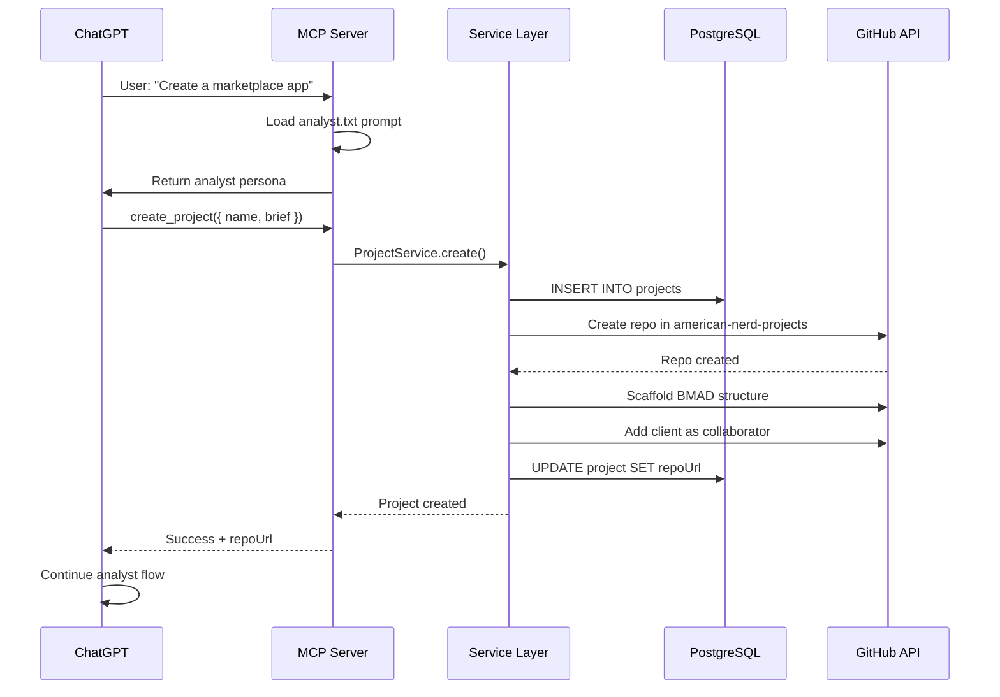
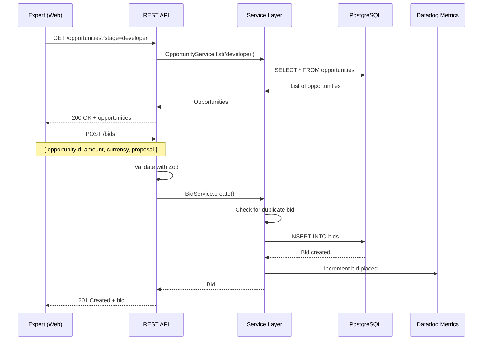
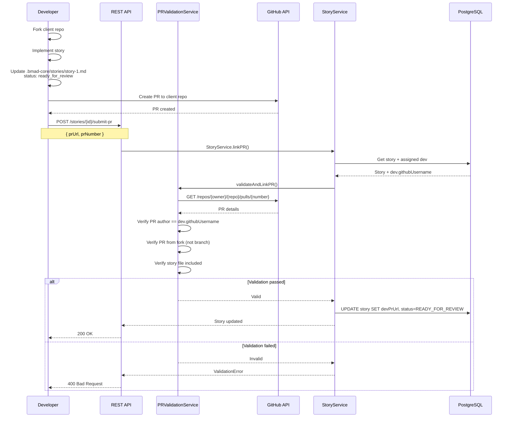
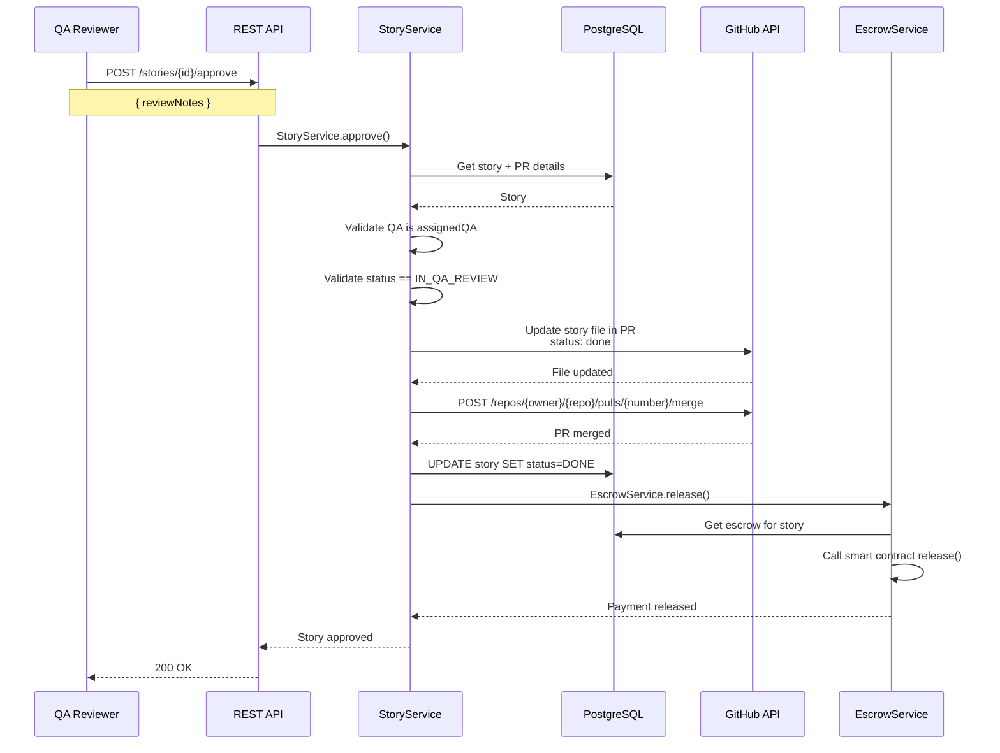
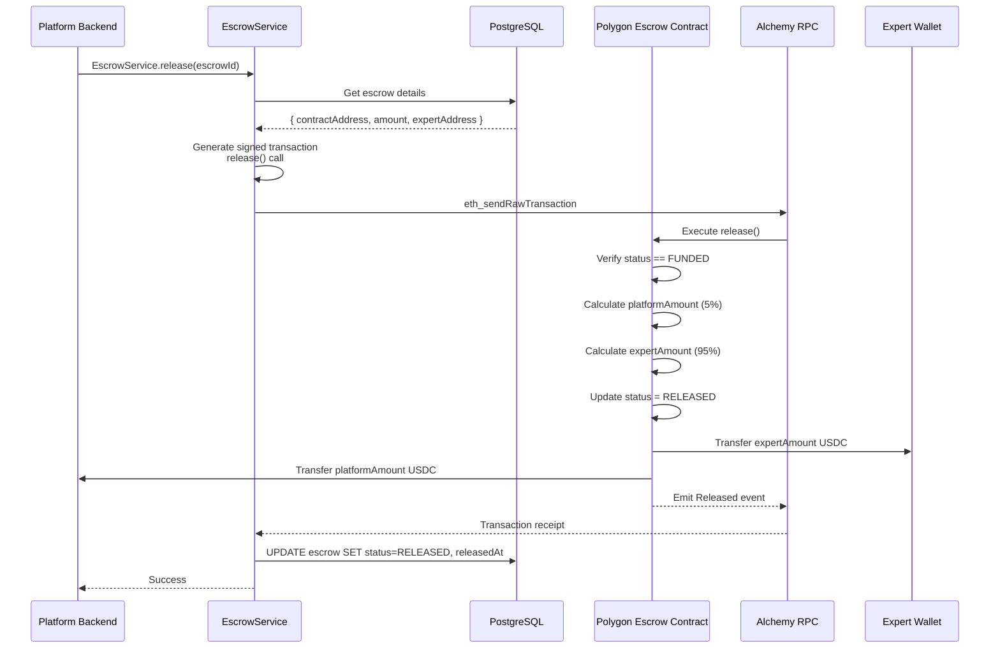
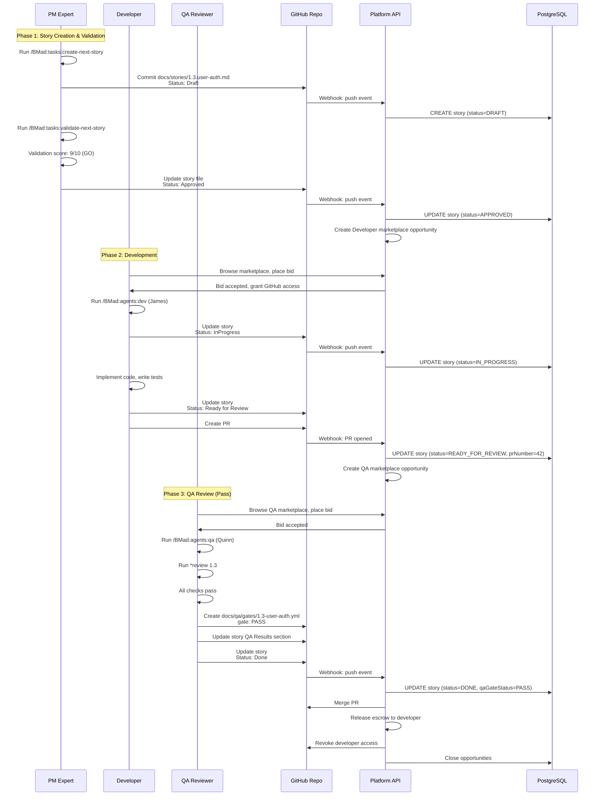
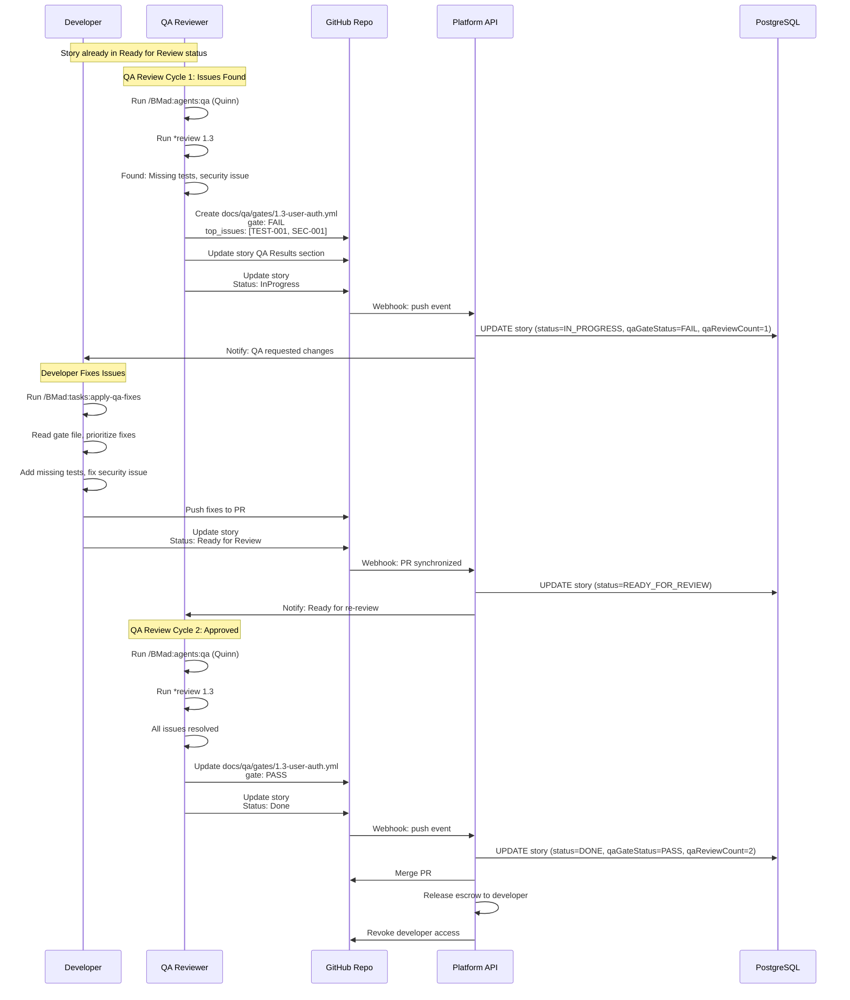

# 8. Core Workflows

## 8.1 Client Creates Project via MCP

## 8.2 Expert Bids on Opportunity

## 8.3 Dev Submits PR for Story

## 8.4 QA Approves Story and Platform Auto-Merges

## 8.5 Escrow Release (Crypto)

## 8.6 Complete BMAD Story Lifecycle (PM → Dev → QA)

## 8.7 BMAD Story Lifecycle with QA Rework (FAIL → Fix → PASS)

---
