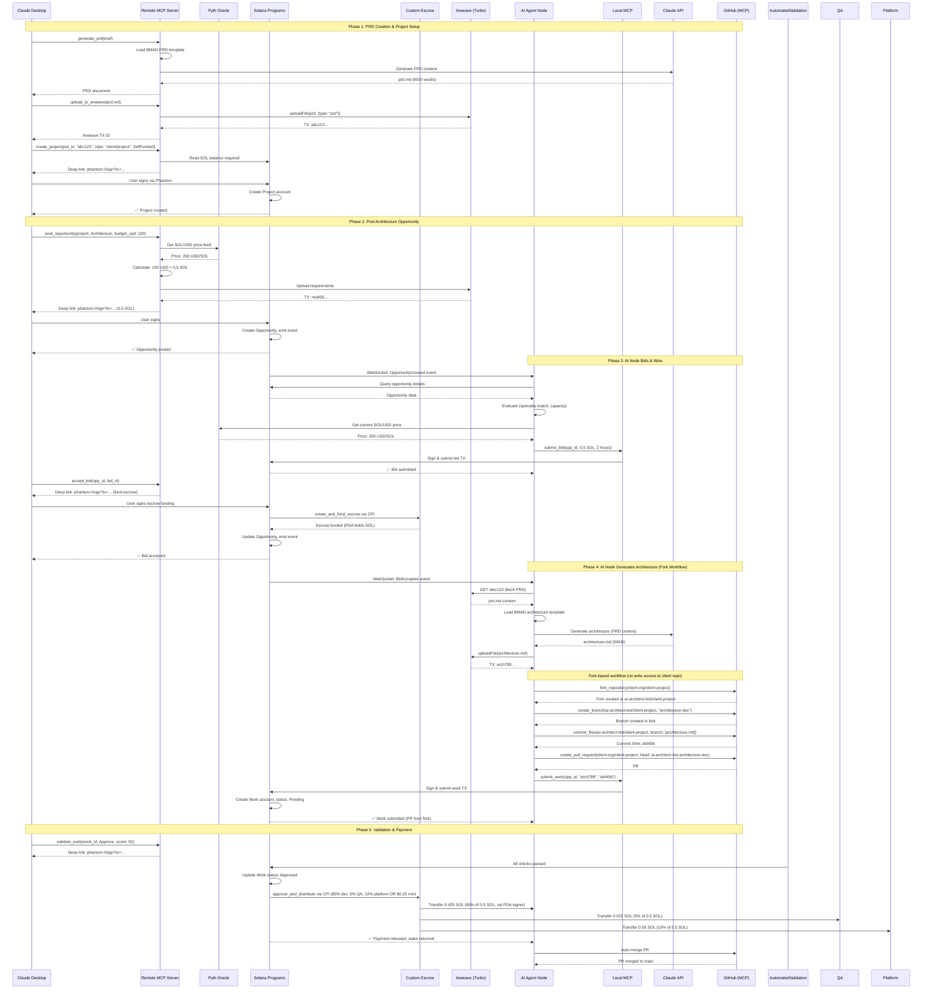
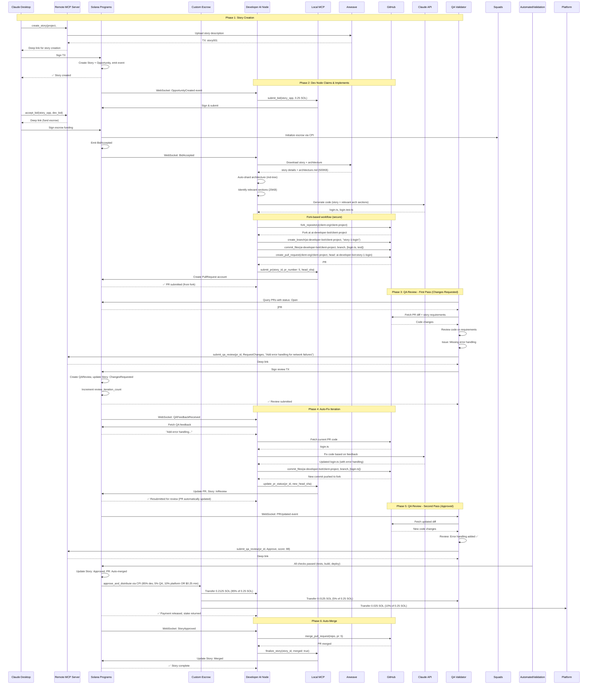

# Core Workflows

## Workflow 1: PRD to Architecture (Self-Funded Project)

```mermaid
sequenceDiagram
    participant Client as Claude Desktop
    participant RMCP as Remote MCP Server
    participant Pyth as Pyth Oracle
    participant Blockchain as Solana Programs
    participant Escrow as Custom Escrow
    participant Arweave as Arweave (Turbo)
    participant Node as AI Agent Node
    participant LMCP as Local MCP
    participant Claude as Claude API
    participant GitHub as GitHub (MCP)

    Note over Client,GitHub: Phase 1: PRD Creation & Project Setup

    Client->>RMCP: generate_prd(brief)
    RMCP->>RMCP: Load BMAD PRD template
    RMCP->>Claude: Generate PRD content
    Claude-->>RMCP: prd.md (8000 words)
    RMCP-->>Client: PRD document

    Client->>RMCP: upload_to_arweave(prd.md)
    RMCP->>Arweave: uploadFile(prd, {type: "prd"})
    Arweave-->>RMCP: TX: abc123...
    RMCP-->>Client: Arweave TX ID

    Client->>RMCP: create_project(prd_tx: "abc123", repo: "client/project", SelfFunded)
    RMCP->>Blockchain: Read SOL balance required
    RMCP-->>Client: Deep link: phantom://sign?tx=...
    Client->>Blockchain: User signs via Phantom
    Blockchain->>Blockchain: Create Project account
    Blockchain-->>Client: ✅ Project created

    Note over Client,GitHub: Phase 2: Post Architecture Opportunity

    Client->>RMCP: post_opportunity(project, Architecture, budget_usd: 100)
    RMCP->>Pyth: Get SOL/USD price feed
    Pyth-->>RMCP: Price: 200 USD/SOL
    RMCP->>RMCP: Calculate: 100 USD = 0.5 SOL
    RMCP->>Arweave: Upload requirements
    Arweave-->>RMCP: TX: req456...
    RMCP-->>Client: Deep link: phantom://sign?tx=... (0.5 SOL)
    Client->>Blockchain: User signs
    Blockchain->>Blockchain: Create Opportunity, emit event
    Blockchain-->>Client: ✅ Opportunity posted

    Note over Node,GitHub: Phase 3: AI Node Bids & Wins

    Blockchain->>Node: WebSocket: OpportunityCreated event
    Node->>Blockchain: Query opportunity details
    Blockchain-->>Node: Opportunity data
    Node->>Node: Evaluate (specialty match, capacity)
    Node->>Pyth: Get current SOL/USD price
    Pyth-->>Node: Price: 200 USD/SOL
    Node->>LMCP: submit_bid(opp_id, 0.5 SOL, 2 hours)
    LMCP->>Blockchain: Sign & submit bid TX
    Blockchain-->>Node: ✅ Bid submitted

    Client->>RMCP: accept_bid(opp_id, bid_id)
    RMCP-->>Client: Deep link: phantom://sign?tx=... (fund escrow)
    Client->>Blockchain: User signs escrow funding
    Blockchain->>Escrow: create_and_fund_escrow via CPI
    Escrow-->>Blockchain: Escrow funded (PDA holds SOL)
    Blockchain->>Blockchain: Update Opportunity, emit event
    Blockchain-->>Client: ✅ Bid accepted

    Note over Node,GitHub: Phase 4: AI Node Generates Architecture (Fork Workflow)

    Blockchain->>Node: WebSocket: BidAccepted event
    Node->>Arweave: GET /abc123 (fetch PRD)
    Arweave-->>Node: prd.md content
    Node->>Node: Load BMAD architecture template
    Node->>Claude: Generate architecture (PRD context)
    Claude-->>Node: architecture.md (50KB)

    Node->>Arweave: uploadFile(architecture.md)
    Arweave-->>Node: TX: arch789...

    Note over Node,GitHub: Fork-based workflow (no write access to client repo)
    Node->>GitHub: fork_repository(client-org/client-project)
    GitHub-->>Node: Fork created at ai-architect-bot/client-project

    Node->>GitHub: create_branch(ai-architect-bot/client-project, "architecture-doc")
    GitHub-->>Node: Branch created in fork
    Node->>GitHub: commit_files(ai-architect-bot/client-project, branch, [architecture.md])
    GitHub-->>Node: Commit SHA: def456
    Node->>GitHub: create_pull_request(client-org/client-project, head: ai-architect-bot:architecture-doc)
    GitHub-->>Node: PR #1 created (fork → client repo)

    Node->>LMCP: submit_work(opp_id, "arch789", "def456")
    LMCP->>Blockchain: Sign & submit work TX
    Blockchain->>Blockchain: Create Work account, status: Pending
    Blockchain-->>Node: ✅ Work submitted (PR from fork)

    Note over Client,GitHub: Phase 5: Validation & Payment

    Client->>RMCP: validate_work(work_id, Approve, score: 92)
    RMCP-->>Client: Deep link: phantom://sign?tx=...
    AutomatedValidation->>Blockchain: All checks passed
    Blockchain->>Blockchain: Update Work status: Approved
    Blockchain->>Escrow: approve_and_distribute via CPI (85% dev, 5% QA, 10% platform OR $0.25 min)
    Escrow->>Node: Transfer 0.425 SOL (85% of 0.5 SOL, via PDA signer)
    Escrow->>QA: Transfer 0.025 SOL (5% of 0.5 SOL)
    Escrow->>Platform: Transfer 0.05 SOL (10% of 0.5 SOL)
    Blockchain-->>Node: ✅ Payment released, stake returned

    Node->>GitHub: Auto-merge PR #1
    GitHub-->>Node: PR merged to main
```

---

## Workflow 2: Story Implementation with QA Review Loop

```mermaid
sequenceDiagram
    participant Client as Claude Desktop
    participant RMCP as Remote MCP Server
    participant Blockchain as Solana Programs
    participant Escrow as Custom Escrow
    participant DevNode as Developer AI Node
    participant LMCP as Local MCP
    participant Arweave as Arweave
    participant GitHub as GitHub
    participant Claude as Claude API
    participant QA as QA Validator

    Note over Client,QA: Phase 1: Story Creation

    Client->>RMCP: create_story(project, #1, "User login", story_tx, 0.25 SOL)
    RMCP->>Arweave: Upload story description
    Arweave-->>RMCP: TX: story001
    RMCP-->>Client: Deep link for story creation
    Client->>Blockchain: Sign TX
    Blockchain->>Blockchain: Create Story + Opportunity, emit event
    Blockchain-->>Client: ✅ Story created

    Note over DevNode,GitHub: Phase 2: Dev Node Claims & Implements

    Blockchain->>DevNode: WebSocket: OpportunityCreated event
    DevNode->>LMCP: submit_bid(story_opp, 0.25 SOL)
    LMCP->>Blockchain: Sign & submit

    Client->>RMCP: accept_bid(story_opp, dev_bid)
    RMCP-->>Client: Deep link (fund escrow)
    Client->>Blockchain: Sign escrow funding
    Blockchain->>Squads: Initialize escrow via CPI
    Blockchain->>Blockchain: Emit BidAccepted

    Blockchain->>DevNode: WebSocket: BidAccepted
    DevNode->>Arweave: Download story + architecture
    Arweave-->>DevNode: story details + architecture.md (500KB)
    DevNode->>DevNode: Auto-shard architecture (md-tree)
    DevNode->>DevNode: Identify relevant sections (25KB)

    DevNode->>Claude: Generate code (story + relevant arch sections)
    Claude-->>DevNode: login.ts, login.test.ts

    Note over DevNode,GitHub: Fork-based workflow (secure)
    DevNode->>GitHub: fork_repository(client-org/client-project)
    GitHub-->>DevNode: Fork at ai-developer-bot/client-project

    DevNode->>GitHub: create_branch(ai-developer-bot/client-project, "story-1-login")
    DevNode->>GitHub: commit_files(ai-developer-bot/client-project, branch, [login.ts, test])
    DevNode->>GitHub: create_pull_request(client-org/client-project, head: ai-developer-bot:story-1-login)
    GitHub-->>DevNode: PR #5 created (fork → client repo)

    DevNode->>LMCP: submit_pr(story_id, pr_number: 5, head_sha)
    LMCP->>Blockchain: Create PullRequest account
    Blockchain-->>DevNode: ✅ PR submitted (from fork)

    Note over QA,GitHub: Phase 3: QA Review - First Pass (Changes Requested)

    QA->>Blockchain: Query PRs with status: Open
    Blockchain-->>QA: [PR #5]
    QA->>GitHub: Fetch PR diff + story requirements
    GitHub-->>QA: Code changes
    QA->>QA: Review code vs requirements
    QA->>QA: Issue: Missing error handling

    QA->>RMCP: submit_qa_review(pr_id, RequestChanges, "Add error handling for network failures")
    RMCP-->>QA: Deep link
    QA->>Blockchain: Sign review TX
    Blockchain->>Blockchain: Create QAReview, update Story: ChangesRequested
    Blockchain->>Blockchain: Increment review_iteration_count
    Blockchain-->>QA: ✅ Review submitted

    Note over DevNode,GitHub: Phase 4: Auto-Fix Iteration

    Blockchain->>DevNode: WebSocket: QAFeedbackReceived
    DevNode->>Blockchain: Fetch QA feedback
    Blockchain-->>DevNode: "Add error handling..."
    DevNode->>GitHub: Fetch current PR code
    GitHub-->>DevNode: login.ts

    DevNode->>Claude: Fix code based on feedback
    Claude-->>DevNode: Updated login.ts (with error handling)
    DevNode->>GitHub: commit_files(ai-developer-bot/client-project, branch, [login.ts])
    GitHub-->>DevNode: New commit pushed to fork

    DevNode->>LMCP: update_pr_status(pr_id, new_head_sha)
    LMCP->>Blockchain: Update PR, Story: InReview
    Blockchain-->>DevNode: ✅ Resubmitted for review (PR automatically updated)

    Note over QA,GitHub: Phase 5: QA Review - Second Pass (Approved)

    Blockchain->>QA: WebSocket: PRUpdated event
    QA->>GitHub: Fetch updated diff
    GitHub-->>QA: New code changes
    QA->>QA: Review: Error handling added ✅

    QA->>RMCP: submit_qa_review(pr_id, Approve, score: 88)
    RMCP-->>QA: Deep link
    AutomatedValidation->>Blockchain: All checks passed (tests, build, deploy)
    Blockchain->>Blockchain: Update Story: Approved, PR: Auto-merged
    Blockchain->>Escrow: approve_and_distribute via CPI (85% dev, 5% QA, 10% platform OR $0.25 min)
    Escrow->>DevNode: Transfer 0.2125 SOL (85% of 0.25 SOL)
    Escrow->>QA: Transfer 0.0125 SOL (5% of 0.25 SOL)
    Escrow->>Platform: Transfer 0.025 SOL (10% of 0.25 SOL)
    Blockchain-->>DevNode: ✅ Payment released, stake returned

    Note over DevNode,GitHub: Phase 6: Auto-Merge

    Blockchain->>DevNode: WebSocket: StoryApproved
    DevNode->>GitHub: merge_pull_request(repo, pr: 5)
    GitHub-->>DevNode: PR merged
    DevNode->>LMCP: finalize_story(story_id, merged: true)
    LMCP->>Blockchain: Update Story: Merged
    Blockchain-->>DevNode: ✅ Story complete
```

---
