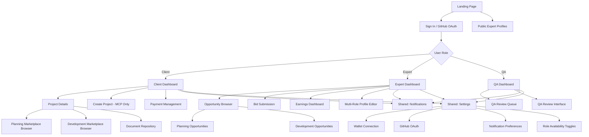
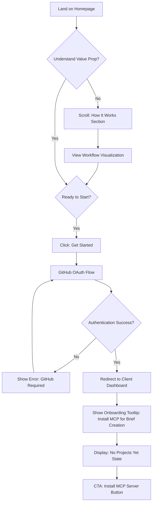
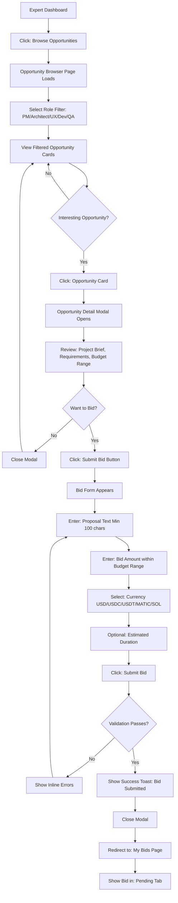
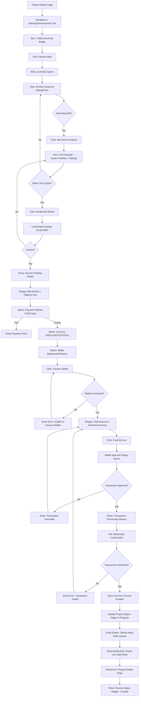
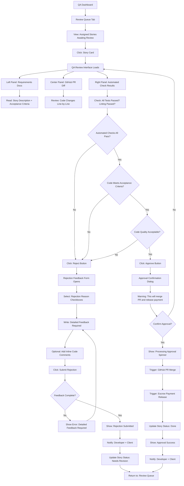
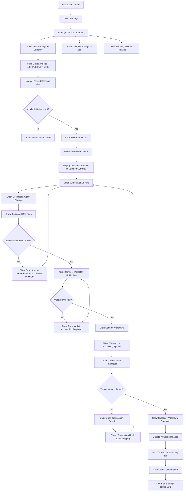
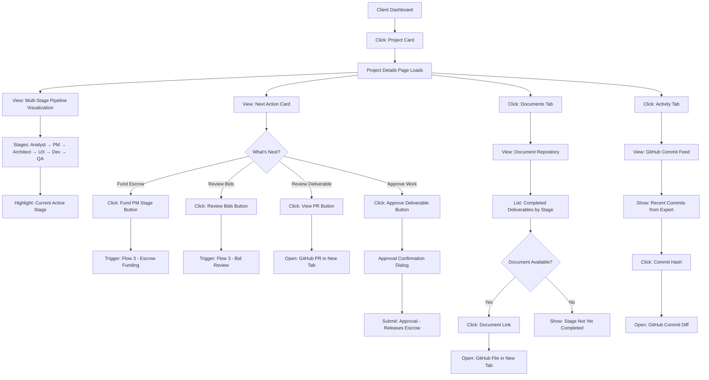

# American Nerd Marketplace UI/UX Specification

**Version:** 1.0
**Date:** October 6, 2025
**Author:** Sally (UX Expert Agent)
**Project:** American Nerd Marketplace - Multi-Stage Expert Marketplace

---

## Change Log

| Date | Version | Description | Author |
|------|---------|-------------|--------|
| 2025-10-06 | 1.0 | Initial comprehensive UI/UX specification | Sally (UX Expert) |

---

## 1. Introduction

This document defines the user experience goals, information architecture, user flows, and visual design specifications for the American Nerd Marketplace user interface. It serves as the foundation for visual design and frontend development, ensuring a cohesive and user-centered experience.

### Overall UX Goals & Principles

#### Target User Personas

**1. Client (Idea Holder)**
- Non-technical entrepreneur or indie maker with software product ideas
- Needs structured guidance through the planning and development process
- Values transparency, clear deliverables, and payment protection
- Desktop-primary user for project creation; mobile for monitoring progress
- Pain points: Overwhelmed by traditional freelancing chaos, fearful of AI slop, needs quality assurance

**2. Expert (Multi-Role Practitioner)**
- Experienced PM, Architect, UX Designer, Developer, or QA professional
- Works asynchronously using their preferred tools (Claude Code, Cursor, Windsurf, Vim, etc.)
- Values clear documentation, fair compensation, and efficient workflows
- Desktop-primary for work delivery; mobile for opportunity browsing and notifications
- Pain points: Wasted time on clarification calls, vague requirements, payment uncertainty

**3. QA Reviewer (Quality Gatekeeper)**
- Specialized role reviewing developer work against requirements
- Needs side-by-side comparison tools (requirements vs code vs automated checks)
- Values clear approval/rejection workflows with detailed feedback mechanisms
- Desktop-exclusive for review work; mobile for queue monitoring
- Pain points: Incomplete context, unclear acceptance criteria, pressure to approve prematurely

#### Usability Goals

1. **Ease of Learning:** New clients can understand the workflow and create their first project brief within 10 minutes (via MCP, not web UI)
2. **Efficiency of Use:** Experts can browse relevant opportunities and submit bids within 2 minutes per opportunity
3. **Trust & Transparency:** All users can see real-time escrow status, GitHub deliverable tracking, and expert reputation at a glance
4. **Error Prevention:** Multi-stage workflows have clear validation, confirmation dialogs for payments, and destructive action warnings
5. **Accessibility:** WCAG 2.1 AA compliance for global expert network and professional marketplace positioning

#### Design Principles

1. **Document-Centric Navigation** - Users navigate by artifacts (Brief, PRD, Architecture, Design, Stories), not abstract stages
2. **Transparency by Default** - Escrow status, GitHub commit history, QA validation badges, blockchain transaction links always visible
3. **Async-First Communication** - Comprehensive docs ARE the conversation; minimize in-platform messaging
4. **Expert Credibility Front-and-Center** - Portfolio previews, ratings, multi-role achievements prominently displayed
5. **Mobile-First Responsive** - Describe mobile layouts first, then adapt for tablet/desktop

---

## 2. Information Architecture (IA)

### Site Map / Screen Inventory

### Navigation Structure

**Primary Navigation:**
- **Persistent Top Bar** (Desktop/Tablet): Logo (left) → Role-specific primary links (center) → Notifications + Avatar Menu (right)
  - Client: "My Projects" | "Find Experts" | "Payments"
  - Expert: "Opportunities" | "My Bids" | "Earnings" | "Profile"
  - QA: "Review Queue" | "My Reviews" | "Earnings"
- **Mobile Bottom Navigation**: 4-5 icons (Dashboard | Browse | Notifications | Profile)

**Secondary Navigation:**
- **Contextual Tabs** within pages (e.g., Project Details → "Overview" | "Planning" | "Development" | "Documents")
- **Role Filter Pills** in marketplace browsers (e.g., "Analyst" | "PM" | "Architect" | "UX" | "Dev" | "QA")

**Breadcrumb Strategy:**
- Desktop/Tablet: Show breadcrumbs for deep navigation (e.g., "My Projects > Marketplace App > Planning > PM Marketplace")
- Mobile: Show single "Back" button with current page title

---

## 3. User Flows

### Flow 1: Landing Page to Client Dashboard (First-Time User)

**User Goal:** Understand the platform value proposition and create an account to start a project

**Entry Points:**
- Landing page (organic/paid traffic)
- Direct link from marketing materials

**Success Criteria:**
- User understands the 6-stage workflow
- User successfully authenticates via GitHub OAuth
- User sees clear next step: "Create Project via Claude Desktop/ChatGPT"

#### Flow Diagram

**Edge Cases & Error Handling:**
- GitHub OAuth fails: Show retry button with error message "Unable to connect to GitHub. Please try again."
- User has no GitHub account: Show link to GitHub signup with explanation "GitHub is required for project repository creation"
- User already has account: Skip onboarding, show existing projects

**Notes:** Landing page must clearly communicate that brief creation requires MCP (Claude Desktop/ChatGPT), but marketplace browsing and project management are web-based.

---

### Flow 2: Expert Browsing Opportunities and Submitting Bid

**User Goal:** Find relevant opportunities matching their expertise and submit a competitive bid

**Entry Points:**
- Expert Dashboard → "Browse Opportunities" button
- Direct navigation to Opportunity Browser via top nav
- Email notification → "View Opportunity" link

**Success Criteria:**
- Expert filters opportunities by role and budget
- Expert reviews project brief and requirements
- Expert submits bid with proposal and pricing
- Expert receives confirmation and bid tracking information

#### Flow Diagram

**Edge Cases & Error Handling:**
- Already submitted bid for this opportunity: Show warning "You've already bid on this opportunity" with link to view/edit existing bid
- Opportunity closed while viewing: Show banner "This opportunity is no longer accepting bids"
- Bid amount outside budget range: Inline validation error "Bid must be between $X and $Y"
- Proposal too short: Character counter shows "Minimum 100 characters required (XX/100)"
- Network error during submission: Show retry button with preserved form data

**Notes:** Bid submission must feel lightweight and fast. Auto-save draft bids to prevent data loss.

---

### Flow 3: Client Funding Escrow and Accepting Expert Bid

**User Goal:** Review expert bids, select the best candidate, fund escrow, and start the planning/development stage

**Entry Points:**
- Client Dashboard → Project Card → "Review Bids" badge
- Email notification → "New Bids Received" link
- Project Details → Planning/Development tab → "Review Bids" button

**Success Criteria:**
- Client reviews all bids with expert portfolios and ratings
- Client selects winning bid
- Client successfully funds escrow with chosen currency
- Expert is notified and granted GitHub repository access

#### Flow Diagram

**Edge Cases & Error Handling:**
- Wallet not installed: Show installation link for Metamask/Phantom
- Insufficient balance: Show clear error "Insufficient USDC balance. You have X, need Y"
- Network congestion: Show estimated wait time "Transaction may take 2-5 minutes on Polygon network"
- Transaction failed: Provide transaction hash link to blockchain explorer for debugging
- Expert declined after acceptance: Show notification and re-open bidding
- Client cancels before funding: Show warning "Expert will be notified. This may affect your reputation."

**Notes:** Escrow funding is the highest-friction moment. Provide real-time transaction status, clear error messages, and customer support link.

---

### Flow 4: QA Reviewer Approving/Rejecting Developer Story

**User Goal:** Review developer's pull request against acceptance criteria, automated checks, and architecture docs, then approve or reject with detailed feedback

**Entry Points:**
- QA Dashboard → "Review Queue" → Story card
- Email notification → "Story Ready for QA" link
- Direct link from story notification

**Success Criteria:**
- QA reviewer sees side-by-side: requirements, code diff, automated check results
- QA reviewer can leave detailed feedback on specific code sections
- QA reviewer approves (triggers PR merge + payment release) or rejects (returns to developer)
- Developer and client are notified of decision

#### Flow Diagram

**Edge Cases & Error Handling:**
- Automated checks still running: Show "Checks in progress, refresh page when complete"
- PR merge conflict: Show error "PR has merge conflicts, developer must resolve first"
- Escrow release fails: Show critical error "PR merged but payment release failed - contact support immediately"
- QA tries to approve without reviewing all files: Show warning "You haven't viewed all changed files"
- Developer force-pushed after QA started review: Show banner "Code has been updated since you started review, please refresh"

**Notes:** QA approval is irreversible and triggers payment. Add extra confirmation dialog. Allow QA to save draft feedback before final submission.

---

### Flow 5: Expert Viewing Earnings and Withdrawing Funds

**User Goal:** Track completed projects, pending escrow releases, and withdraw accumulated crypto earnings to personal wallet

**Entry Points:**
- Expert Dashboard → "Earnings" card
- Top navigation → "Earnings"
- Email notification → "Payment Released" link

**Success Criteria:**
- Expert sees clear breakdown of completed projects, pending payments, and available balance
- Expert can filter by currency (USD, USDC, USDT, ETH, SOL)
- Expert can withdraw crypto to their personal wallet
- Expert receives transaction confirmation and updated balance

#### Flow Diagram

**Edge Cases & Error Handling:**
- Invalid wallet address: Client-side validation error "Invalid address format for selected network"
- Amount below minimum: Show error "Minimum withdrawal is $10 (gas fees would exceed smaller amounts)"
- Gas price spike: Show warning "Network fees are high ($X). Consider withdrawing later."
- Transaction pending: Allow user to check status via transaction hash link
- Multiple currencies selected: Show error "Please select one currency at a time"

**Notes:** Provide clear gas fee estimates before withdrawal. Link to blockchain explorer for all transactions. Show withdrawal history with status tracking.

---

### Flow 6: Client Viewing Project Progress and Documents

**User Goal:** Monitor project status across all stages, view completed deliverables (PRD, Architecture, Design, Code), and track GitHub activity

**Entry Points:**
- Client Dashboard → Project Card
- Top navigation → "My Projects" → Select Project
- Email notification → "Stage Completed" link

**Success Criteria:**
- Client sees clear multi-stage progress visualization
- Client can access all completed documents via GitHub repository
- Client can see real-time GitHub commit activity
- Client understands next required actions (fund escrow, review deliverable, etc.)

#### Flow Diagram

**Edge Cases & Error Handling:**
- Project in planning but no bids yet: Show "Waiting for expert bids" with suggested action "Share project link"
- Stage completed but client hasn't approved: Show prominent CTA "Review and approve to continue"
- GitHub repo access denied: Show error "Unable to load repository. Contact support."
- No commits in 7+ days: Show warning banner "No recent activity. Expert may need support."

**Notes:** Project Details page is the client's "mission control." Prioritize clarity over comprehensive data. Use visual progress indicators (checkmarks, progress bars, stage badges).

---

## 4. Wireframes & Mockups

**Primary Design Files:** Figma designs will be created post-specification. This section provides detailed component and layout descriptions for each key screen.

### Key Screen Layouts

#### Screen 1: Landing Page

**Purpose:** Communicate value proposition, build trust, and drive GitHub OAuth signup

**Key Elements:**

**Mobile Layout (320-767px):**
- **Hero Section:**
  - Centered logo + tagline: "Expert-Validated Software Development"
  - H1: "Turn Ideas into Shipped Code with Real Developers"
  - Subheadline: "Multi-stage marketplace connecting you with PM, Architect, UX, Developer, and QA experts. AI assists, humans validate."
  - Single CTA button: "Get Started with GitHub" (OAuth flow)
  - Trust badge: "Escrow-Protected Payments"

- **How It Works Section (Vertical Cards):**
  - Card 1: "1. Create Brief" (Icon: Document) - "Describe your idea"
  - Card 2: "2. Experts Bid" (Icon: People) - "Review proposals from specialists"
  - Card 3: "3. Escrow Protected" (Icon: Shield) - "Fund securely with crypto or fiat"
  - Card 4: "4. GitHub Delivery" (Icon: GitHub) - "Receive quality code + docs"

- **Workflow Visualization (Horizontal Scroll):**
  - Six stage badges: Analyst → PM → Architect → UX → Dev → QA
  - Below each: Brief description of deliverable

- **Social Proof Section:**
  - "Featured Experts" - 3 expert profile cards with avatar, role, rating
  - "Recent Projects" - 2 project cards with tech stack tags

- **FAQ Section (Accordion):**
  - "How is this different from Upwork?"
  - "What if I don't like the deliverable?"
  - "Do I need to know how to code?"

- **Footer:**
  - Links: About | How It Works | For Experts | Pricing | Support
  - Social: GitHub | Twitter | Discord

**Tablet/Desktop Adaptation (768px+):**
- Hero section: Split layout - Content left (60%), Animated workflow visualization right (40%)
- How It Works: 2x2 grid instead of vertical stack
- Workflow Visualization: Full 6-stage pipeline visible without scroll
- Featured Experts: 6 cards in 3x2 grid
- FAQ: Two-column layout

**Interaction Notes:**
- CTA button hover: Slight elevation shadow + color darken
- Workflow stage badges: Hover shows tooltip with deliverable description
- Expert cards: Click to view public profile (modal on mobile, new tab on desktop)

---

#### Screen 2: Client Dashboard

**Purpose:** Central hub for managing projects, viewing notifications, and accessing marketplaces

**Key Elements:**

**Mobile Layout (320-767px):**
- **Top Bar:**
  - Left: Hamburger menu icon (opens nav drawer)
  - Center: "My Projects" title
  - Right: Notification bell icon (badge if unread)

- **Project Cards (Vertical Stack):**
  - Card header: Project name + status badge (Planning/In Development/Completed)
  - Pipeline progress bar: Analyst → PM → Architect → UX → Dev → QA (color-coded: completed green, active blue, pending gray)
  - Current stage highlight: "PM Expert Working" or "Awaiting Your Approval"
  - Next action CTA: "Review Bids" or "Fund Escrow" or "Approve Deliverable"
  - Card footer: Last updated timestamp + "View Details" link

- **Empty State (No Projects):**
  - Illustration: Empty clipboard or rocket
  - H2: "No Projects Yet"
  - Body: "Create your first project using Claude Desktop or ChatGPT with our MCP server"
  - CTA: "Install MCP Server" button → Documentation link

- **Bottom Navigation:**
  - Icons: Projects (active) | Find Experts | Payments | Profile

**Tablet/Desktop Adaptation (768px+):**
- **Top Navigation Bar (Persistent):**
  - Logo (left)
  - "My Projects" | "Find Experts" | "Payments" (center links)
  - Search bar (right of center)
  - Notification bell + Avatar dropdown (right)

- **Projects Grid:**
  - 2 columns (tablet 768-1024px)
  - 3 columns (desktop 1024px+)
  - Larger cards with visible GitHub activity feed preview

- **Sidebar (Right, Desktop only):**
  - "Quick Stats" widget: Total projects, Active stages, Pending payments
  - "Recent Activity" feed: Latest commits, bids received, payments released

**Interaction Notes:**
- Project cards: Tap/click anywhere except CTA opens Project Details
- Status badge: Color-coded (blue=active, green=completed, gray=planning, red=blocked)
- Pipeline progress: Interactive - tap stage to jump to details
- Notification bell: Shows unread count, opens dropdown list on click

---

#### Screen 3: Opportunity Browser (Expert View)

**Purpose:** Allow experts to filter opportunities by role, budget, and deadline, then submit bids

**Key Elements:**

**Mobile Layout (320-767px):**
- **Top Bar:**
  - Left: Back button (to Expert Dashboard)
  - Center: "Opportunities" title
  - Right: Filter icon (opens filter drawer)

- **Filter Drawer (Slide from Right):**
  - **Role Filter (Pills, Multi-Select):**
    - Analyst | PM | Architect | UX | Developer | QA
  - **Budget Range (Slider):**
    - Min: $0, Max: $10,000+
  - **Currency Filter (Dropdown):**
    - USD | USDC | USDT | ETH | SOL
  - **Deadline (Date Picker):**
    - "Next 7 days" | "Next 30 days" | "Anytime"
  - **Status Filter (Checkboxes):**
    - Open | Closed
  - Apply Filters Button (Sticky bottom)

- **Active Filters Bar:**
  - Horizontal scroll chips showing selected filters
  - Each chip has X to remove
  - "Clear All" button (right)

- **Opportunity Cards (Vertical Stack):**
  - **Card Header:**
    - Project name + role badge (PM/Architect/UX/Dev/QA color-coded)
  - **Card Body:**
    - Title: Opportunity title (e.g., "Create PRD for SaaS Analytics App")
    - Description: First 100 characters + "Read more"
    - Budget: "$500 - $1,000" + currency badge (USDC)
    - Deadline: "Due in 5 days" (relative time)
  - **Card Footer:**
    - Client avatar + name
    - "X bids received" counter
    - "View Details" button

- **Empty State (No Matches):**
  - Illustration: Empty search
  - H2: "No Opportunities Match Your Filters"
  - CTA: "Clear Filters" button

**Tablet/Desktop Adaptation (768px+):**
- **Top Bar with Inline Filters:**
  - Role filter pills always visible (no drawer)
  - Budget/Currency/Deadline dropdowns in top bar

- **Opportunities Grid:**
  - 2 columns (tablet)
  - 3 columns (desktop 1440px+)

- **Left Sidebar (Desktop only):**
  - Filter panel always visible
  - "Saved Searches" section
  - "Recommended for You" widget based on role history

**Interaction Notes:**
- Opportunity card: Tap/click opens detail modal with full description, client profile, and bid form
- Role badges: Color-coded (Analyst=purple, PM=blue, Architect=teal, UX=pink, Dev=green, QA=orange)
- Budget range: Real-time filtering as slider moves
- "View Details" button: Opens modal on mobile, inline expansion on desktop

---

#### Screen 4: Project Details (Client View)

**Purpose:** Comprehensive project management hub with stage progress, documents, GitHub activity, and escrow status

**Key Elements:**

**Mobile Layout (320-767px):**
- **Top Bar:**
  - Left: Back button (to Dashboard)
  - Center: Project name (truncated)
  - Right: Settings icon (3-dot menu) → "Edit Project" | "Archive" | "Delete"

- **Stage Pipeline Visualization (Horizontal Scroll):**
  - Six stage cards: Analyst | PM | Architect | UX | Developer | QA
  - Each card shows:
    - Stage icon + name
    - Status: Completed ✓ | In Progress ⏳ | Pending ⏸ | Blocked ❌
    - Expert avatar (if assigned)
    - "View Details" link

- **Next Action Card (Prominent Banner):**
  - Icon + Title: "Action Required"
  - Description: "Review 3 bids from PM experts"
  - CTA Button: "Review Bids"

- **Tabs (Horizontal Scroll):**
  - Overview | Planning | Development | Documents | Activity | Payments

- **Tab: Overview**
  - **Project Brief Preview:**
    - Expandable/collapsible section
    - First 200 characters + "Read more" → Opens GitHub brief file
  - **Escrow Status Widget:**
    - Title: "Escrow Status"
    - Current stage: "PM Stage"
    - Amount funded: "$800 USDC"
    - Status: Funded ✓ | Awaiting Release ⏳ | Released ✓
    - Transaction hash link (if crypto)
  - **GitHub Repository Link:**
    - Button: "View on GitHub" → Opens repo in new tab

- **Tab: Planning**
  - **Analyst Stage Card:**
    - Status badge
    - Deliverable: "Market Research + Competitive Analysis"
    - Expert: Avatar + Name + Rating
    - Completed date
    - "View Deliverable" button → GitHub PR link
  - **PM Stage Card:** (Same structure)
  - **Architect Stage Card:** (Same structure)
  - **UX Stage Card:** (Same structure)

- **Tab: Development**
  - **Story List (Grouped by Status):**
    - Ready for Dev | In Development | In QA Review | Done
  - **Story Card:**
    - Story number + title
    - Assigned developer avatar + name
    - Assigned QA avatar + name
    - Status badge
    - "View PR" button (if submitted)

- **Tab: Documents**
  - **Document List:**
    - Brief (GitHub link)
    - PRD (GitHub link)
    - Architecture (GitHub link)
    - Design Specs (GitHub link)
    - "View All in GitHub" button

- **Tab: Activity**
  - **GitHub Commit Feed:**
    - Commit message + hash (truncated)
    - Author avatar + name
    - Relative timestamp
    - "View diff" link

- **Tab: Payments**
  - **Escrow History Table:**
    - Stage | Amount | Currency | Status | Date
    - Transaction hash link (if crypto)

**Tablet/Desktop Adaptation (768px+):**
- **Stage Pipeline:** All six stages visible horizontally, larger cards
- **Tabs:** Persistent tab bar (no scroll), content area below
- **Three-Column Layout (Desktop 1440px+):**
  - Left: Stage pipeline (vertical instead of horizontal)
  - Center: Tab content (larger)
  - Right: Escrow status widget + GitHub activity feed (always visible)

**Interaction Notes:**
- Stage cards: Click to expand details inline (mobile modal, desktop inline)
- Next Action Card: Dismissible after action completed
- Escrow widget: Real-time updates (poll every 30s when transaction pending)
- GitHub activity: Auto-refresh every 60s

---

#### Screen 5: QA Review Interface

**Purpose:** Side-by-side comparison of requirements, code diff, and automated checks for story approval/rejection

**Key Elements:**

**Desktop Layout (1024px+ ONLY - Mobile shows "Use desktop for QA review"):**

- **Top Bar:**
  - Left: "← Back to Review Queue"
  - Center: Story title + number (e.g., "Story #3: Implement User Authentication")
  - Right: Timer showing time spent on review

- **Three-Panel Layout (Equal Width):**

  **Left Panel: Requirements & Context**
  - **Story Details:**
    - Description (full text, scrollable)
    - Acceptance Criteria (checklist format)
    - Related documents: Link to PRD section, Architecture section
  - **Developer Notes:**
    - Any notes submitted with PR

  **Center Panel: GitHub PR Diff**
  - **PR Header:**
    - PR title + number
    - Developer avatar + name
    - Commit count + files changed
    - "View in GitHub" link (new tab)
  - **File Tree (Left Sidebar):**
    - Collapsible folder structure
    - File names with +/- line counts
  - **Diff View:**
    - Side-by-side or unified diff toggle
    - Line numbers
    - Inline comment capability
    - Syntax highlighting

  **Right Panel: Automated Checks & Actions**
  - **Automated Check Results:**
    - Test Suite: ✓ 127 passed | ❌ 0 failed
    - Linting: ✓ Passed
    - Type Checking: ✓ Passed
    - Build: ✓ Succeeded
    - Security Scan: ⚠️ 1 warning (expandable details)
  - **QA Checklist (Interactive):**
    - □ Code follows architecture patterns
    - □ All acceptance criteria met
    - □ Edge cases handled
    - □ Error handling implemented
    - □ No code smells or anti-patterns
  - **Action Buttons:**
    - **Approve Button (Green, Prominent):**
      - "Approve & Merge PR"
      - Shows escrow release amount below
    - **Reject Button (Red, Secondary):**
      - "Request Changes"
      - Opens feedback form

- **Reject Feedback Form (Modal):**
  - **Rejection Reasons (Checkboxes):**
    - □ Acceptance criteria not met
    - □ Code quality issues
    - □ Missing tests
    - □ Security concerns
    - □ Architecture violations
  - **Detailed Feedback (Required Text Area):**
    - Placeholder: "Explain what needs to be changed and why..."
    - Character counter (min 50 characters)
  - **Inline Comments Reference:**
    - List of any inline code comments added
  - **Submit Rejection Button**

- **Approve Confirmation Dialog:**
  - Warning icon
  - Title: "Approve Story and Release Payment?"
  - Body: "This will merge the PR and release $X USDC to the developer. This action cannot be undone."
  - Checkbox: "I have reviewed all code changes and confirmed acceptance criteria are met"
  - Cancel | Confirm Approval buttons

**Interaction Notes:**
- Three-panel layout: Resizable dividers (drag to adjust width)
- Inline comments: Click line number in diff → Comment input appears
- Checklist: Must check all items before Approve button enabled
- File tree: Click file → Scroll diff to that file's changes
- Automated checks: Click to expand full logs/warnings

---

#### Screen 6: Payment/Escrow Management (Client View)

**Purpose:** Fund escrow for project stages, view transaction history, and monitor escrow release status

**Key Elements:**

**Mobile Layout (320-767px):**
- **Top Bar:**
  - Left: Back to Dashboard
  - Center: "Payments"
  - Right: Filter icon (Currency filter)

- **Active Escrow Card (If Any):**
  - Title: Project name
  - Stage: "PM Stage" badge
  - Amount funded: "$800 USDC"
  - Status: "Funded - Work in Progress" with spinner
  - Progress bar: Expert working → QA review → Release
  - "View Project" link

- **Fund Escrow CTA (If Pending):**
  - Banner: "Action Required"
  - Text: "Fund PM Stage escrow to start work"
  - Amount: "$500 - $1,000 budget range"
  - "Fund Escrow" button → Opens funding modal

- **Payment History (Vertical List):**
  - **Transaction Card:**
    - Header: Project name + Stage
    - Amount: "$800 USDC" + transaction type (Funded | Released | Refunded)
    - Date: Relative timestamp
    - Status badge: Completed ✓ | Pending ⏳ | Failed ❌
    - Transaction hash link (if crypto)
    - Expandable details:
      - Expert name
      - Platform fee breakdown
      - Blockchain explorer link

- **Empty State (No Payments):**
  - Illustration: Empty wallet
  - H2: "No Payment History"
  - Body: "Fund your first project stage to get started"

**Tablet/Desktop Adaptation (768px+):**
- **Two-Column Layout:**
  - Left (60%): Payment history table with sortable columns
  - Right (40%): Active escrow widget + Quick actions

- **Payment History Table:**
  - Columns: Date | Project | Stage | Amount | Currency | Status | Transaction
  - Sortable by date, amount
  - Filterable by project, currency, status

**Funding Escrow Modal:**
- **Step 1: Confirm Amount**
  - Display: Bid amount + Platform fee ($100 + 5%) = Total
  - Editable: No (determined by accepted bid)

- **Step 2: Select Payment Method**
  - Radio buttons:
    - 💳 Credit Card (Stripe) - USD only
    - 🪙 Cryptocurrency (Metamask/Phantom)

- **Step 3a: Fiat Payment (Stripe)**
  - Stripe embedded form
  - Card number, expiry, CVC, ZIP
  - "Pay $X USD" button

- **Step 3b: Crypto Payment**
  - **Select Currency:** USDC | USDT | ETH (Polygon) | USDC-SPL | SOL (Solana)
  - **Select Network:** Polygon | Solana (auto-selected based on currency)
  - **Connect Wallet:**
    - Metamask button (EVM)
    - Phantom button (Solana)
  - **Wallet Connected Display:**
    - Address: 0x1234...5678
    - Balance: "X USDC available"
  - **Amount Display:**
    - Total in selected currency (with real-time exchange rate)
    - Estimated gas fee: "$0.02 MATIC"
  - **"Fund Escrow" Button:**
    - Opens wallet approval dialog
    - Shows transaction status: Awaiting approval → Broadcasting → Confirming → Confirmed
    - Estimated time: "1-2 minutes on Polygon"

**Interaction Notes:**
- Transaction hash: Opens blockchain explorer in new tab
- Real-time updates: Poll transaction status every 5s when pending
- Failed transactions: Show retry button with preserved selections

---

#### Screen 7: Expert Earnings Dashboard

**Purpose:** Track completed projects, pending payments, available balance, and withdraw crypto earnings

**Key Elements:**

**Mobile Layout (320-767px):**
- **Top Bar:**
  - Left: Back to Dashboard
  - Center: "Earnings"
  - Right: Currency filter dropdown

- **Balance Cards (Vertical Stack):**
  - **Total Earnings Card:**
    - Large number: "$12,450 USD equivalent"
    - Breakdown by currency:
      - USDC: $8,000
      - ETH: $3,200
      - SOL: $1,250
  - **Available to Withdraw Card:**
    - Amount: "$3,500 USDC"
    - "Withdraw" button (green, prominent)
  - **Pending Escrow Card:**
    - Amount: "$1,200 USDC"
    - Text: "In escrow for 2 active projects"
    - "View Projects" link

- **Tabs (Horizontal Scroll):**
  - Completed | Pending | Withdrawn

- **Tab: Completed (Project List):**
  - **Project Card:**
    - Project name + client avatar
    - Role badge: PM | Architect | UX | Dev | QA
    - Amount earned: "$800 USDC"
    - Date completed
    - "View Project" link

- **Tab: Pending (Escrow List):**
  - **Escrow Card:**
    - Project name
    - Stage: "PM Stage"
    - Amount: "$500 USDC"
    - Status: "Awaiting QA Approval" or "Client Review"
    - Estimated release date

- **Tab: Withdrawn (Transaction History):**
  - **Withdrawal Card:**
    - Amount: "$2,000 USDC"
    - Destination: 0x1234...5678
    - Date
    - Transaction hash link

**Tablet/Desktop Adaptation (768px+):**
- **Top Row:** Balance cards in 3-column layout (Total | Available | Pending)
- **Bottom Section:** Tabs with table view instead of cards

**Withdraw Modal:**
- **Step 1: Select Currency**
  - Radio buttons: USDC | USDT | ETH | SOL
  - Display available balance for each

- **Step 2: Enter Amount**
  - Input field with max button
  - Show: "Available: $3,500 USDC"
  - Validation: Minimum $10 (to cover gas fees)

- **Step 3: Enter Destination Wallet**
  - Input field with paste button
  - Validation: Address format for selected network
  - Warning: "Double-check address. Transactions are irreversible."

- **Step 4: Review & Confirm**
  - Amount: $3,500 USDC
  - Destination: 0x1234...5678
  - Estimated gas fee: $0.05 MATIC
  - Total deducted: $3,500.05
  - "Connect Wallet to Confirm" button

- **Step 5: Processing**
  - Spinner: "Broadcasting transaction..."
  - Transaction hash appears when confirmed
  - Success message: "Withdrawal complete! Funds sent to your wallet."

**Interaction Notes:**
- Balance cards: Tap currency to filter transactions by that currency
- Withdraw button: Disabled if balance < $10
- Transaction hash: Copy button + blockchain explorer link

---

## 5. Component Library / Design System

### Design System Approach

**Selected Design System:** shadcn-ui (v4) built on Radix UI primitives with Tailwind CSS

**Rationale:**
- Accessible by default (WCAG AA compliant components)
- Copy-paste approach (no npm bloat, full customization)
- Consistent with tech stack (Next.js + Tailwind)
- Comprehensive component library (buttons, forms, modals, tables, etc.)
- Active community and excellent documentation

### Core Components

#### Component 1: OpportunityCard

**Purpose:** Display opportunity summary in marketplace browser with role badge, budget, and deadline

**Variants:**
- Default: Standard card with all details
- Compact: Smaller card for sidebar widgets (no description)
- Featured: Larger card with highlighted border for "recommended" opportunities

**States:**
- Default: White background, gray border
- Hover: Elevated shadow, border color change
- Clicked/Active: Blue border, slight background tint
- Closed: Grayed out, "Closed" badge overlay

**Usage Guidelines:**
- Always include role badge (color-coded by stage)
- Show currency badge next to budget
- Use relative time for deadline ("Due in 5 days" not "Dec 15")
- Truncate description to 100 characters with "Read more"

---

#### Component 2: StagePipeline

**Purpose:** Visual representation of 6-stage workflow progress

**Variants:**
- Horizontal: For desktop/tablet project details
- Vertical: For desktop sidebar
- Compact: Mobile horizontal scroll

**States:**
- Completed: Green checkmark, filled background
- Active: Blue spinner, pulsing animation
- Pending: Gray outline, empty background
- Blocked: Red X, filled red background

**Usage Guidelines:**
- Always show all 6 stages (Analyst → PM → Architect → UX → Dev → QA)
- Include expert avatar for completed/active stages
- Clickable stages open stage details
- Use consistent color coding across platform

---

#### Component 3: EscrowStatusWidget

**Purpose:** Display real-time escrow funding and release status

**Variants:**
- Summary: Shows only total amount and status
- Detailed: Includes transaction hash, platform fee breakdown, progress steps

**States:**
- Not Funded: Gray, "Fund Escrow" CTA
- Funded: Blue, "Work in Progress" with spinner
- Released: Green, "Payment Released" with checkmark
- Failed: Red, "Transaction Failed" with retry button

**Usage Guidelines:**
- Always show currency badge (USDC, ETH, SOL, etc.)
- Include transaction hash link for crypto payments
- Show real-time updates (poll every 30s when pending)
- Use progressive disclosure for fee breakdown (expandable)

---

#### Component 4: BidForm

**Purpose:** Allow experts to submit proposals and pricing for opportunities

**Variants:**
- Inline: Embedded in opportunity detail modal
- Full-page: Standalone page for complex bids

**States:**
- Empty: Placeholder text in all fields
- Partial: Some fields filled, validation errors shown
- Valid: All required fields filled, submit button enabled
- Submitting: Loading spinner, form disabled
- Success: Confirmation message, form hidden

**Usage Guidelines:**
- Proposal textarea: Min 100 characters with live counter
- Budget input: Validate against opportunity budget range
- Currency selector: Show only currencies accepted by client
- Auto-save draft every 30 seconds
- Preserve data on network errors

---

#### Component 5: QAChecklistPanel

**Purpose:** Interactive checklist for QA reviewers to track review progress

**Variants:**
- Default: All checklist items visible
- Compact: Only incomplete items shown

**States:**
- Incomplete: Unchecked boxes, approve button disabled
- Complete: All boxes checked, approve button enabled
- Submitted: Read-only view with checkmarks

**Usage Guidelines:**
- Always require all items checked before enabling approve button
- Include link to relevant documentation for each checklist item
- Allow QA to add custom checklist items
- Auto-save checklist progress

---

#### Component 6: WalletConnectButton

**Purpose:** Connect Metamask or Phantom wallet for crypto transactions

**Variants:**
- Metamask: For EVM chains (Polygon)
- Phantom: For Solana

**States:**
- Disconnected: "Connect Wallet" button
- Connecting: Loading spinner, "Connecting..." text
- Connected: Shows truncated address (0x1234...5678) + balance
- Error: Red border, error message below

**Usage Guidelines:**
- Show wallet icon (Metamask fox, Phantom ghost)
- Display network badge (Polygon, Solana) when connected
- Include "Disconnect" option in dropdown
- Show balance in selected currency when relevant

---

#### Component 7: TransactionStatusTracker

**Purpose:** Real-time blockchain transaction status visualization

**Variants:**
- Inline: Small progress indicator in widget
- Modal: Full-screen progress with detailed steps

**States:**
- Awaiting Approval: "Please approve transaction in wallet"
- Broadcasting: "Sending transaction to network..."
- Confirming: "Waiting for confirmations (1/3)"
- Confirmed: "Transaction confirmed!" with checkmark
- Failed: "Transaction failed" with error message + retry button

**Usage Guidelines:**
- Always show transaction hash when available
- Link to blockchain explorer
- Show estimated time remaining
- Provide retry mechanism for failed transactions

---

## 6. Branding & Style Guide

### Visual Identity

**Brand Guidelines:** Professional indie maker aesthetic - clean, modern, technical without being sterile

**Brand Personality:**
- Trustworthy and transparent (escrow visualizations, blockchain links)
- Expert-focused (credibility signals: portfolios, ratings, achievements)
- Global and accessible (multi-currency, crypto-native)
- AI-assisted but human-validated (expert faces front-and-center)

### Color Palette

| Color Type | Hex Code | Usage |
|------------|----------|-------|
| **Primary** | `#2563EB` (Blue 600) | Primary buttons, active states, links, trust indicators |
| **Primary Hover** | `#1D4ED8` (Blue 700) | Button hover states |
| **Secondary** | `#0EA5E9` (Sky 500) | Secondary actions, informational badges |
| **Accent** | `#8B5CF6` (Violet 500) | Special highlights, Analyst role badge |
| **Success** | `#10B981` (Emerald 500) | Escrow released, QA approved, PRs merged, completed stages |
| **Warning** | `#F59E0B` (Amber 500) | Pending QA review, escrow funding required, approaching deadline |
| **Error** | `#EF4444` (Red 500) | Failed transactions, rejected bids, blocked stages |
| **Neutral 50** | `#F9FAFB` | Page backgrounds |
| **Neutral 100** | `#F3F4F6` | Card backgrounds, secondary backgrounds |
| **Neutral 200** | `#E5E7EB` | Borders, dividers |
| **Neutral 400** | `#9CA3AF` | Placeholder text, disabled states |
| **Neutral 600** | `#4B5563` | Secondary text |
| **Neutral 900** | `#111827` | Primary text, headings |

**Role-Specific Badge Colors:**
- Analyst: `#8B5CF6` (Violet 500)
- PM: `#2563EB` (Blue 600)
- Architect: `#0EA5E9` (Sky 500)
- UX: `#EC4899` (Pink 500)
- Developer: `#10B981` (Emerald 500)
- QA: `#F97316` (Orange 500)

### Typography

#### Font Families
- **Primary:** Inter (Google Fonts) - Clean, modern sans-serif for UI and body text
- **Secondary:** Inter (same family for consistency)
- **Monospace:** JetBrains Mono - For code snippets, transaction hashes, wallet addresses

#### Type Scale

| Element | Size | Weight | Line Height | Usage |
|---------|------|--------|-------------|-------|
| **H1** | 36px (2.25rem) | 700 (Bold) | 1.2 | Page titles (mobile: 28px) |
| **H2** | 30px (1.875rem) | 600 (Semibold) | 1.3 | Section headings (mobile: 24px) |
| **H3** | 24px (1.5rem) | 600 (Semibold) | 1.4 | Card titles, subsection headings |
| **H4** | 20px (1.25rem) | 600 (Semibold) | 1.4 | Component titles |
| **Body** | 16px (1rem) | 400 (Regular) | 1.6 | Primary content, descriptions |
| **Small** | 14px (0.875rem) | 400 (Regular) | 1.5 | Secondary text, metadata, timestamps |
| **Tiny** | 12px (0.75rem) | 500 (Medium) | 1.4 | Badges, labels, captions |

### Iconography

**Icon Library:** Lucide React (included with shadcn-ui)

**Usage Guidelines:**
- Use 24px icons for primary actions (buttons, navigation)
- Use 16px icons for inline text elements (badges, labels)
- Use consistent icons for common actions:
  - GitHub: `<GitHubIcon />`
  - Wallet: `<WalletIcon />`
  - Escrow: `<ShieldCheckIcon />`
  - Expert: `<UserIcon />`
  - Payment: `<DollarSignIcon />`
  - Notification: `<BellIcon />`
  - Settings: `<SettingsIcon />`
  - Search: `<SearchIcon />`
  - Filter: `<FilterIcon />`

### Spacing & Layout

**Grid System:** 12-column responsive grid (Tailwind CSS default)

**Spacing Scale (Tailwind):**
- `space-1`: 4px (0.25rem) - Icon padding
- `space-2`: 8px (0.5rem) - Tight component spacing
- `space-3`: 12px (0.75rem) - Default component spacing
- `space-4`: 16px (1rem) - Card padding (mobile)
- `space-6`: 24px (1.5rem) - Card padding (desktop), section spacing
- `space-8`: 32px (2rem) - Large section spacing
- `space-12`: 48px (3rem) - Major section dividers
- `space-16`: 64px (4rem) - Page section spacing

**Container Widths:**
- Mobile: 100% width with 16px padding
- Tablet: Max 768px centered
- Desktop: Max 1280px centered
- Wide: Max 1536px centered

---

## 7. Accessibility Requirements

### Compliance Target

**Standard:** WCAG 2.1 Level AA

**Rationale:** Global expert network and professional marketplace positioning require robust accessibility. Level AA balances comprehensive accessibility with practical implementation for MVP.

### Key Requirements

**Visual:**
- **Color contrast ratios:** All text meets 4.5:1 minimum (3:1 for large text 18px+)
- **Focus indicators:** 2px blue outline on all interactive elements (keyboard navigation)
- **Text sizing:** All text minimum 14px (12px for metadata only), scalable to 200% without loss of functionality

**Interaction:**
- **Keyboard navigation:** All workflows completable via keyboard (Tab, Enter, Escape, Arrow keys)
- **Screen reader support:** Semantic HTML, ARIA labels for custom components, descriptive link text
- **Touch targets:** Minimum 44x44px for all interactive elements (mobile)

**Content:**
- **Alternative text:** Descriptive alt text for all expert portfolio images, logos, and informational graphics
- **Heading structure:** Logical heading hierarchy (H1 → H2 → H3) for screen reader navigation
- **Form labels:** All form inputs have visible labels or ARIA labels, error messages linked via aria-describedby

### Testing Strategy

**Automated Testing:**
- ESLint plugin: `eslint-plugin-jsx-a11y` for component accessibility checks
- Axe DevTools: Run on all pages during development
- Lighthouse Accessibility audit: Target score 95+ on all major pages

**Manual Testing:**
- Keyboard-only navigation testing for all critical workflows
- Screen reader testing (NVDA on Windows, VoiceOver on macOS)
- Color contrast verification using Contrast Checker
- Focus order verification (logical tab sequence)

**User Testing:**
- Recruit at least 2 users with disabilities for beta testing
- Test with keyboard-only users and screen reader users
- Gather feedback on form completion, navigation, and transaction flows

---

## 8. Responsiveness Strategy

### Breakpoints

| Breakpoint | Min Width | Max Width | Target Devices |
|------------|-----------|-----------|----------------|
| **Mobile** | 320px | 767px | iPhone SE, iPhone 12/13/14, Android phones |
| **Tablet** | 768px | 1023px | iPad, iPad Air, Android tablets |
| **Desktop** | 1024px | 1439px | Laptops, small desktop monitors |
| **Wide** | 1440px | - | Large desktop monitors, 4K displays |

### Adaptation Patterns

**Layout Changes:**
- **Mobile:** Single-column layout, vertical card stacks, horizontal scroll for wide content (pipelines, tabs)
- **Tablet:** Two-column grids for cards, persistent top navigation replaces bottom nav
- **Desktop:** Three-column layouts with sidebars, all content visible without scroll where possible
- **Wide:** Increased max-width containers (1536px), more whitespace, larger typography

**Navigation Changes:**
- **Mobile:** Bottom navigation bar (4-5 icons), hamburger menu for secondary links
- **Tablet/Desktop:** Top navigation bar with horizontal links, dropdown menus for subpages
- **Breadcrumbs:** Hidden on mobile, visible on tablet/desktop

**Content Priority:**
- **Mobile:** Show critical information first (project name, status, next action), hide metadata (timestamps, transaction hashes) in expandable sections
- **Tablet/Desktop:** Display all information simultaneously, use sidebars for contextual widgets

**Interaction Changes:**
- **Mobile:** Tap targets minimum 44px, modals full-screen, swipe gestures for carousels
- **Tablet/Desktop:** Smaller tap targets acceptable (24px+), modals centered overlays, hover states for cards/buttons

---

## 9. Animation & Micro-interactions

### Motion Principles

1. **Purposeful, not decorative:** Animations should guide attention, provide feedback, or indicate relationships
2. **Fast and responsive:** Transitions <300ms for immediate feel, avoid >500ms animations
3. **Respect user preferences:** Honor `prefers-reduced-motion` for accessibility
4. **Consistent easing:** Use standard Tailwind easing (ease-in-out) for natural feel

### Key Animations

- **Page Transitions:** Fade in (200ms, ease-in-out) on route changes
- **Modal Open/Close:** Slide up from bottom (250ms, ease-out) on mobile, scale + fade (200ms, ease-in-out) on desktop
- **Card Hover:** Elevation shadow + slight scale (150ms, ease-out)
- **Button Click:** Scale down 98% (100ms, ease-in-out) for tactile feedback
- **Stage Pipeline Progress:** Pulsing animation (1000ms, infinite) on active stage badge
- **Escrow Status Update:** Checkmark scale + fade in (300ms, ease-out) when status changes to "Released"
- **Notification Badge:** Bounce in (400ms, ease-out) when new notification arrives
- **Form Validation Error:** Shake animation (300ms, ease-in-out) on input field with error
- **Loading Spinner:** Continuous rotation (1000ms, linear) for transaction processing
- **Toast Notification:** Slide in from top (250ms, ease-out), auto-dismiss after 5s with fade out (200ms)

---

## 10. Performance Considerations

### Performance Goals

- **Page Load:** First Contentful Paint (FCP) <1.5s on 4G mobile, <800ms on desktop broadband
- **Interaction Response:** Button clicks, form inputs respond within 100ms
- **Animation FPS:** 60fps for all animations and transitions (no jank)

### Design Strategies

**Image Optimization:**
- Use Next.js `<Image>` component for automatic optimization
- Lazy load all below-the-fold images (expert avatars, project cards)
- Use WebP format with PNG/JPG fallbacks
- Provide multiple image sizes for responsive breakpoints

**Code Splitting:**
- Lazy load modals and heavy components (QA Review Interface, Wallet Connect)
- Split routes by user role (client dashboard vs expert dashboard separate bundles)
- Defer non-critical JavaScript (analytics, chat widget)

**Data Fetching:**
- Use React Server Components for initial page data (no client-side loading spinners)
- Implement optimistic UI updates for form submissions
- Cache API responses with SWR or React Query
- Paginate long lists (opportunities, payment history)

**Critical Rendering Path:**
- Inline critical CSS for above-the-fold content
- Defer non-critical fonts (load system fonts first)
- Minimize layout shifts with skeleton loaders

**Blockchain Interaction:**
- Show immediate optimistic UI feedback before blockchain confirmation
- Poll transaction status asynchronously (don't block UI)
- Cache wallet connection state to avoid reconnection prompts

---

## 11. Next Steps

### Immediate Actions

1. **Stakeholder Review:** Share this specification with project stakeholders for feedback and approval
2. **Create Figma Designs:** Translate wireframes and component descriptions into high-fidelity visual designs
3. **Build Component Storybook:** Develop isolated shadcn-ui components in Storybook for design system reference
4. **Frontend Architecture Handoff:** Provide this document to Design Architect for detailed frontend architecture specification
5. **Accessibility Audit Plan:** Schedule accessibility testing sprint with automated + manual testing

### Design Handoff Checklist

- [x] All user flows documented (6 critical flows defined)
- [x] Component inventory complete (7 core components specified)
- [x] Accessibility requirements defined (WCAG 2.1 AA target)
- [x] Responsive strategy clear (4 breakpoints with adaptation patterns)
- [x] Brand guidelines incorporated (color palette, typography, iconography)
- [x] Performance goals established (FCP <1.5s, 60fps animations)

---

## 12. Open Questions & Decisions Needed

**Design Decisions:**
1. **Landing Page Hero Animation:** Should the workflow visualization be animated (auto-playing stage progression) or static? Consider performance impact and distraction.
2. **Expert Profile Public View:** Do we need a dedicated public expert profile page for marketing, or only show profiles within opportunity modals?
3. **Dark Mode:** Should we support dark mode for MVP? QA reviewers working long hours might benefit, but adds complexity.

**UX Decisions:**
1. **Bid Editing:** Can experts edit submitted bids before client accepts, or are bids immutable once submitted?
2. **Client Feedback on Rejections:** When QA rejects a story, should clients see the rejection feedback, or only the developer?
3. **Multi-Project Dashboard:** For clients with 5+ projects, should we add filtering/search to project dashboard?

**Technical Decisions:**
1. **Real-Time Updates:** Use WebSocket for live updates (escrow status, GitHub commits) or polling? Consider Supabase Realtime vs manual polling.
2. **Wallet Persistence:** Should wallet connection persist across sessions, or require reconnection on each visit for security?

---

**End of Specification**
